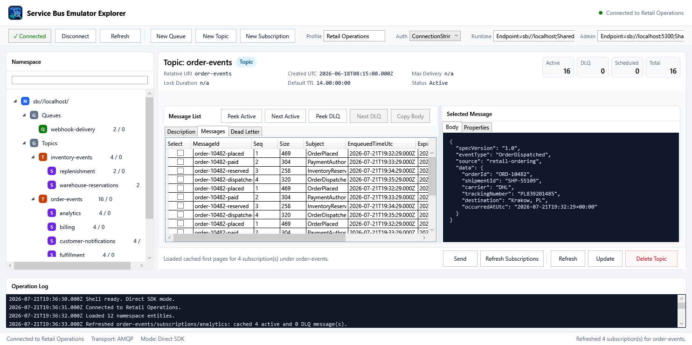

# Service Bus Emulator Explorer

<p align="center">
  
</p>

<p align="center">
  A Windows desktop explorer for Azure Service Bus and the local Azure Service Bus emulator.
</p>

<p align="center">
  <a href="https://github.com/kkolodziejczak/ServiceBusEmulatorExplorer/actions/workflows/ci.yml"></a>
  <a href="https://github.com/kkolodziejczak/ServiceBusEmulatorExplorer/releases/latest"></a>
  <a href="LICENSE"></a>
</p>

Service Bus Emulator Explorer is a WPF application for browsing namespaces, inspecting messages, sending messages, managing entities, and working safely with dead-letter queues (DLQs). It supports connection strings for the local emulator or SAS-based namespaces, and Azure CLI credentials for Azure public-cloud namespaces.

<!-- Updated automatically from a deterministic WPF UI scenario built from released source by .github/workflows/update-readme-screenshot.yml. -->


## Highlights

- Browse queues, topics, and subscriptions in a namespace tree.
- Inspect active, scheduled, and dead-lettered messages and their metadata.
- Send messages to queues and topics.
- Replay a DLQ message as a new active message, with optional edits.
- Delete selected or visible-page DLQ messages through explicit confirmations.
- Create, update, and delete entities when using connection-string authentication.
- Save named connection profiles locally.
- Connect to Azure with the account already authenticated by Azure CLI.

## Download

Download the latest Windows x64 executable from [GitHub Releases](https://github.com/kkolodziejczak/ServiceBusEmulatorExplorer/releases/latest).

| Package | Choose it when | Requirement |
| --- | --- | --- |
| `*-win-x64-portable.exe` | You want the simplest setup. This is the recommended download. | No separate .NET installation. |
| `*-win-x64-requires-dotnet10.exe` | You already have the desktop runtime and prefer a smaller download. | [.NET 10 Desktop Runtime for Windows x64](https://dotnet.microsoft.com/en-us/download/dotnet/10.0/runtime). |

The executables are currently unsigned. Windows Defender SmartScreen may show an unrecognized-app warning. Download them only from this repository's Releases page and confirm that the release tag is the version you intended to install.

## Connect to the local emulator

Prerequisites: [Docker Desktop](https://www.docker.com/products/docker-desktop/) or another Docker Compose-compatible environment.

From a clone of this repository:

```powershell
Copy-Item .env.example .env
docker compose --env-file .env up -d
```

On first launch, the application selects **Local emulator** and automatically attempts to connect using the defaults below. If the emulator is not running, start it and click **Connect**. Existing saved profiles and connected/disconnected startup choices are preserved.

For a manually configured profile, select **ConnectionString** and use:

```text
Runtime:        Endpoint=sb://localhost;SharedAccessKeyName=RootManageSharedAccessKey;SharedAccessKey=SAS_KEY_VALUE;UseDevelopmentEmulator=true;
Administration: Endpoint=sb://localhost:5300;SharedAccessKeyName=RootManageSharedAccessKey;SharedAccessKey=SAS_KEY_VALUE;UseDevelopmentEmulator=true;
```

The runtime connection handles message operations. The administration connection handles namespace topology and entity management.

Emulator counts marked with `*` are **observed deliveries from browsing**, not live broker totals. Refresh and Load more update them; hover over a count for the check time and whether the scan is partial or complete. Unvisited sources/buckets and unavailable scheduled totals show `—`. Main-queue observations may include scheduled, deferred or expired messages; topic observations count each subscription's delivery separately. Azure profiles continue to use broker-reported counts.

When finished:

```powershell
docker compose down
```

## Connect to Azure with Azure CLI

1. Install [Azure CLI](https://learn.microsoft.com/cli/azure/install-azure-cli) and run `az login`.
2. In the application, choose **AzureCli**.
3. Enter the fully qualified namespace, for example `orders.servicebus.windows.net`.
4. Connect and select an entity from the namespace tree.

The supported RBAC contract is **Azure Service Bus Data Owner at the whole namespace scope**. The app does not inspect or modify role assignments. Sender-only, Receiver-only, combined Sender + Receiver, and entity-scoped-only assignments are not supported workflows for this explorer.

| Operation | Azure CLI / RBAC |
| --- | --- |
| Browse namespace topology | Supported |
| Peek queue or subscription messages | Supported |
| Send to a queue or topic | Supported |
| Create, update, or delete entities | Not supported |

Topics are send destinations. Read messages from a topic's subscriptions, not from the topic itself. If authentication fails, run `az login` again. Use `az account show` to inspect the active subscription and `az login --tenant <tenant-id>` when the wrong tenant is selected. New role assignments can take several minutes to propagate.

The app never starts an interactive login and never stores Azure CLI access tokens or its credential cache.

## Important safety notes

- Operations target the namespace you connect to. Verify the namespace and selected entity before sending, replaying, or deleting messages.
- Replaying a DLQ message is non-destructive: it creates a new active message and leaves the original in the DLQ. Deleting the original is a separate, explicitly confirmed action.
- Saved connection-string profiles contain secrets. They are stored locally as JSON under `%LOCALAPPDATA%\ServiceBusEmulatorExplorer\connection-profiles.json`. Protect that file and never attach it to an issue or commit it.
- Logs and screenshots can contain entity names, message bodies, identifiers, and application properties. Sanitize them before sharing.

## Help and feedback

Found a problem or have an idea? Start with the [support guide](SUPPORT.md), search the existing issues, and use the provided bug or feature form. Contributions are welcome through [CONTRIBUTING.md](CONTRIBUTING.md).

- [Get help or report a problem](SUPPORT.md)
- [Report a security vulnerability](SECURITY.md)
- [Read the Code of Conduct](CODE_OF_CONDUCT.md)

## License

Licensed under the [MIT License](LICENSE).

Service Bus Emulator Explorer is an independent open-source project. It is not affiliated with, endorsed by, or supported by Microsoft.
