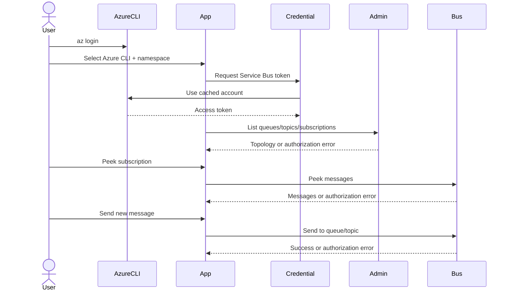
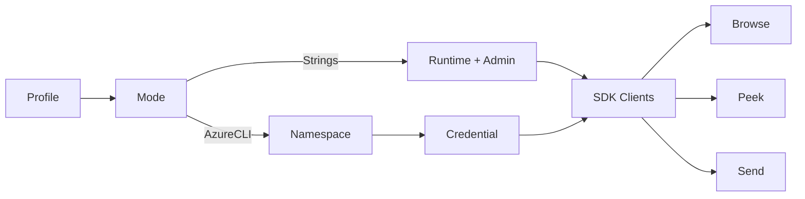

# Azure CLI RBAC Implementation Plan

## Purpose

Add a fast, passwordless Azure Service Bus connection path for users who have already authenticated with `az login`. The application must connect to an Azure Service Bus namespace, browse queues/topics/subscriptions, peek queue or subscription messages, and send new messages to queues or topics.

The existing local-emulator/SAS connection-string path must continue to work unchanged. Azure RBAC entity creation, update, and deletion are explicitly outside this feature scope.

## Agreed Decisions

- Use `AzureCliCredential`; users authenticate outside the application with `az login`.
- Do not add interactive browser login, WAM, an app registration, managed identity, service-principal secrets, or token persistence.
- Support accounts assigned any of these built-in roles at the namespace or entity scope:
  - `Azure Service Bus Data Owner`
  - `Azure Service Bus Data Sender`
  - `Azure Service Bus Data Receiver`
  - Sender and Receiver together
- Do not query Azure Resource Manager for role assignments and do not ask the user to declare a role.
- Attempt send and receive operations when invoked. If permission is missing, show a concise authorization error in the existing status/error/log surfaces.
- Treat Azure RBAC entity management as unsupported. Hide or disable create/update/delete entity controls in Azure CLI mode. Preserve those controls and their behavior in connection-string mode.
- A topic is a send destination. Messages are read from its subscriptions, never directly from the topic.
- Store the authentication mode and fully qualified namespace in the existing JSON profile. Never copy or persist Azure CLI access tokens.
- Support the Azure public cloud in this first slice. Sovereign-cloud authority selection is deferred.

## Current State

- `ConnectionProfile` contains only a profile name and separate runtime/administration connection strings.
- `ConnectionProfileValidator` requires both connection strings and an `Endpoint=sb://` value.
- `DirectServiceBusClientFactory` creates `ServiceBusClient` and `ServiceBusAdministrationClient` from connection strings and probes the administration connection by listing queues.
- `ShellViewModel` loads/saves one profile, connects, then refreshes the entity tree.
- `MainWindow.xaml` always displays runtime and administration connection-string fields.
- `ServiceBusAdministrationService` already browses queues, topics, subscriptions, metadata, and runtime counts.
- `ServiceBusMessageService` already peeks queue/subscription messages and sends to queues/topics.
- Message and shell operation wrappers already expose exception messages in status and operation-log surfaces.
- Entity-management commands are implemented and must remain available for connection-string/emulator profiles.
- The Core project references `Azure.Messaging.ServiceBus` 7.20.1 but does not reference `Azure.Identity`.

## Intent Model

### Actors

- Operator: signs in with Azure CLI, chooses a connection mode, and invokes browse/read/send actions.
- Azure CLI: owns the cached user authentication session.
- WPF application: stores non-secret connection metadata and creates Azure SDK clients.
- Azure Service Bus: authorizes each operation using the operator's assigned data role.

### Inputs

- Profile name.
- Authentication mode: connection strings or Azure CLI.
- Fully qualified namespace such as `orders.servicebus.windows.net` for Azure CLI mode.
- Existing runtime and administration connection strings for emulator mode.
- Queue/topic/subscription selection and message content.

### Outputs and side effects

- Entity topology and runtime counts displayed in the tree.
- Peeked messages displayed without settling or deleting them.
- A new message sent to a selected queue or topic.
- A saved profile containing mode and namespace, but no Azure token.
- Clear authentication or authorization errors in existing UI/log surfaces.

### Failures

- Azure CLI is missing, not logged in, logged into the wrong tenant, or cannot acquire a token.
- Namespace input is missing or malformed.
- Network/DNS/TLS connectivity fails.
- The current role permits browsing but not the requested send or receive operation.
- Role assignment has not propagated yet.

## Role Behavior Contract

| Assigned role | Browse topology | Peek queue/subscription | Send queue/topic | Manage entities in Azure CLI mode |
|---|---:|---:|---:|---:|
| Data Owner | Yes | Yes | Yes | Unsupported by this feature |
| Data Sender | Yes | Authorization error | Yes | Unsupported |
| Data Receiver | Yes | Yes | Authorization error | Unsupported |
| Sender + Receiver | Yes | Yes | Yes | Unsupported |

The application does not infer role membership. Azure Service Bus remains the authorization authority for every operation.

## Common Ground Diagrams





## Mock Template

This mock is authoritative for field visibility and interaction flow, but illustrative for exact widths and styling. Reuse the current toolbar styles and responsive behavior rather than introducing a new visual system.

```text
Profile [ Azure Production ]  Auth [ Azure CLI v ]  Namespace [ orders.servicebus.windows.net ]  [ Connect ]

Connection-string mode:
Profile [ Local Emulator ]    Auth [ Connection strings v ]
Runtime [ Endpoint=sb://... ] Admin [ Endpoint=sb://... ]                              [ Connect ]
```

Implementation notes:

- `Auth` is a stable automation-addressable selector.
- Azure CLI mode replaces the two connection-string fields with one namespace field; do not squeeze all three fields into the row.
- Switching modes changes visible fields without clearing the values held in the view model during that session.
- Saved profiles persist only the fields relevant to their selected mode.
- In Azure CLI mode, create/update/delete entity controls are unavailable with a tooltip explaining that Azure RBAC entity management is outside the supported workflow.
- Send and peek controls remain based on entity selection and connection state. They are not disabled based on an assumed role.
- Update emulator-specific copy such as “Connect to an emulator first” to say “Connect first” where the message applies to both modes.

## Target Architecture

### Profile contract

Extend the current record without breaking three-argument construction or legacy JSON:

```csharp
public enum ConnectionAuthenticationMode
{
    ConnectionString,
    AzureCli
}

public sealed record ConnectionProfile(
    string Name,
    string RuntimeConnectionString,
    string AdministrationConnectionString,
    ConnectionAuthenticationMode AuthenticationMode = ConnectionAuthenticationMode.ConnectionString,
    string FullyQualifiedNamespace = "");
```

The exact representation may change if `System.Text.Json` compatibility tests show that a property-based record is safer. The behavioral contract is authoritative: an old three-field JSON profile must load as `ConnectionString` without migration failure.

### Validation

- Always require a profile name.
- In `ConnectionString` mode, retain the current two-string validation exactly.
- In `AzureCli` mode:
  - require a fully qualified namespace;
  - accept a hostname only, for example `orders.servicebus.windows.net`;
  - reject connection strings, URI schemes, paths, queries, fragments, ports, and whitespace-only values;
  - normalize by trimming outer whitespace, not by silently rewriting the host.
- Irrelevant fields must not make the selected mode invalid.

### Credential and SDK clients

- Pin a stable `Azure.Identity` package version compatible with the solution target; do not introduce a floating version.
- Create one `AzureCliCredential` per connected Azure CLI profile and share it between:
  - `new ServiceBusAdministrationClient(fullyQualifiedNamespace, credential)`;
  - `new ServiceBusClient(fullyQualifiedNamespace, credential)`.
- Preserve current disposal and reconnect semantics.
- Preserve the connection-string constructors for emulator profiles.
- Keep the connection probe non-mutating. Listing the first queue is acceptable; it must not send, receive, create, update, or delete anything.
- Do not invoke `az login` from the application.

### Error conventions

- Keep original exception details in the operation log when they are useful and non-secret.
- Present concise guidance for known credential failures:
  - CLI unavailable/not logged in: run `az login`, then reconnect.
  - authentication failure: verify the active tenant/account with Azure CLI.
  - authorization failure: request Data Owner, Data Sender, or Data Receiver as appropriate for the attempted operation.
- Do not claim to know the user's assigned role.
- Do not convert authorization failures into connection loss automatically; a Sender-only user can remain connected after a failed peek and still send.
- Never log access tokens or credential cache contents.

## Shared Configuration

No secret environment variables are required for normal app usage.

Optional real-Azure proof variables:

```text
SBE_RUN_AZURE_RBAC_TESTS=true
SBE_AZURE_NAMESPACE=<name>.servicebus.windows.net
SBE_AZURE_TOPIC=<pre-provisioned-topic>
SBE_AZURE_SUBSCRIPTION=<pre-provisioned-subscription>
```

The proof must use pre-provisioned entities and must not create, update, or delete Azure resources. Any message it sends must use a unique test identifier and a clearly recognizable, non-sensitive body.

## Stage 1: Azure CLI Connection Vertical Slice

**Goal:** An Azure CLI profile can be entered, saved, loaded, validated, and used to construct/connect both Service Bus SDK clients, while all legacy emulator profiles remain compatible.

**Allowed files/modules:**

- `src/ServiceBusEmulatorExplorer.Core/Connection/*`
- `src/ServiceBusEmulatorExplorer.Core/ServiceBus/DirectServiceBusClientFactory.cs`
- `src/ServiceBusEmulatorExplorer.Core/ServiceBusEmulatorExplorer.Core.csproj`
- `src/ServiceBusEmulatorExplorer.App/ViewModels/ShellViewModel.cs`
- `src/ServiceBusEmulatorExplorer.App/MainWindow.xaml`
- focused Core/App tests for those files

**Do not change:**

- Entity/message request mapping.
- DLQ semantics.
- Entity-management workflows.
- Emulator Docker configuration.
- Profile storage location.

**Required sequence:**

1. Add failing validator and legacy/new JSON profile tests.
2. Add the authentication-mode/profile contract and make those tests pass.
3. Add failing factory-path tests where a stable seam is possible without creating a broad abstraction. If real connection behavior cannot be unit-tested honestly, cover construction inputs through focused contract tests and reserve network behavior for Stage 2 proof.
4. Add the pinned `Azure.Identity` dependency and the client-factory branch.
5. Add failing Shell view-model tests for load/save/mode switching.
6. Implement Shell properties, commands, tooltips, and profile mapping.
7. Add the minimal XAML selector and conditional fields using existing styles.
8. Add/update a UI smoke test for mode switching and automation IDs without requiring Azure access.
9. Run the fast test loop and `git diff --check`.

**Tests/proof:**

- Legacy JSON with three fields loads as connection-string mode.
- New Azure CLI profile round-trips with namespace and no token/secret.
- Connection-string validation is unchanged.
- Azure CLI validation accepts a host and rejects missing/scheme/path/connection-string forms.
- Shell loads and saves both modes correctly.
- Switching mode changes visible fields and preserves in-memory values.
- Factory keeps separate emulator connection strings and uses one namespace/credential for Azure CLI clients.
- Existing non-integration solution tests pass.
- UI smoke proves the auth selector and correct field visibility.

**Stop conditions:**

- The Azure SDK version in the repository lacks the documented namespace-plus-`TokenCredential` constructors.
- Backward compatibility would require silently discarding or corrupting a saved profile.
- Adding the selector requires a broad toolbar redesign rather than the compact conditional replacement in the mock.

**Implementation prompt:** Implement Stage 1 only. Create each failing test before its behavior, preserve legacy connection-string behavior, implement the minimum Azure CLI vertical slice, run the required checks, and stop if a stop condition is hit.

- [x] Add authentication mode and backward-compatible profile contract.
- [x] Add mode-specific validation and tests.
- [x] Pin and add `Azure.Identity`.
- [x] Add the Azure CLI client-factory branch.
- [x] Add Shell profile/mode state and tests.
- [x] Add the compact conditional connection UI and UI smoke coverage.

Stage 1 acceptance:

- [x] A user can select Azure CLI mode, enter a namespace, and initiate a connection using the account cached by `az login`.
- [x] Legacy emulator profiles and tests remain green.
- [x] No Azure credential or token is persisted.

## Stage 2: Supported Operations, Diagnostics, and Azure Proof

**Goal:** Browse, peek, and send behave predictably under Data Owner, Sender, Receiver, or combined Sender+Receiver permissions, with entity management explicitly excluded from Azure CLI mode and the workflow documented and proven.

**Depends on:** Stage 1.

**Allowed files/modules:**

- focused authentication/authorization error formatting in Core or App
- `src/ServiceBusEmulatorExplorer.App/ViewModels/ShellViewModel.cs`
- `src/ServiceBusEmulatorExplorer.App/ViewModels/MessageInspectionViewModel.cs`
- `src/ServiceBusEmulatorExplorer.App/MainWindow.xaml`
- focused App/Core/UI smoke tests
- `README.md`
- `tests/README.md` if test setup needs expansion
- an opt-in Azure proof helper/test under `tests/` or `scripts/`, after reading any script before execution

**Do not change:**

- Do not add role discovery or Azure Resource Manager dependencies.
- Do not add entity mutation to the Azure proof.
- Do not remove or weaken connection-string/emulator entity management.
- Do not change peek into receive-and-settle.
- Do not broaden into DLQ replay/delete RBAC support; those operations may naturally work with sufficient permissions but are not acceptance requirements.

**Required sequence:**

1. Add failing tests for credential and authorization error presentation, including preservation of connection state after an operation-level 403.
2. Add focused error translation without string-matching arbitrary localized exception messages where SDK status/type information is available.
3. Add failing view-model/UI tests that Azure CLI mode excludes entity-management actions while keeping send/peek actions optimistic.
4. Implement the mode-specific management-action availability and generic connection copy.
5. Add an opt-in real-Azure UI/E2E proof using pre-provisioned topic/subscription inputs.
6. Prove topology load, subscription peek, and topic send with an account that has the needed permissions.
7. Where separate role assignments are available, prove Sender-only failed peek/successful send and Receiver-only successful peek/failed send. If separate principals are unavailable, record these as unverified manual matrix rows rather than faking success.
8. Update README with prerequisites, quickstart, role matrix, topic/subscription explanation, entity-management non-goal, troubleshooting, and role-propagation note.
9. Run the fast test loop, relevant opt-in proof, and `git diff --check`.

**Tests/proof:**

- Owner or Sender+Receiver: namespace loads, a topic is visible, subscription messages can be peeked, and a uniquely identified message can be sent.
- Sender-only: send succeeds; peek failure is displayed without disconnecting.
- Receiver-only: peek succeeds; send failure is displayed without disconnecting.
- Azure CLI mode does not offer entity create/update/delete actions.
- Connection-string mode retains entity-management actions.
- Missing/expired CLI authentication produces actionable guidance.
- Existing emulator integration and UI smoke tests remain green when explicitly run.

**Stop conditions:**

- No pre-provisioned Azure namespace/topic/subscription is available for the opt-in proof.
- The current Azure CLI account lacks all supported Service Bus data roles.
- Network policy blocks the Service Bus endpoint.
- The SDK wraps authorization errors without stable typed/status information; capture the observed exception before choosing a narrower mapping.

**Implementation prompt:** Implement Stage 2 only after Stage 1 is complete. Write failing diagnostic and UI-state tests first, keep authorization enforcement server-side, add the bounded opt-in proof and documentation, run all relevant checks, and report any unverified role row honestly.

- [ ] Add actionable authentication/authorization diagnostics.
- [ ] Exclude entity-management actions in Azure CLI mode only.
- [ ] Add permission-failure state tests.
- [ ] Add opt-in Azure RBAC UI/E2E proof.
- [ ] Document Azure CLI setup, supported roles, limitations, and troubleshooting.

Stage 2 acceptance:

- [ ] The supported browse/read/send workflow is proven against a real Azure namespace.
- [ ] Missing send or receive permission fails clearly without corrupting UI state or disconnecting the usable session.
- [ ] README explicitly states that Azure RBAC entity management is out of scope.
- [ ] Emulator/SAS behavior remains working.

## Test Strategy

### Unit and view-model

- Profile defaults, validation branches, normalization, and JSON compatibility.
- Shell mode switching, load/save, field visibility properties, command availability, and tooltips.
- Credential/authentication/authorization error formatting using representative typed exceptions.
- Connection state remains usable after operation-level permission failure.

### Existing emulator integration

- Continue using the Docker-backed integration suite to guard connection-string client creation and all existing message/entity behavior.
- Do not make Azure credentials a prerequisite for normal `dotnet test`.

### UI smoke

- Default suite: auth selector and conditional field visibility without network access.
- Existing emulator suite: confirms no regression.
- New opt-in Azure suite: connects, locates a pre-provisioned topic/subscription, peeks, sends a uniquely tagged message, and performs no entity mutation.

### Manual role matrix

- Use actual Azure role assignments when available.
- Allow time for assignment propagation before diagnosing implementation failure.
- Record role, scope, account identity, operation, and result without recording tokens or sensitive message bodies.

## Flow Traceability

| Flow step | Production location | Primary proof |
|---|---|---|
| Select auth mode | `MainWindow.xaml`, `ShellViewModel` | App tests + UI smoke |
| Validate namespace | `ConnectionProfileValidator` | Core unit tests |
| Save/load profile | `JsonConnectionProfileStore`, `ShellViewModel` | JSON + App tests |
| Acquire CLI token | Azure Identity credential creation in client factory | Opt-in Azure proof |
| Create clients | `DirectServiceBusClientFactory` | focused tests + emulator/Azure proofs |
| Browse topology | `ServiceBusAdministrationService` | existing emulator integration + Azure proof |
| Peek messages | `ServiceBusMessageService`, `MessageInspectionViewModel` | existing tests + Azure proof |
| Send message | `ServiceBusMessageService`, send dialog/view model | existing tests + Azure proof |
| Report missing permission | operation wrappers/error formatter | App tests + role matrix proof |
| Exclude RBAC management | Shell command availability/XAML | App tests + UI smoke |

## Risks and Mitigations

- **Azure CLI not installed or not signed in:** translate credential failures into `az login` guidance; never launch login automatically.
- **Wrong tenant/account:** document `az account show` and `az login --tenant <tenant-id>` troubleshooting.
- **Role propagation delay:** document that assignments can take several minutes to become effective.
- **Sender/Receiver topology visibility differs by scope:** surface the exact failed operation and document namespace/entity scoping; do not infer role membership.
- **Legacy profile compatibility:** lock behavior with a fixture representing the current three-field JSON before changing the record.
- **Dense toolbar regression:** conditionally replace fields rather than adding all auth fields simultaneously.
- **Cloud tests mutate shared state:** use pre-provisioned entities, peek only, send one uniquely tagged non-sensitive test message, and never delete entities or messages.
- **Raw SDK errors are confusing:** translate only known typed/status cases and retain useful detail in the log.

## Explicit Non-Goals

- Interactive/browser/WAM sign-in.
- App registration or MSAL integration.
- Managed identity, workload identity, client secrets, or certificates.
- Azure Resource Manager role discovery or role assignment.
- Automatic capability detection.
- Entity create, update, or delete in Azure CLI mode.
- RBAC-specific DLQ replay/delete guarantees.
- Sovereign Azure clouds or custom authority hosts.
- Disabling namespace SAS/local authentication.
- Multiple saved-profile management beyond the current single-profile behavior.

## Refactor Removal List

No existing feature or file should be removed.

- Replace unconditional connection-string validation with mode-specific validation.
- Replace unconditional connection-string field visibility with mode-specific connection inputs.
- Replace emulator-only user-facing connection wording where it applies to both modes.
- Preserve the current connection-string constructors, profile defaults, entity management, and tests.

## Implementation Order

1. Implement and verify Stage 1.
2. Stop at the Stage 1 checkpoint if requested; the branch should remain buildable and testable.
3. Implement and verify Stage 2.
4. Compare the resulting diff against the Intent Model, Role Behavior Contract, and Flow Traceability table.

## Definition of Done

- [ ] Existing connection-string/emulator profiles load and connect without migration work.
- [ ] Azure CLI profiles persist mode and namespace without secrets.
- [ ] A user authenticated with `az login` can connect to a fully qualified Azure Service Bus namespace.
- [ ] The app can browse topics/subscriptions, peek subscription messages, and send a new message to a topic when the assigned role permits it.
- [ ] Sender-only and Receiver-only authorization failures are clear and do not invalidate other permitted operations.
- [ ] Azure CLI mode does not expose entity-management actions as a supported workflow.
- [ ] README documents prerequisites, supported roles, message topology, limitations, and troubleshooting.
- [ ] Unit/view-model tests, relevant emulator tests, UI smoke, opt-in Azure proof, and `git diff --check` pass or any externally blocked proof is explicitly recorded.

## Authoritative References

- Azure Service Bus authentication and built-in data roles: <https://learn.microsoft.com/azure/service-bus-messaging/authenticate-application>
- Azure Service Bus .NET passwordless usage: <https://learn.microsoft.com/azure/service-bus-messaging/service-bus-migrate-azure-credentials>
- Azure CLI credential API: <https://learn.microsoft.com/dotnet/api/azure.identity.azureclicredential>
- Service Bus client namespace/token constructor: <https://learn.microsoft.com/dotnet/api/azure.messaging.servicebus.servicebusclient.-ctor>
- Administration client namespace/token constructor: <https://learn.microsoft.com/dotnet/api/azure.messaging.servicebus.administration.servicebusadministrationclient.-ctor>
