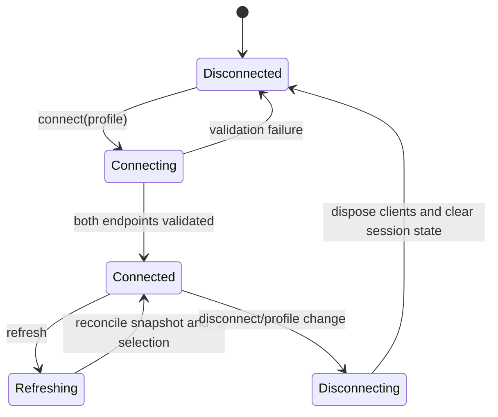

# Codebase Audit Remediation Implementation Plan

## Purpose

Resolve the correctness, specification-compliance, security, responsive-layout, and maintainability issues found in the 2026-07-09 codebase audit without weakening the emulator-first scope or the non-destructive DLQ policy.

This PLAN is the source of truth for `$implement-it`. Implement stages in order. Each stage must be completed, verified, reviewed by the mandatory plan-compliance and thermo-nuclear gates, marked complete, and committed before the next stage begins.

## Agreed Decisions

- The audit findings are implementation requirements, not optional suggestions.
- Mutation truthfulness is the first priority: a successful send, replay, or delete must never be reported as failed because a later refresh failed.
- Administration runtime properties are authoritative for entity totals. A peek page length is only a loaded-row count.
- Message caches are connection-scoped and must never survive disconnect/reconnect or profile changes.
- Global refresh preserves a still-existing selected entity and refreshes its visible message context.
- The existing MVP wireframe remains authoritative. `Copy Body` is implemented rather than removed from the MVP.
- DLQ replay remains non-destructive by default, and delete remains separately confirmed.
- Edited replay needs explicit keep/clear/set semantics; blank input must not silently restore an original value.
- The product remains emulator-first. Saved connection secrets still receive Windows-appropriate protection because the app accepts SDK connection strings.
- Existing uncommitted changes in `MainWindow.xaml` and `MainWindowSmokeTests.cs` are user work and form the baseline for the responsive inspector stage. Preserve their intent; do not revert them.
- Dashboard, active receive/complete, cloud identity, Event Hubs, Relay, Notification Hubs, and namespace import/export remain out of scope.

## Current State

- Build passes with zero compiler warnings.
- The default fast suite passes 71 tests.
- The launch-only WPF UI smoke test passes.
- Docker-backed integration and emulator-backed UI suites were not rerun during the audit because Docker was not running.
- `dotnet format --verify-no-changes` reports whitespace issues in `src/ServiceBusEmulatorExplorer.App/AssemblyInfo.cs`.
- `ShellViewModel.cs` is approximately 1,088 lines and `MessageInspectionViewModel.cs` approximately 1,071 lines.
- Current dirty worktree before this PLAN:
  - `src/ServiceBusEmulatorExplorer.App/MainWindow.xaml`
  - `tests/ServiceBusEmulatorExplorer.UiSmoke.Tests/MainWindowSmokeTests.cs`

## Intent Model

### Actors

- Developer/operator: connects to the local emulator, inspects entities/messages, sends messages, and performs explicit DLQ recovery/deletion.
- WPF shell: owns presentation and command availability, not SDK behavior or cross-session cache lifetime.
- Explorer session: owns the active profile identity, selected entity identity, authoritative entity snapshot, message pages, and cache lifetime.
- Administration service: supplies authoritative entity metadata and runtime counts.
- Message service: supplies message pages and performs sends.
- DLQ service: performs non-destructive replay and explicit deletion.
- Profile store: persists multiple named profiles atomically and protects secret material.

### Inputs And Outputs

| Input | Processing | Output | Failure behavior |
| --- | --- | --- | --- |
| Send/replay/delete command | Perform mutation, commit outcome, then refresh separately | Truthful primary outcome plus optional refresh warning | Never relabel a committed mutation as failed |
| Peek page | Load up to page size | Rows and next-page cursor | Does not alter authoritative totals |
| Global refresh | Load admin snapshot, reconcile selection, refresh visible page | Coherent tree/detail/message state | Preserve prior usable state when refresh fails |
| Disconnect/profile change | End explorer session | Empty selection, pages, cursors, and caches | No cached data can cross the boundary |
| Replay edits | Apply explicit field patches | New active message with intended body/properties | Keep, clear, and set are distinguishable |
| Profile save | Upsert named profile and atomically persist protected secrets | Reusable profile list | Existing file remains readable after interrupted save |

## Common Ground Diagrams

```mermaid
sequenceDiagram
    actor User
    participant VM as Message Workflow
    participant SDK as Message or DLQ Service
    participant Admin as Administration Service
    participant UI as WPF State

    User->>VM: Send / replay / delete
    VM->>SDK: Execute mutation with bounded token
    SDK-->>VM: Mutation committed
    VM->>UI: Publish success immediately
    VM->>Admin: Refresh counts and visible page
    alt refresh succeeds
        Admin-->>VM: Fresh snapshot/page
        VM->>UI: Reconcile visible state
    else refresh fails
        Admin-->>VM: Error
        VM->>UI: Keep mutation success; show refresh warning
    end
```



## Mock Template

The existing promoted wireframe at `specs/wpf-service-bus-emulator-explorer-mvpResources/ui-wireframe.html` is the authoritative UI template. Preserve its command placement and compact desktop workflow. The current dirty `MainWindow.xaml` inspector-tab change is an in-progress implementation baseline.

Responsive behavior added by this PLAN is contractual:

- At the declared minimum window size, tree, message list, inspector, action strip, and status/log regions remain reachable.
- A user-resized splitter cannot force either inspector subpane below a usable width and silently clip it.
- If horizontal side-by-side inspection cannot fit, switch to a deliberate stacked/compact layout rather than relying on incompatible `MinWidth` values.
- The connection status dot reflects disconnected/connecting/connected/error state; it is not always green.

## Target Architecture

- `ShellViewModel` remains top-level orchestration.
- A connection-scoped explorer-session component owns entity snapshots, selection reconciliation, and cache invalidation.
- A focused message-page component owns active/DLQ pages and cursors; page size never represents entity totals.
- A focused mutation workflow owns truthful outcome reporting and best-effort refresh.
- Replay editing uses an explicit patch contract instead of nullable fallback semantics.
- Profile selection/persistence is a dedicated workflow with an atomic, protected store.
- UI-only clipboard and responsive behavior stay in the App layer.

## Contracts And Conventions

### Mutation outcome

- Mutation completion is the commit point.
- Follow-up refresh has a separate error boundary and status message.
- A refresh failure after mutation success must produce wording equivalent to: `Operation succeeded, but refresh failed: ...`.
- Retrying refresh must not repeat the mutation.

### Count ownership

- `EntityRuntimeCounts` comes from administration runtime properties or a full authoritative refresh.
- Message page collections expose loaded rows only.
- Remove or redesign `MessageCountUpdate` so it cannot accept a page length as an entity total.
- Topic counts are derived from authoritative child subscription counts plus the topic's scheduled count rules, not from loaded pages.

### Session/cache ownership

- Selection identity is `EntityAddress`, not object reference.
- Disconnect, reconnect, profile switch, and entity deletion invalidate message pages, cursors, and caches.
- Refresh preserves selection only if the identity still exists and still matches the active filter.
- No cached page is displayed unless it belongs to the current connection session.

### Replay edits

- Optional scalar fields use an explicit patch state: keep original, clear, or set value.
- Editing one application property preserves the runtime types of untouched properties.
- Removing a property is explicit and testable.

### Profile persistence

- Load and display all named profiles.
- Save performs an upsert rather than replacing the entire list.
- Writes use a temporary file followed by atomic replacement.
- Saved secret material is protected for the current Windows user; plaintext legacy files are migrated once and rewritten protected.
- Both administration and runtime paths are validated before the UI reports connected.
- Active connection data is separated from editable draft fields; connection secrets are masked by default.

## Refactor Removal List

By the end of the PLAN, remove or replace:

- mutation plus refresh inside one `RunOperationAsync` failure boundary;
- page-length-to-runtime-count propagation;
- cross-session `_cachedMessages` ownership in the monolithic message view model;
- nullable replay values that conflate keep and clear;
- single-profile `FirstOrDefault`/`SaveAsync([profile])` behavior;
- always-green connection indicator;
- incompatible inspector `MinWidth` combinations;
- the disabled `Copy Body` placeholder;
- avoidable responsibilities that keep either production view model above 1,000 lines;
- known `dotnet format` whitespace violations.

## Stage 1: Truthful Message Mutation Outcomes

**Goal:** A committed send, replay, or DLQ delete is always reported as successful even when its follow-up refresh fails.

**Allowed files/modules:** `MessageInspectionViewModel`, message/DLQ workflow services if a focused abstraction is justified, app tests, and directly affected UI status text.

**Do not change:** DLQ replay/delete semantics, confirmation dialogs, entity count ownership, paging behavior, or XAML layout.

**Required sequence:** Add failing tests for each mutation-success/refresh-failure path; separate mutation and refresh failure boundaries; run focused and fast tests.

**Tests/proof:** Unit tests for send, replay, and delete where the mutation succeeds and peek throws; assert the success log remains primary, a refresh warning is visible, and no second mutation occurs.

**Stop conditions:** Stop if truthful reporting requires changing a core service's externally observable mutation semantics.

**Implementation prompt:** Implement Stage 1 only. Create failing tests first, preserve mutation commit points, implement separate best-effort refresh handling, run verification and both review gates, update this stage, commit, and stop.

- [x] Separate mutation execution from post-mutation refresh.
- [x] Preserve successful operation IDs/counts in status and log output.
- [x] Add refresh-warning state that does not overwrite mutation success.
- [x] Add regression tests for send, replay, and delete.

Stage 1 acceptance:

- [x] A failed post-send peek cannot produce `Send message failed` after the send completed.
- [x] A failed post-replay peek cannot produce `Replay DLQ message failed` after replay completed.
- [x] A failed post-delete peek cannot produce `Delete DLQ messages failed` after deletion completed.
- [x] Retrying refresh never repeats the mutation.

## Stage 2: Connection-Scoped Explorer State And Authoritative Counts

**Goal:** Counts, selection, visible pages, and caches remain coherent across peek, refresh, entity deletion, disconnect, reconnect, and profile change.

**Allowed files/modules:** shell/message view models, topic refresh workflow, administration abstractions, focused new session/page components, related unit/integration/UI smoke tests.

**Do not change:** paging page size, DLQ destructive rules, dashboard scope, or profile persistence format.

**Required sequence:** Add failing tests for page-count corruption, initial topic aggregation, selection-preserving refresh, deleted selection, and cache invalidation; introduce authoritative/session state; then wire UI.

**Tests/proof:** Unit tests with totals greater than 50; topic/subscription aggregation tests; disconnect/reconnect with same entity names; refresh preserving a selected entity and refreshing its visible page; one emulator integration proof when Docker is available.

**Stop conditions:** Stop if the emulator cannot provide required runtime counts; document the exact unavailable count instead of substituting page length.

**Implementation prompt:** Implement Stage 2 only. Start with failing state-integrity tests, make administration counts authoritative, scope caches to a connection session, preserve selection by identity, run relevant emulator proof when available, complete review gates, update this stage, commit, and stop.

- [ ] Remove page-length propagation into `EntityRuntimeCounts`.
- [ ] Aggregate topic counts from authoritative subscription counts.
- [ ] Preserve selected entity and visible message context on successful refresh.
- [ ] Clear or version all pages/cursors/caches at connection boundaries.
- [ ] Invalidate state when a selected entity is deleted or filtered out.

Stage 2 acceptance:

- [ ] Peeking 50 rows from an entity with more than 50 messages leaves its runtime total unchanged.
- [ ] Topic counts are correct immediately after entity-tree refresh.
- [ ] Global refresh preserves an existing selected entity and refreshes its visible page.
- [ ] No cached message from a prior profile/session can appear after reconnect.

## Stage 3: Wire And Test Copy Body

**Goal:** Satisfy the authoritative MVP wireframe's `Copy Body` workflow.

**Allowed files/modules:** app-layer clipboard abstraction/implementation, DI wiring, `MessageInspectionViewModel`, `MainWindow.xaml`, app tests, bounded UI smoke tests.

**Do not change:** message selection semantics, OS clipboard access in unit tests, or unrelated command layout.

**Required sequence:** Add fake clipboard and command-state tests; implement command; replace placeholder binding; add rendered enabled/disabled proof.

**Tests/proof:** Active, DLQ, subscription, empty selection, and empty body; UIA command state without depending on reading the real OS clipboard.

**Stop conditions:** Stop if UI automation requires physical input; use UI Automation invoke and fake clipboard evidence instead.

**Implementation prompt:** Implement Stage 3 only using the existing gap-analysis clipboard contract, add tests first, wire the command and tooltip states, run review gates, update this stage, commit, and stop.

- [ ] Add `IClipboardService` and WPF implementation.
- [ ] Add `CopyBodyCommand` and explanatory tooltip states.
- [ ] Replace the disabled XAML placeholder with the command binding.
- [ ] Add unit and UI smoke coverage.

Stage 3 acceptance:

- [ ] Copy Body works for active, DLQ, and subscription messages.
- [ ] It is disabled with a specific reason when no copyable body is selected.
- [ ] Exact body text is verified through a fake clipboard.

## Stage 4: Lossless Replay Editing

**Goal:** Edited replay can keep, clear, set, add, update, and remove properties without silently restoring values or converting untouched types.

**Allowed files/modules:** replay contracts/factory/mapper, replay dialog, focused core/app tests, integration test for edited replay.

**Do not change:** new `MessageId` policy, destination rules, original-DLQ preservation, or delete behavior.

**Required sequence:** Define the explicit patch contract; add mapper/dialog tests; implement UI conversion; run a live edited-replay proof when Docker is available.

**Tests/proof:** Clear each scalar field; keep each field; set new values; edit/remove one application property while preserving untouched integer/boolean/binary-supported types.

**Stop conditions:** Stop if a property type is unsupported by Azure SDK; surface a validation error rather than coercing it silently.

**Implementation prompt:** Implement Stage 4 only. Add failing replay patch tests, introduce explicit keep/clear/set semantics and typed property preservation, verify non-destructive replay, run review gates, update this stage, commit, and stop.

- [ ] Introduce an explicit replay field/property patch model.
- [ ] Make scalar clearing distinct from keeping the original.
- [ ] Preserve untouched application-property types.
- [ ] Add unit and integration coverage.

Stage 4 acceptance:

- [ ] Clearing Subject, ContentType, CorrelationId, or SessionId leaves the replayed value empty.
- [ ] Editing one property does not convert untouched typed properties to strings.
- [ ] The original message remains in DLQ.

## Stage 5: Complete And Harden Connection Profiles

**Goal:** Multiple named profiles are reusable, connection state is truthful, persistence is atomic/protected, and secrets are masked.

**Allowed files/modules:** connection profile contracts/store/validator/client factory, app profile workflow/view model/XAML, DI, migration tests, connection smoke/integration tests, README/spec notes directly affected.

**Do not change:** emulator default values, direct SDK architecture, or add cloud identity.

**Required sequence:** Add multiple-profile/upsert and interrupted-write tests; add protected versioned persistence with legacy migration; validate runtime and admin paths; then update UI selection/masking.

**Tests/proof:** Multiple profile round-trip, upsert without loss, atomic failure preservation, plaintext migration, wrong runtime/right admin rejection, active profile separated from draft, UI smoke for profile selection and masking.

**Stop conditions:** Stop before adding an unpinned dependency or if protected storage cannot be made backward-compatible; report the precise migration risk.

**Implementation prompt:** Implement Stage 5 only. Start with persistence and dual-endpoint validation tests, add atomic protected multi-profile storage and migration, wire profile selection/masking, run review gates, update this stage, commit, and stop.

- [ ] Load, select, upsert, and delete multiple named profiles.
- [ ] Use atomic file replacement and recover safely from interrupted writes.
- [ ] Protect saved secret material for the current Windows user and migrate plaintext files.
- [ ] Validate both runtime and administration connectivity before connected state.
- [ ] Separate active profile display from editable draft and mask secrets by default.

Stage 5 acceptance:

- [ ] Saving one profile does not erase another.
- [ ] A failed save cannot truncate the last valid profile file.
- [ ] An invalid runtime path cannot produce connected state when admin validation succeeds.
- [ ] Connection strings are not displayed or persisted as unprotected plaintext by default.

## Stage 6: Responsive Inspector And Accurate Connection Indicator

**Goal:** Preserve the current inspector-tab redesign while making it usable at minimum window size and making connection state visually accurate.

**Allowed files/modules:** `MainWindow.xaml`, minimal view-model presentation properties/converters, current UI smoke tests, layout-specific test helpers.

**Do not change:** wireframe command placement, desktop visual direction, message/action semantics, or revert the current dirty inspector work.

**Required sequence:** Capture minimum-size failure in UI smoke or measurable layout assertion; implement responsive constraints/stacking; add status-state styling; verify default and minimum sizes.

**Tests/proof:** Launch at default size and resize to `980x640`; verify message list, inspector tabs, property panes, action strip, and status remain reachable; verify disconnected indicator is not green and connected indicator is green.

**Stop conditions:** Stop if the only fix is raising minimum width above common 1080p usability; prefer a compact/stacked layout.

**Implementation prompt:** Implement Stage 6 only. Preserve the current inspector intent, add a failing minimum-size proof, remove incompatible minimum widths or add deliberate responsive stacking, bind status styling, run review gates, update this stage, commit, and stop.

- [ ] Reconcile outer and nested minimum widths.
- [ ] Add compact/stacked behavior where side-by-side panes cannot fit.
- [ ] Bind connection indicator color/state accurately.
- [ ] Extend UI smoke for default and minimum window sizes.

Stage 6 acceptance:

- [ ] No primary inspector or action control is clipped at `980x640`.
- [ ] Splitter resizing cannot make the Properties tab unusable.
- [ ] Disconnected, connected, and failure states are visually distinguishable and accessible.

## Stage 7: Decompose View Models And Enforce Quality Baseline

**Goal:** Remove the structural bottlenecks that caused cross-state bugs while preserving verified behavior.

**Allowed files/modules:** shell/message view models, focused extracted app components, DI, tests, `AssemblyInfo.cs`, repository formatting/analyzer configuration if needed.

**Do not change:** observable behavior established by Stages 1-6, core Service Bus semantics, or add speculative frameworks.

**Required sequence:** Characterize current behavior with tests; extract one responsibility at a time; keep invocation-order readability; run full fast suite after each extraction; finish with formatting verification.

**Tests/proof:** Existing and new unit suites remain green; launch smoke passes; `dotnet format --verify-no-changes` passes; no production view model remains above 1,000 lines; dependency surfaces shrink or are explicitly justified.

**Stop conditions:** Stop if extraction requires public API expansion without a concrete consumer, or if it merely moves the same conditionals without reducing state ownership.

**Implementation prompt:** Implement Stage 7 only. Add characterization tests, extract connection/session, page/cache, mutation, and presentation responsibilities with behavior preserved, remove obsolete helpers, run full verification and both review gates, update this stage, commit, and stop.

- [ ] Extract connection/session and selection reconciliation ownership from `ShellViewModel`.
- [ ] Extract page/cache and mutation workflow ownership from `MessageInspectionViewModel`.
- [ ] Remove obsolete branches/helpers rather than wrapping them.
- [ ] Fix `AssemblyInfo.cs` formatting and make format verification green.

Stage 7 acceptance:

- [ ] Neither production view model exceeds 1,000 lines.
- [ ] Extracted components have focused contracts and direct tests.
- [ ] No verified behavior from earlier stages regresses.
- [ ] Build, fast tests, UI launch smoke, and format verification pass.

## Test Strategy

- Fast unit/view-model tests remain the default loop and must pass after every stage.
- Each behavior stage begins with a failing regression test.
- Docker-backed integration tests are required when the stage depends on SDK runtime behavior; they remain explicitly gated.
- UI smoke tests cover rendered behavior only: command state, truthful status, profile selection/masking, responsive layout, and accessible status indication.
- Use UI Automation patterns, not physical mouse input.
- Run `git diff --check` and `dotnet format --verify-no-changes` before staging.

## Flow Traceability

| Audit requirement | Primary implementation area | Required proof | Stage |
| --- | --- | --- | --- |
| Truthful mutation outcomes | Message mutation workflow | Success plus refresh-failure tests | 1 |
| Page count must not overwrite totals | Session/count projection | >50-message unit/integration proof | 2 |
| Refresh preserves context | Session selection reconciliation | Refresh selection/page tests | 2 |
| No cross-session cache | Session/page store | Reconnect/profile-change tests | 2 |
| Copy Body | Clipboard service and command | Unit plus UIA state proof | 3 |
| Replay keep/clear/set and types | Replay patch contract | Mapper/dialog/integration tests | 4 |
| Multiple atomic protected profiles | Profile workflow/store | Persistence/migration/connection tests | 5 |
| Responsive inspector | WPF layout | Minimum-size UI smoke | 6 |
| Accurate status indicator | WPF state styling | Disconnected/connected UI smoke | 6 |
| Giant view-model decomposition | App architecture | Characterization tests and size check | 7 |
| Formatting baseline | Repository quality gate | `dotnet format --verify-no-changes` | 7 |

## Risks And Mitigations

- Mutation refresh separation can hide useful errors: retain a visible warning and retry-refresh path without changing the successful outcome.
- Count refresh adds administration calls: refresh once per coherent operation, not per row.
- Cache invalidation can remove convenient data: reload explicitly and show clear loading/empty states.
- DPAPI migration can make files user/machine-specific: version the format, keep a tested one-time plaintext migration, and never destroy the legacy file before successful replacement.
- WPF responsive behavior can destabilize UI automation: assert stable automation IDs and use layout-independent UIA patterns.
- Decomposition can become churn: require fewer responsibilities/branches, not file shuffling.

## Explicit Non-Goals

- Dashboard overview and auto-refresh.
- Active message receive/complete.
- Entra ID or cloud-first namespace exploration.
- Event Hubs, Relay, or Notification Hubs.
- Rule/filter CRUD.
- Namespace import/export.
- Changing replay into replay-and-delete.

## Implementation Order

1. Truthful message mutation outcomes.
2. Connection-scoped state and authoritative counts.
3. Copy Body.
4. Lossless replay editing.
5. Complete/harden profiles.
6. Responsive inspector and connection indicator.
7. View-model decomposition and quality baseline.

Do not parallelize stages that touch the same view-model or XAML state. Mandatory review gates may use subagents as required by `$implement-it`.

## Definition Of Done

- [ ] Every stage and stage acceptance item is checked only after implementation, verification, mandatory review gates, and commit.
- [ ] All audit findings are resolved or explicitly re-approved by the user with rationale.
- [ ] MVP spec/checklist claims match current implementation evidence.
- [ ] Fast tests, build, launch smoke, relevant gated integration/UI tests, `git diff --check`, and formatting verification pass.
- [ ] No unrelated user work, secrets, generated artifacts, or `Lessons/` content is committed.
- [ ] Final whole-feature proof confirms non-destructive replay, explicit DLQ deletion, truthful outcomes, authoritative counts, session isolation, multiple protected profiles, Copy Body, and minimum-size usability.
