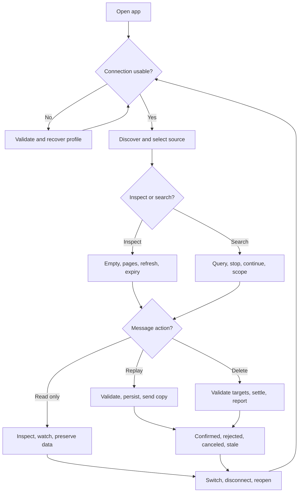

# Daily workflow integration audit — 2026-09-19

Requested outcome: add new executable cases for daily workflow branches and edge cases, run them, report failures, and stop without repairing production. The audited production revision is `7f0de3b605ed3be27e54d792b44a7080b937a1c0`.

## Scope and evidence levels

The audit adds 66 independently reported cases: 6 real WPF window journeys, 44 real-broker workspace cases (15 browse, 17 search/lifecycle, 12 mutation safety), and 16 broker/core operation cases. Broker operations use the actual SDK and production services. Workspace cases run on a WPF STA dispatcher, not a fake broker. Search and safety fixtures use an explicitly in-memory preferences store; browse and desktop fixtures use isolated protected files. A deliberate store-write failure is injected to test replay's persistence-before-send boundary.

Existing broker and four current-shell desktop journeys are supplementary regression evidence, not counted as newly added cases. Several assertions can expose the same underlying defect; failing cases are not the same as unique bugs.

The main runs use a separate Docker Compose project `sbe-daily-audit`, runtime port 5674 and administration port 5302, with the repository's pinned images. Fixtures use unique entity names and remove only their own entities. The user's demo emulator remains separate. An exploratory delegated operations run used the demo endpoint with its own unique fixtures; it is excluded from the final totals. Only coordinator-run result files listed below count.

## Decision tree

## Workflow branch matrix

| Workflow | New executable branches | Boundary |
| --- | --- | --- |
| Connect/profile lifecycle | Valid connection; empty source; malformed profile; recovery; dirty draft reject/approve; warning reject/approve; automatic connection on switch; disconnect/reconnect; restart | Local emulator and protected Windows-user profile; Azure credentials not tested |
| Browse | Queue/subscription/topic; empty/nonempty; queue and topic page boundaries; duplicate message IDs distinguished by source/sequence/bucket; source switching; repeated read does not consume | Actual SDK reads and production workspace |
| Refresh | External arrival; unchanged page; focus preserved; externally removed focused row marked unobserved; expired delivery after independent receive check; actual automatic timer | Real desktop cases supplement workspace cases |
| Counts | Active queue, subscription and topic; DLQ queue; visible active/DLQ summaries; direct admin-versus-peek discrepancy | Audit criterion: a known numeric total must not contradict observed messages; unavailable is acceptable. Existing tooltip caveats do not make literal zero an accurate total |
| Search | Exact message ID; shared correlation across queues/subscriptions; duplicate IDs; no match; invalid syntax; Stop during discovery; Continue; clear; OR/default message-ID mode; queue/topic/subscription scope | Local namespace scan; large-scale/cloud throttling not tested |
| Inspection | JSON; invalid JSON; Unicode; binary/Base64; body/content type/correlation preservation; scheduled due-time preservation | Real messages; no claim of exhaustive AMQP body-type coverage |
| Replay | Original retained; valid edited copy; invalid edit/discard; repeated IDs/attempts; concurrent requests; queue/topic fan-out; active rejection; stale generation; disconnected state; pre-cancel; failed reservation persistence | Confirmed-send and safe rejection branches; ambiguous remote send acknowledgement remains a gap |
| Delete | Active rejected; empty selection; pre-cancel; stale generation; selective DLQ target; vanished target; mixed confirmed/unavailable outcomes; neighboring active/DLQ preservation | Existing real-window typed confirmation journey also rerun; mid-settlement network loss remains a gap |
| Watch | Existing baseline silent; new active arrival once; new DLQ arrival; independent bucket | Existing desktop hidden-window/notification investigation journey rerun |
| Persistence | Preferences saved through workspace; protected isolated profile; selected queue and reconnect after actual close/reopen | Search/safety store is in-memory and must not be interpreted as a disk failure certification |

## Validity corrections before final counting

- Initial headless tests used arbitrary test threads and encountered AvalonEdit thread-affinity exceptions. The harness now uses a WPF STA dispatcher; those initial failures are excluded.
- Topic fixture setup independently waits for fan-out to both subscriptions before asserting the app's combined view. This prevents eventual broker delivery from masquerading as lost UI rows.
- Stop may occur during discovery before a scanned-count summary exists. The test treats that state as zero scanned and then verifies Continue advances.
- Peek can legitimately expose scheduled and expired messages. Tests distinguish diagnostic browsing from receive availability using [Microsoft's browsing semantics](https://learn.microsoft.com/en-us/azure/service-bus-messaging/message-browsing) and [expiration semantics](https://learn.microsoft.com/en-us/azure/service-bus-messaging/message-expiration).
- A new draft case uses a real DLQ message rather than programmatically editing an active read-only message. Clear-search tests do not manually reselect the scope they claim to verify.

## Coverage limits

This is a finite branch audit, not a proof of every possible decision-tree combination. The following remain unverified and must not be counted as passing integration cases:

- Azure CLI/RBAC roles, expired credentials, tenant/namespace permissions, cloud throttling and transient service failures.
- Network loss exactly during replay acknowledgement or DLQ settlement, lock expiry during a long operation, broker restart during an operation, incomplete discovery races, and persistence failure after a confirmed remote mutation.
- Very large namespaces, maximum-size/unsupported AMQP bodies, session-enabled entities, duplicate-detection-enabled entities, topic filter combinations and multi-user concurrency.
- Watch rule combinations while reconnecting, long-running notification retention, tray behavior over Windows sleep/resume, and repeated multi-hour operation.
- Full physical keyboard/screen-reader journeys, mixed DPI, all viewport combinations, and all modal confirmation-cancel combinations. The new desktop cases use the real window at 1100×800, but they do not certify every visual/accessibility state.

UI verification is not a full PASS while visible state contradicts the broker reads. No production repair is part of this audit.

## Results

**66 newly added cases executed: 58 passed, 8 failed, 0 skipped.** The [per-case results](daily-workflow-audit-2026-09-19-results.md) record every case, duration, assertion failure and local TRX evidence source.

| New suite | Cases | Passed | Failed |
| --- | ---: | ---: | ---: |
| Real WPF window journeys | 6 | 4 | 2 |
| Browse/refresh workspace | 15 | 11 | 4 |
| Search/profile lifecycle workspace | 17 | 17 | 0 |
| Mutation safety workspace | 12 | 12 | 0 |
| Broker/core operations | 16 | 14 | 2 |
| **Total** | **66** | **58** | **8** |

The eight failures represent two issue groups, not eight independent bugs:

1. **Count truthfulness: seven cases.** One direct provider check observes two messages through Peek while the emulator administration API reports zero. Four workspace checks reproduce numeric zero for queue active, queue DLQ, topic and subscription observations despite independently visible deliveries. Two real-window checks show a loaded active/DLQ delivery beside a zero total. The direct provider failure is an emulator discrepancy; presenting those totals as known numeric values is the application-level gap. Existing tooltip caveats are present but do not satisfy this audit's visible-count criterion.
2. **Scheduled-message inspection metadata: one case.** The SDK exposes a future `ScheduledEnqueueTime`, but the production message projection omits it from the inspector's system properties. An operator cannot inspect that due timestamp through the projected message data. The test separately confirms that the timestamp exists on the actual broker message, so this is not inferred from a missing fixture.

Supplementary evidence: all 15 existing broker integration cases and four existing current-shell desktop journeys passed. Combined unique executed scope is 85 cases: 77 passed and eight failed. The primary requested number is the 66 newly added cases above.

Final runs used `new-window.trx`, the unchanged 12 safety cases from `new-workflows.trx`, `workflows-final.trx`, and the new-case subset of `core-final.trx`. Earlier harness failures and the delegated exploratory run are excluded. Builds passed with zero warnings/errors after using isolated output directories to avoid the user's running executable locks.

UI verification verdict: **FAIL** for dependent count-state truthfulness, based on the actual WPF journeys. Geometry/accessibility across all supported viewports is **not certified by this functional audit**; the explicit coverage limits above remain. No production fixes were made, and the audit stops at these results.
