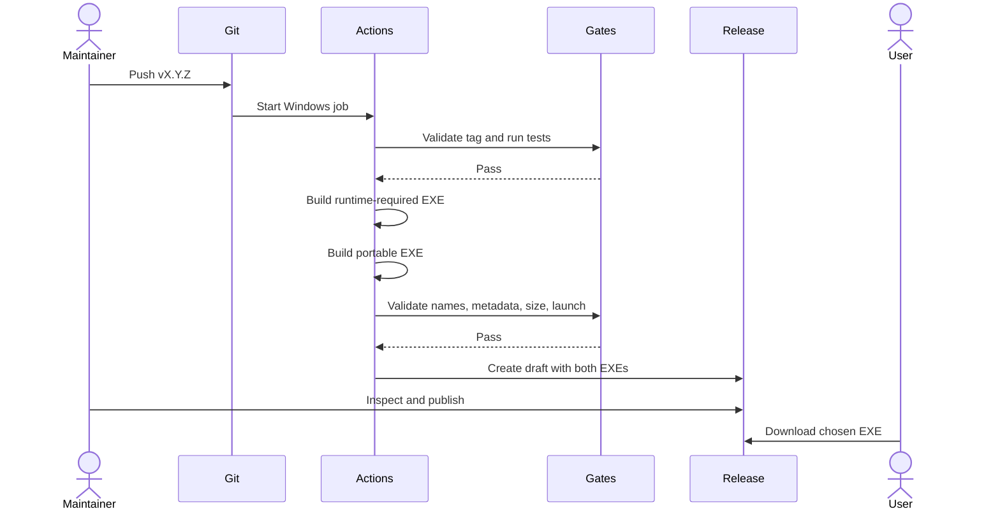
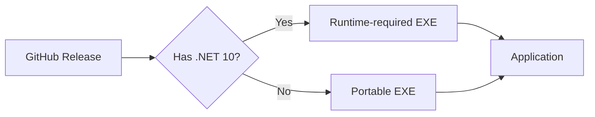

# GitHub Release Distribution Implementation Plan

## Purpose

Distribute Service Bus Emulator Explorer through GitHub Releases as two clearly named, single-file Windows executables:

1. a small framework-dependent executable for users who already have the .NET 10 Desktop Runtime;
2. a compressed, self-contained portable executable for users who do not want to install .NET.

Both variants target `win-x64`. A pushed semantic-version tag starts validation and creates a draft GitHub Release. The release remains unpublished until a maintainer inspects it and publishes it manually.

## Agreed Decisions

- [x] Publish both framework-dependent and self-contained variants.
- [x] Each downloadable application artifact is one `.exe` file.
- [x] Target `win-x64` only for the first release workflow.
- [x] Use tags shaped as `vX.Y.Z` to initiate a release.
- [x] Create a draft GitHub Release after automated verification; do not publish automatically.
- [x] Initial releases are unsigned.
- [x] Document the expected Windows SmartScreen warning.
- [x] Defer signing rather than blocking the first release.

## Current State

- The WPF application targets `net10.0-windows`.
- `scripts/Publish-Windows.ps1` publishes `win-x64`, self-contained, single-file output with native libraries embedded for extraction.
- The existing published executable is 135.46 MiB and unsigned.
- The existing self-contained build directory is 141.56 MiB excluding PDB files.
- The existing framework-dependent Debug payload is 4.38 MiB excluding PDB files. A Release single-file measurement is still required; 4–6 MiB is an inference, not a confirmed release size.
- ZIP compression reduced the existing self-contained executable to 56.95 MiB. This proves that the payload is compressible, but it does not establish the exact size produced by `.NET` single-file compression.
- WPF is not trim-compatible. `PublishTrimmed` must not be introduced as a size optimization.
- There is no `.github` workflow directory, no release automation, no Git tags, and no explicit product-version configuration.
- `scripts/Invoke-UiSmoke.ps1` already supports launching an alternate executable through `SBE_APP_EXE`, but process cleanup contains a hard-coded development executable name.
- `scripts/Invoke-ManualProof.ps1` calls `scripts/Publish-Windows.ps1` without arguments and expects `artifacts/publish/win-x64`; that behavior must remain working.

## Intent Model

### Actors

- **Maintainer:** chooses a version, pushes the release tag, inspects the generated draft, and publishes it manually.
- **GitHub Actions:** validates the tag, tests the repository, produces both executables, verifies them, and creates the draft release.
- **Runtime user:** downloads the smaller executable and supplies a compatible installed .NET Desktop Runtime.
- **Portable user:** downloads the larger executable containing its own runtime.

### Inputs

- A Git tag in the strict form `vMAJOR.MINOR.PATCH`, for example `v0.1.0`.
- The tagged repository commit.
- The .NET 10 SDK and `win-x64` runtime packs on a Windows GitHub-hosted runner.

### Outputs

For tag `v0.1.0`, the only public application assets are:

```text
ServiceBusEmulatorExplorer-v0.1.0-win-x64-requires-dotnet10.exe
ServiceBusEmulatorExplorer-v0.1.0-win-x64-portable.exe
```

PDBs, `.deps.json`, `.runtimeconfig.json`, DLLs, intermediate folders, and source archives generated automatically by GitHub are not additional application assets. GitHub's automatic source-code archives may still appear on the release page.

### State and Side Effects

- Build output is created only under ignored `artifacts/` paths.
- A successful workflow creates or updates a draft release associated with the already-pushed tag.
- The workflow never publishes the release publicly.
- A failed workflow leaves the Git tag in place but must not leave a partially populated public release.

### Failure Behavior

- Reject malformed tags before restoring or publishing.
- Stop before release creation if tests, either publish, artifact validation, metadata validation, or launch smoke fails.
- Build both assets before creating the draft so a failed second build cannot create a partial release.
- If draft creation or upload fails, report the exact failing asset and leave the release unpublished.
- Never silently fall back from portable to runtime-required output or vice versa.

## Common Ground Diagrams

### Release Sequence



### Distribution Choice



## Release Page Contract

This template is authoritative for asset naming and choice guidance. Version values are examples and must be replaced from the validated tag. It is not an application UI mock because this feature does not change application UI.

```markdown
## Choose a download

### Portable — recommended if you are unsure

`ServiceBusEmulatorExplorer-v0.1.0-win-x64-portable.exe`

- Includes the .NET runtime.
- No separate .NET installation is required.
- Larger download.

### Smaller download — .NET 10 required

`ServiceBusEmulatorExplorer-v0.1.0-win-x64-requires-dotnet10.exe`

- Requires the .NET 10 Desktop Runtime for Windows x64.
- If the application reports a missing framework, install the Desktop Runtime and retry.

## Windows security notice

This release is currently unsigned. Windows Defender SmartScreen may display an
unrecognized-app warning. Download releases only from this repository and verify
that the tag and release correspond to the version you intended to install.
```

The final text must include an official .NET 10 Desktop Runtime download link and must not claim that an unsigned executable is trusted or warning-free.

## Target Architecture

### Local publishing scripts

- Keep `scripts/Publish-Windows.ps1` as the low-level publisher.
- Add explicit deployment-mode support rather than duplicating the `dotnet publish` command in multiple scripts.
- Preserve its current no-argument behavior for `scripts/Invoke-ManualProof.ps1`: self-contained `win-x64` output under `artifacts/publish/win-x64`.
- Add a release orchestrator, `scripts/Publish-Release.ps1`, responsible for validating the version, invoking both modes, selecting only the executable from each output, assigning final asset names, and invoking artifact validation.
- Add a focused validator, `scripts/Test-ReleaseArtifacts.ps1`, that can fail independently and can be run both locally and in GitHub Actions.

### Publish modes

| Mode | Required publish properties | Result |
|---|---|---|
| Runtime-required | `RuntimeIdentifier=win-x64`, `SelfContained=false`, `PublishSingleFile=true` | Small single EXE requiring .NET 10 Desktop Runtime x64 |
| Portable | `RuntimeIdentifier=win-x64`, `SelfContained=true`, `PublishSingleFile=true`, `IncludeNativeLibrariesForSelfExtract=true`, `EnableCompressionInSingleFile=true` | Larger compressed single EXE with bundled runtime |

Do not enable `PublishTrimmed`, Native AOT, ReadyToRun, or globalization reduction as part of this work. ReadyToRun generally increases size, and WPF trimming is unsupported.

### GitHub workflow

- Add `.github/workflows/release.yml` targeting `windows-latest`.
- Trigger on pushed tags matching a broad `v*` filter, then enforce strict `^v\d+\.\d+\.\d+$` validation inside the job before any expensive work.
- Grant only `contents: write`; do not grant issue, pull-request, package, or identity-token permissions.
- Use official checkout and .NET setup actions pinned to reviewed full commit SHAs.
- Use the runner-provided GitHub CLI and `GITHUB_TOKEN` to create the draft release rather than introducing a third-party release action.
- Create the draft only after both assets and all verification steps exist locally.
- Upload exactly the two named executables.
- Generate release notes that begin with the release-page contract above, followed by generated change notes when feasible.

## Contracts and Conventions

### Version contract

- Tags are strict stable semantic versions: `vMAJOR.MINOR.PATCH`.
- Strip the leading `v` before passing the version to MSBuild.
- Set `Version`, `FileVersion`, and informational version metadata from the tag and commit SHA using MSBuild properties; do not edit a source file during CI.
- Artifact filenames retain the leading `v` from the tag.
- The file metadata of both executables must report the same semantic version as the tag.

### Artifact contract

- Exactly two release application assets exist.
- Both are PE executables for Windows x64.
- Neither requires adjacent application DLLs, JSON files, or native libraries.
- The portable executable launches on a clean Windows runner without relying on a separately installed Desktop Runtime.
- The runtime-required executable launches in the normal release runner environment where the .NET 10 Desktop Runtime is installed.
- The runtime-required executable must be smaller than the portable executable.
- Record exact sizes during the workflow.
- Initial size gates:
  - runtime-required executable: no more than 15 MiB;
  - portable executable: at least 30% smaller than the current 135.46 MiB baseline.
- If either gate fails, stop and inspect the bundle contents rather than weakening the threshold without evidence.

### Unsigned-release contract

- Initial releases intentionally have no Authenticode signature.
- Artifact validation reports signature status but does not fail because it is `NotSigned`.
- Release notes always disclose the unsigned status and possible SmartScreen warning.
- Adding signing later is a separate plan and must sign before upload without changing the two-asset contract.

### UI smoke contract

- Update `scripts/Invoke-UiSmoke.ps1` cleanup to derive the process name from `SBE_APP_EXE` rather than hard-coding `ServiceBusEmulatorExplorer.App`.
- Run the existing launch smoke once for each final renamed executable.
- Continue passing a per-test `--profile-store-path`; release verification must not write profiles to user-local AppData.
- Keep physical mouse input out of the smoke path.

## Shared Configuration

Use one source of truth in the release orchestrator for:

- product asset stem: `ServiceBusEmulatorExplorer`;
- RID: `win-x64`;
- framework label: `dotnet10`;
- version parsed from the tag;
- ignored working output: `artifacts/release/<tag>/`;
- final filenames.

The GitHub workflow should pass the validated tag/version into the script and should not rebuild filename rules in YAML.

## Stage 1: Deterministic Dual-Mode Local Publishing

**Goal:** Produce and verify both final release executables locally from one versioned command while preserving the existing manual-proof path.

**Dependencies:** None.

**Allowed files/modules:**

- `scripts/Publish-Windows.ps1`
- `scripts/Publish-Release.ps1` (new)
- `scripts/Test-ReleaseArtifacts.ps1` (new)
- `scripts/Invoke-UiSmoke.ps1`
- `src/ServiceBusEmulatorExplorer.App/ServiceBusEmulatorExplorer.App.csproj` only if build-time metadata defaults or single-file analysis settings must be declared there
- focused script/build tests if introduced

**Do not change:**

- application features, Service Bus behavior, profile format, or UI layout;
- `scripts/Invoke-ManualProof.ps1` expectations unless a compatibility test proves an equivalent preserved path;
- integration-test opt-in behavior;
- target framework or package versions;
- signing, ARM64, installers, MSIX, Store distribution, trimming, or auto-update behavior.

**Required sequence:**

1. Add a failing artifact-contract check that describes the two expected final filenames, version metadata, file count, size relationship, and companion-file prohibition.
2. Refactor the low-level publisher to accept explicit deployment mode and version while preserving current defaults.
3. Add the release orchestrator and make the contract check pass.
4. Update UI-smoke cleanup to support renamed release executables.
5. Run fast tests, publish both variants, validate artifacts, and launch-smoke both final files.
6. Rerun the existing no-argument publish path or manual-proof publish portion to prove backward compatibility.

**Tests/proof:**

```powershell
dotnet test ServiceBusEmulatorExplorer.slnx --filter "TestCategory!=Integration&TestCategory!=UiSmoke"
.\scripts\Publish-Release.ps1 -Version 0.1.0
.\scripts\Test-ReleaseArtifacts.ps1 -Version 0.1.0
$env:SBE_RUN_UI_TESTS = "true"
$env:SBE_APP_EXE = "<runtime-required-exe>"
.\scripts\Invoke-UiSmoke.ps1 -NoBuild
$env:SBE_APP_EXE = "<portable-exe>"
.\scripts\Invoke-UiSmoke.ps1 -NoBuild
.\scripts\Publish-Windows.ps1
```

All implementation commands must retain explicit bounded timeouts when executed by an agent or wrapper.

**Stop conditions:**

- Framework-dependent single-file output needs companion files to start.
- Portable compression causes launch or feature-smoke failure.
- Runtime-required output exceeds 15 MiB or is not smaller than portable output.
- Portable output is not at least 30% smaller than the 135.46 MiB baseline.
- Version metadata cannot be injected without editing tracked files during each release.
- The existing manual-proof publish contract breaks.

**Implementation prompt:** Implement Stage 1 only. Create the failing artifact-contract check first, preserve the existing manual-proof publish defaults, implement deterministic dual-mode publishing, run bounded fast tests and launch smoke against both final renamed executables, report exact sizes and startup observations, and stop if any stop condition is hit.

- [x] Add the failing artifact contract.
- [x] Parameterize the low-level Windows publisher without breaking its defaults.
- [x] Add the versioned dual-release publisher.
- [x] Add artifact validation and exact size reporting.
- [x] Make UI-smoke cleanup safe for renamed executables.
- [x] Prove both variants launch.
- [x] Prove the legacy manual publish path remains valid.

Stage 1 acceptance:

- [x] One bounded local command creates exactly the two agreed, correctly versioned EXEs.
- [x] The runtime-required EXE is no more than 15 MiB and smaller than portable.
- [x] Portable is at least 30% smaller than the current baseline.
- [x] Both final renamed EXEs pass the existing WPF launch smoke.
- [x] No application behavior or manual-proof regression is introduced.

## Stage 2: Tag-Driven Draft GitHub Release

**Goal:** Turn a pushed `vX.Y.Z` tag into a verified draft GitHub Release containing exactly the two Stage 1 artifacts and clear download guidance.

**Dependencies:** Stage 1 is complete with recorded local evidence.

**Allowed files/modules:**

- `.github/workflows/release.yml` (new)
- `.github/` release-note configuration or template files when needed
- `README.md`
- release scripts from Stage 1 only for CI portability fixes proven necessary on `windows-latest`

**Do not change:**

- Stage 1 artifact names or publish semantics without returning to Stage 1 validation;
- application code or UI behavior;
- GitHub repository settings automatically;
- public release state; the workflow creates drafts only;
- permissions beyond `contents: write`;
- signing, ARM64, installers, or automatic update delivery.

**Required sequence:**

1. Add the tag-triggered workflow with strict in-job tag validation and least-privilege permissions.
2. Pin official setup actions to reviewed full commit SHAs.
3. Restore and run the fast test suite.
4. Invoke the Stage 1 release publisher and validator rather than duplicating publish arguments in YAML.
5. Run launch smoke for both final assets on the Windows runner.
6. Create the draft release only after every gate passes, then upload exactly both executables.
7. Update README packaging guidance with the two download choices, tag workflow, runtime prerequisite, unsigned warning, and manual draft-publication step.
8. Exercise the workflow with a disposable pre-release repository/tag strategy or a real first tag only after reviewing the workflow diff. Do not push or create a release without explicit user authorization during implementation.

**Tests/proof:**

- Validate workflow syntax before pushing.
- Run the local Stage 1 commands again after workflow integration.
- Use GitHub Actions logs to prove strict tag parsing, fast tests, two publishes, two artifact validations, and two launch smokes.
- Inspect the resulting draft release:
  - correct tag and title;
  - exactly two application assets with exact agreed names;
  - clear portable versus runtime-required guidance;
  - official Desktop Runtime link;
  - unsigned/SmartScreen notice;
  - no public publication.
- Download both assets from the draft and compare sizes and hashes with the workflow outputs when draft asset download permissions permit it.

**Stop conditions:**

- Any workflow step requires a long-lived personal access token instead of `GITHUB_TOKEN`.
- A third-party release action is required despite the runner-provided GitHub CLI.
- The workflow creates the release before both assets pass validation.
- The workflow publishes rather than drafts the release.
- GitHub-hosted runner launch smoke is blocked by the desktop session; preserve build validation and move only the UI launch proof to a documented, explicit manual gate rather than claiming it passed.
- A real tag push or release mutation lacks explicit user authorization.

**Implementation prompt:** Implement Stage 2 only after Stage 1 is complete. Add a least-privilege tag-triggered Windows workflow that calls the tested release scripts, creates a draft only after all gates pass, uploads exactly the two agreed assets, updates user documentation, validate locally, and stop before pushing a real tag or creating a GitHub release unless the user explicitly authorizes it.

- [ ] Add and validate the least-privilege release workflow.
- [x] Pin official workflow actions to reviewed immutable revisions.
- [x] Reuse Stage 1 publishing and validation scripts.
- [x] Gate release creation behind tests and both launch proofs.
- [x] Create a draft release with exactly two application assets.
- [x] Add download-choice and unsigned-release documentation.
- [ ] Verify the draft end to end with explicit authorization.

Stage 2 acceptance:

- [ ] Pushing a valid authorized `vX.Y.Z` tag produces a draft, never an automatic public release.
- [ ] A malformed tag or failed gate creates no release assets.
- [ ] The draft contains exactly the two agreed executables and accurate guidance.
- [ ] Workflow permissions are limited to repository contents.
- [ ] README and release notes explain runtime requirements and SmartScreen behavior.

## Test Strategy

### Fast regression tests

Run the repository's default non-integration, non-UI suite before publishing. Packaging changes must not change application behavior.

### Artifact contract tests

Treat filenames, count, version metadata, architecture, signature status, size bounds, and absence of required companion files as observable release behavior. The validator must return a nonzero exit code on any violation.

### Launch smoke

Run the existing default WPF launch smoke against each final renamed artifact, not against an intermediate development executable. This is the minimum proof that bundling, renaming, extraction, XAML resources, dependency injection, and shell startup survived publishing.

### Manual draft inspection

Automatic checks cannot prove that download guidance is understandable or that the GitHub draft is not accidentally public. The maintainer must inspect both before clicking **Publish release**.

## Flow Traceability

| Flow step | Planned location | Proof |
|---|---|---|
| Parse `vX.Y.Z` | `.github/workflows/release.yml`, `scripts/Publish-Release.ps1` | malformed-tag and version-metadata checks |
| Build runtime-required EXE | `scripts/Publish-Windows.ps1` | artifact validator and WPF launch smoke |
| Build portable EXE | `scripts/Publish-Windows.ps1` | compression size gate and WPF launch smoke |
| Assign public names | `scripts/Publish-Release.ps1` | exact-name and exact-count checks |
| Preserve manual proof | `scripts/Publish-Windows.ps1` | existing no-argument publish proof |
| Create draft | `.github/workflows/release.yml` | GitHub run and draft inspection |
| Explain user choice | release-note template/configuration, `README.md` | rendered draft and documentation review |
| Publish publicly | maintainer action in GitHub | explicitly outside workflow automation |

## Risks and Mitigations

- **Missing .NET runtime:** Clearly label the small asset and link the official .NET 10 Desktop Runtime x64 installer.
- **SmartScreen warnings:** Disclose unsigned status; never imply that GitHub hosting removes Windows warnings.
- **Compression startup cost:** Record launch-smoke duration for both variants and report a material regression rather than hiding it.
- **WPF trimming failures:** Explicitly prohibit `PublishTrimmed`.
- **Tag exists after failure:** Make reruns idempotent for the same draft/tag while refusing to overwrite a published release.
- **Partial releases:** Build and validate both assets before draft creation.
- **Mutable workflow dependencies:** Pin official actions to reviewed commit SHAs.
- **Hard-coded executable process name:** Derive cleanup identity from the configured release executable.
- **Version drift:** Derive all metadata and filenames from one validated tag value.
- **Unexpected size growth:** Fail the size contract and inspect output composition before changing limits.

## Explicit Non-Goals

- Authenticode or Artifact Signing integration.
- Avoiding every SmartScreen prompt.
- ARM64 or x86 artifacts.
- MSI, MSIX, ClickOnce, Microsoft Store, package-manager, or auto-update distribution.
- Native AOT, trimming, ReadyToRun, or framework migration.
- Automatic publication of a GitHub Release.
- Automatic creation or pushing of a release tag.
- Publishing integration-test infrastructure, Docker images, PDBs, or source bundles as application assets.

## Implementation Order

1. Implement Stage 1 and record exact artifact sizes and launch evidence.
2. Review whether the initial size gates are met without unsafe optimization.
3. Implement Stage 2 using only the verified Stage 1 command surface.
4. Review the workflow and documentation locally.
5. With explicit authorization, push the first tag and inspect the resulting draft.
6. Publish the draft manually only when both downloads and release notes are correct.

## Definition of Done

- [x] Local release publishing deterministically produces exactly two single-file `win-x64` executables.
- [x] Runtime-required and portable assets satisfy their documented dependency models.
- [x] Both final renamed assets pass artifact validation and WPF launch smoke.
- [x] The existing manual-proof publish path remains working.
- [ ] A valid authorized semantic tag creates a draft GitHub Release only after all gates pass.
- [ ] The draft has exactly two application assets and accurate choice guidance.
- [x] Version metadata and filenames match the tag.
- [x] Initial unsigned status and SmartScreen risk are documented.
- [x] No ARM64, signing, installer, trimming, or auto-publication scope was added.
- [ ] Relevant tests, workflow logs, exact sizes, unverified items, and residual risks are reported before publication.
