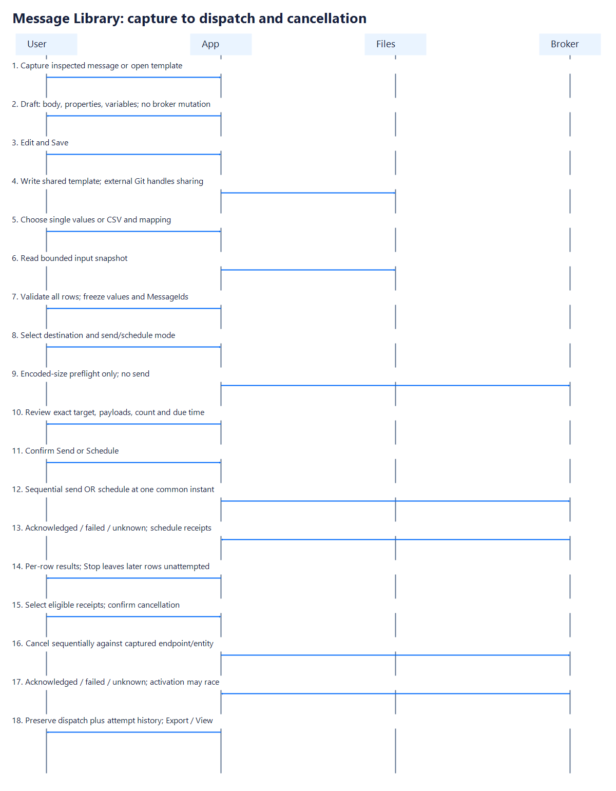
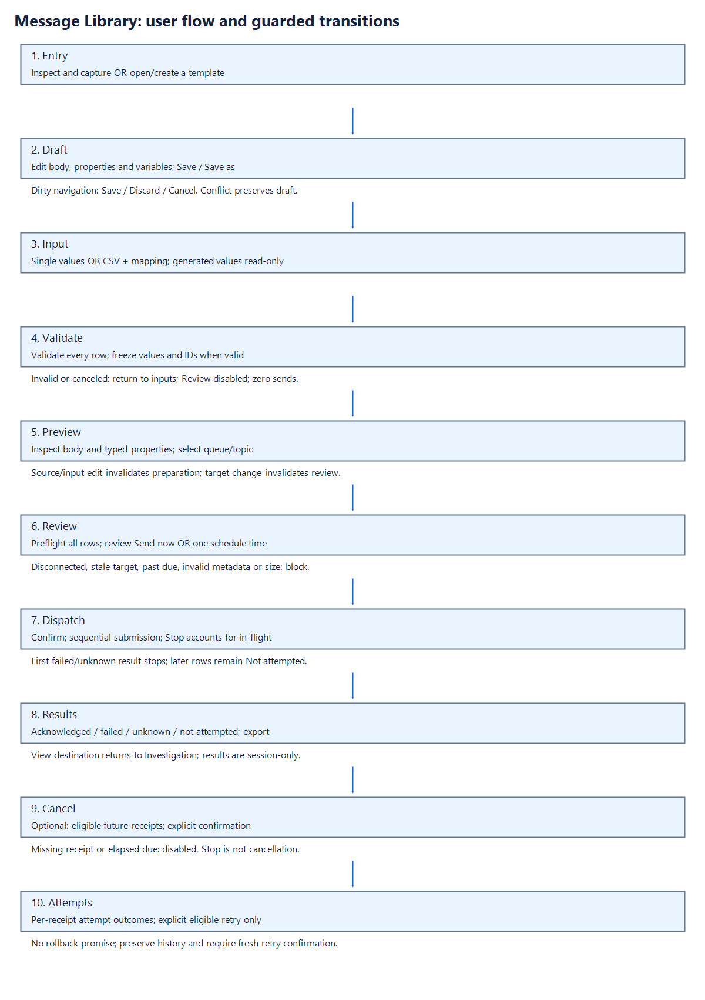
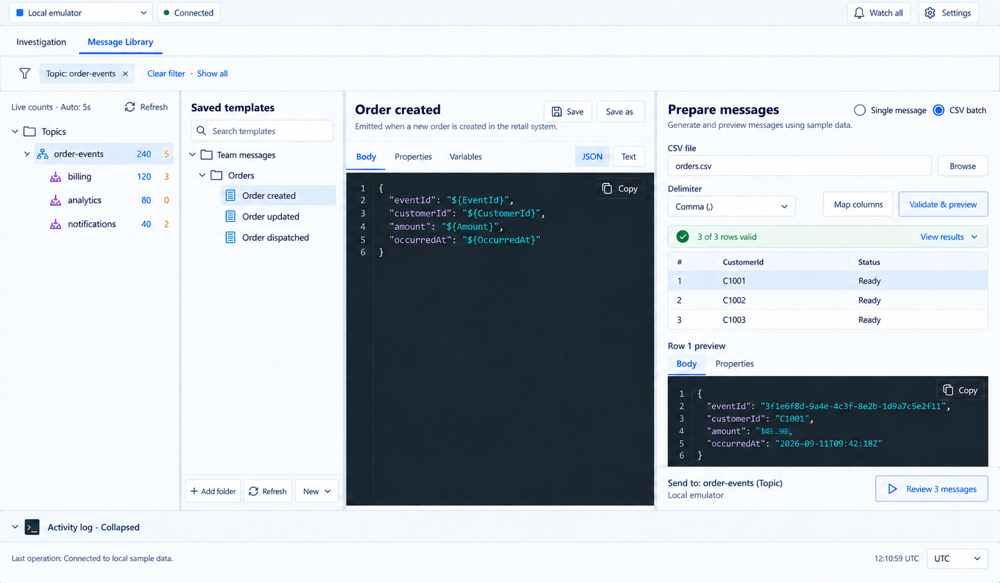

# Message Library implementation plan

Status: product direction agreed; original specification and six-capability extension independently reviewed. Ready for a separately requested implementation stage. Implementation has not started.

Prepared 2026-09-19 against `82435a7`. Recheck the checkout before each stage: another task is actively changing the repository. This plan authorizes no release, legacy-shell removal, or unrelated cleanup.

## Start here

Implement exactly one requested stage. Read the shared contracts below and that stage's control block. Establish red evidence, implement the vertical slice, obtain independent plan-compliance and quality review, and exercise the actual production UI before claiming completion. The coordinator owns shared contracts, shell integration, runtime leases and commits. Use named Luna specialist roles, at most three concurrent specialists, with non-overlapping ownership. See the execution protocol at the end.

This feature targets the **new Investigation application**. `App.xaml.cs` starts `InvestigationWindow`. The old `MainWindow`, `ShellViewModel`, `MessageInspectionViewModel` and `SendMessageDialog` are historical implementations, not integration targets. Their removal belongs to a separate task.

## Agreed product decisions

1. A Postman-style message library stores reusable messages in local folders, including folders inside Git checkouts. Users clone, pull, commit and push externally. Multiple roots appear in the library tree. Git itself is not required.
2. Templates contain a body, reusable message properties and optional queue/topic associations. Associations contain entity kind/path only; connection profiles and fully qualified send destinations remain local. Follow the [topic context amendment](message-library/topic-context.md).
3. An inspected Active or DLQ message can be saved as a template. This does not settle, consume, replay or delete the source message.
4. One CSV data record creates one message. Validate the whole input before enabling review/send; do not skip invalid records.
5. Support named `$(Name)` placeholders, explicit types, defaults, generated GUIDs and generated UTC timestamps. No scripting engine, loops or conditions.
6. Use a **dedicated Message Library workspace in the existing window**. Investigation and Message Library share the connection selector. Preserve drafts/selections when switching workspaces. Library authoring works offline.
7. The bridge is Inspect → Save as template → choose root/folder/name → open library; template → single values or CSV → preview → destination → review/send → View destination.
8. Support Send now / Schedule for later with **one scheduled instant for the whole run**, including CSV batches. No per-row CSV schedule.
9. Include all six approved audit additions: TTL, optional custom MessageId, ReplyTo/ReplyToSessionId, explicit scheduled-message cancellation, richer scalar application-property types and advanced PartitionKey. Their authoritative detailed contracts are in [properties and cancellation](message-library/message-properties-and-cancellation.md). Read that document for every stage. Binary templates, raw AMQP editing, native multi-message sending and transactions remain separately deferred.
10. Keep the namespace sidebar beside the original library/editor/prepare panes. Topic selection filters both trees; template selection applies its associations in reverse. Hide unrelated branches; Clear filter restores both without discarding drafts. Infer a single valid destination and show read-only Send to; use a picker only when a choice is needed. The topic context amendment defines R18.
11. Implement the **five explicitly approved boards pixel-perfect**, under the [visual acceptance contract](message-library/design/README.md). Discarded compact images and earlier layouts are not design authority.

The engineering defaults below make these choices implementable. They are specifications, not claims that the user individually selected every threshold or wire-format detail. A change to these contracts during implementation requires a coordinator decision.

## Current evidence and lessons

| Evidence | Implication for this feature |
|---|---|
| [Production startup](../src/ServiceBusEmulatorExplorer.App/App.xaml.cs), [workspace](../src/ServiceBusEmulatorExplorer.App/Investigation/InvestigationWorkspace.cs) | Integrate with the current window and connection generation; do not implement a feature only reachable in the legacy shell. |
| [Existing send contracts](../src/ServiceBusEmulatorExplorer.Core/ServiceBus/ServiceBusContracts.cs), [mapper](../src/ServiceBusEmulatorExplorer.Core/ServiceBus/SendMessageRequestMapper.cs) | Reuse `EntityAddress` and SDK conventions. Existing send has no explicit MessageId and trims some values; it cannot silently become the exact-preview transport. |
| [Replay sender](../src/ServiceBusEmulatorExplorer.Core/ServiceBus/ReplayCopySender.cs) | A dedicated client with zero automatic retries is an established local pattern. Preserve acknowledged sends when disposal fails. |
| [Delivery identity](../src/ServiceBusEmulatorExplorer.Core/Investigation/MessageDelivery.cs) | Source identity includes connection generation, source, bucket and sequence. Saving a snapshot is different from sending to its source. |
| [Preferences](../src/ServiceBusEmulatorExplorer.Core/Investigation/WorkspacePreferences.cs), [protected store](../src/ServiceBusEmulatorExplorer.App/Investigation/Settings/ProtectedWorkspacePreferencesStore.cs) | Add local root registrations through the existing serialized save path; never put secrets or machine paths in shared templates. The store has explicit envelope mapping, so adding a model property alone is insufficient. |
| [Prior implementation checkpoints](investigation-workspace-handoff.md) | Reviews found missing production resources masked by fixture injection, stale selections, connection-generation races and UIA toggle behavior missed by Click-only handlers. Require production resource loading and real routed-state tests. |
| [Daily audit and fixes](daily-workflow-audit-remediation-2026-09-19.md) | Broker counters and UIA rich-text extraction are not reliable substitutes for observing actual messages and rendered content. Separate unit, render, executable and broker proof. |

These are observed project outcomes, not a controlled benchmark of Luna. Bounded domain modules, explicit contracts and focused proofs worked well in prior milestones; integration/state and visual gaps required coordinator/reviewer intervention. This plan provides those boundaries and proof obligations in advance.

## Technology decisions

| Component | Choice | Implementation rule |
|---|---|---|
| Runtime/UI | Existing .NET 10 / `net10.0-windows`, WPF | No web view, web server or additional UI framework. |
| MVVM / DI | Existing CommunityToolkit.Mvvm 8.4.2 / Microsoft.Extensions.DependencyInjection 10.0.9 | Focused feature view models, injected I/O and time seams; shell only coordinates. |
| Editor | Existing AvalonEdit 6.3.1.120 | Reuse syntax resources, wrap, keyboard/accessibility conventions; no custom text editor. |
| JSON | Framework `System.Text.Json`, `JsonNode`, `Utf8JsonWriter` | Parse/traverse JSON values; never construct JSON by raw textual substitution. |
| CSV | **CsvHelper 33.1.0**, exact version in Core csproj | One new dependency. Forward reading with explicit options and hard limits; no `Split(',')`. |
| Broker | Existing Azure.Messaging.ServiceBus 7.20.1 / Azure.Identity 1.13.2 | Dedicated library-run sender, same approved auth choices; no upgrade required. |
| Tests | Existing xUnit 2.9.3, test SDK 17.14.1, FlaUI 5.0.0 | Existing STA/nonparallel WPF collection and UIA3 runner; real emulator tests remain opt-in. |
| Persistence | UTF-8 JSON files and BCL filesystem APIs | No database, LibGit2Sharp, watcher service, scripting/template engine or cloud sync. |

Primary references verified during planning: [CsvHelper package/version](https://www.nuget.org/packages/CsvHelper/33.1.0), [CsvHelper reading/culture behavior](https://joshclose.github.io/CsvHelper/getting-started/), [mutable JSON DOM](https://learn.microsoft.com/en-us/dotnet/standard/serialization/system-text-json/use-dom), [SDK send API](https://learn.microsoft.com/en-us/dotnet/api/azure.messaging.servicebus.servicebussender.sendmessageasync?view=azure-dotnet). Pin the chosen version, verify restore in Stage 3, and stop for a dependency decision if it cannot be restored. Do not substitute a handwritten CSV parser.

## Intent model and flow

Actors: author, teammate, local filesystem/Git client, app, broker. Shared artifacts are templates; root registrations, connection credentials, input CSV paths and execution results are local. CSV files are user inputs and are not copied into shared repositories automatically.





The PNG diagrams render without Mermaid support. Editable [sequence source](message-library/design/message-sequence.mmd) and [flow source](message-library/design/message-flow.mmd) are generated alongside the images by the documentation-only [renderer](message-library/design/render-diagrams.ps1). Regenerate both formats together when the flow changes. Mermaid source can also be pasted into the repository's [offline viewer](mermaid-viewer/mermaid-offline-viewer.html). The flow's cancellation tail is optional and available only for eligible acknowledged schedules.

No broker mutation occurs during capture, editing, validation or preview. Broker preflight may create an SDK sender/batch to check encoded size, but does not send. A completed validation is not a guarantee of authorization, quota or broker availability at send time.

## UI contract and mock

Read the [approved five-board visual contract](message-library/design/README.md) and [topic context amendment](message-library/topic-context.md) before any UI stage. Only those five boards are approved. The prior seven-board set, compact mockups and alternative layouts are superseded. The [new prototype preview](../tools/ServiceBusEmulatorExplorer.InvestigationPrototype/preview.png) and [UI language](ui-language.md) retain authority for existing chrome/tokens.




**Pixel-perfect fidelity is mandatory**, not an illustrative aspiration. Match the approved composition and app tokens; verify real WPF captures with side-by-side/overlay comparisons and repair discrepancies before completion. Only the visual contract's explicit generated-text, runtime-data and production-resource corrections are exceptions. No rendered implementation PASS is claimed by these images.

- Keep connection/profile controls above two tabs: Investigation and Message Library. Retain Watch/Settings behavior. Switching tabs does not disconnect, reset browsing, stop Watch or discard either workspace's drafts.
- Persistent far-left namespace pane retains broker tree/counts/refresh. Beside it, the separate library pane has Add folder, Refresh libraries, search and roots → directories → templates. Search is local name/description matching. One shared topic filter prunes both projections under R18, retaining matching ancestors/subscriptions; no broker counts appear in the library tree.
- Authoring pane: name/description, Save, Save as; Body/Properties/Variables tabs. Variables live in the Variables tab to preserve useful editor height at compact sizes. New template and New folder are available in the library toolbar/context menu. Rename/delete/move can remain external in version 1; Refresh reconciles them.
- Preview pane: Single message / CSV batch; inputs; Validate/Preview; per-row status; selected body/properties; read-only Send to for one resolved target, otherwise a destination picker; Review N messages. Virtualize rows and show only the selected JSON document.
- Review displays profile, namespace, exact queue/topic, count, size and topic fan-out. Send is explicit. Selecting a subscription resolves context to its visibly labeled parent topic under R18; a subscription address is never accepted as the SDK send destination.
- Properties and review include ID mode, TTL, reply fields, advanced PartitionKey and the complete scalar type selector, with validation and automation IDs from the linked extension contract. Results expose Cancel scheduled messages for eligible retained receipts, distinct from Stop and DLQ deletion.
- Send state replaces review actions with progress and Stop. Results show `Confirmed sent`, `Confirmed scheduled`, `Failed`, `Outcome unknown`, `Not attempted`, with row number and MessageId. No automatic retry or misleading rollback label. View destination opens queue Active browsing or the existing combined topic view; it does not promise immediate visibility or delivery to every subscription. A scheduled receipt is not evidence of activation or consumption; show its due time and receipt separately.
- On one focused inspected message, show Save as template. It opens a draft and root/folder/name selection; no file is written until Save. The capture dialog defaults to original observed body. If an edited inspector draft exists, offer explicit Original / Edited choices and show the selected body. Saving a library template never clears the inspector draft.
- Switching workspaces preserves session-only drafts. Selecting another template, removing a root containing the current draft, or closing the app with an unsaved template offers Save / Discard / Cancel. Failed Save preserves the draft. Close-to-tray preserves it without prompting as the process remains alive.
- Roots and saved templates work disconnected. Profile changes retain template/input drafts, clear the chosen destination and invalidate review authorization; reuse the app's existing connection-warning behavior. While sending, profile changes require Stop and completion of in-flight accounting before the connection changes.
- Empty library, unavailable root, loading, malformed template, read-only folder, save conflict, invalid CSV, canceled validation, disconnected destination and partial send each have distinct actionable states. Invalid files must not hide healthy siblings.
- Stable automation IDs: `WorkspaceTabs`, `MessageLibraryTab`, `LibraryTree`, `LibraryAddFolder`, `LibraryRefresh`, `TemplateName`, `TemplateSave`, `TemplateBodyEditor`, `TemplateProperties`, `TemplateVariables`, `TemplateInputMode`, `TemplateCsvPath`, `TemplateValidate`, `TemplatePreviewRows`, `TemplateDestination`, `TemplateReview`, `TemplateConfirmSend`, `TemplateStop`, `TemplateRunResults`, `TemplateViewDestination`, `InspectorSaveTemplate`. Scope repeated controls under their owning view/dialog.
- The approved wide layout has four resizable panes: namespaces, saved templates, author, prepare/preview. Verify 1500×1000, 1100×800 and 980×640 with both trees retained and reachable actions, no outer horizontal clipping. No compact mockup was approved; establish an approved responsive reference before completing a rearranged compact viewport. Preserve themes/focus/icons and expanded/collapsed log.

## Shared files and schema v1

A root is any user-selected local directory. Only recursive `*.sbetemplate.json` files are indexed. Directory structure is the collection structure; there is no manifest to keep synchronized. Skip `.git`, hidden/system directories and all reparse-point entries, including junctions/symlinks. Reject a selected root that is itself a reparse point. Do not execute files, resolve includes, fetch URLs or expand environment variables from template content.

Use relative paths for template identity within a root; local root identity is a generated registration ID and canonical absolute path. Same template IDs in different roots are valid; duplicate IDs within a root produce an error on both files. Windows canonical path comparison is ordinal-ignore-case. Registering the same root twice focuses its existing entry. Reject overlapping registered roots with a clear explanation; this avoids duplicate scanning and ambiguous saves.

The runnable examples are [template](message-library/examples/order-created.sbetemplate.json) and [CSV](message-library/examples/orders.csv). Files are intended to be copied together for a smoke test. New library folders/files are only created by explicit user actions.

```json
{
  "schemaVersion": 1,
  "id": "b8c93fc3-58a4-458d-aa15-a477898dc53f",
  "name": "Order created",
  "description": "Create one order event per input row.",
  "body": {
    "format": "json",
    "source": "{\n  \"eventId\": \"$(EventId)\",\n  \"customerId\": \"$(CustomerId)\",\n  \"amount\": \"$(Amount)\",\n  \"occurredAt\": \"$(OccurredAt)\"\n}"
  },
  "properties": {
    "contentType": "application/json",
    "subject": "OrderCreated",
    "correlationId": "order-$(CustomerId)",
    "sessionId": null,
    "applicationProperties": {
      "source": { "type": "string", "source": "message-library" }
    }
  },
  "variables": [
    { "name": "CustomerId", "type": "string", "source": "input" },
    { "name": "Amount", "type": "number", "source": "input" },
    { "name": "EventId", "type": "string", "source": "guid" },
    { "name": "OccurredAt", "type": "string", "source": "utcNow" }
  ]
}
```

Schema rules:

- Optional `associations` follows the topic context amendment: at most 32 literal queue/topic kind/path hints, no endpoint/profile/credentials; omitted means empty and older templates remain valid. These are not SDK destination addresses.

- Required: schemaVersion=1, canonical GUID id, nonblank name (max 120 characters), body, properties, variables (may be empty). Description optional, max 2,000 characters. Unknown schema versions and unknown members are errors, never silently discarded on save. Reject duplicate JSON object keys at any depth before deserializing; reject duplicate variable names. Case-sensitive wire members and enum values. Max JSON depth 64.
- `body.format`: `json` or `text`. `body.source` is the editable text; persist its exact characters through JSON string encoding. Format=json source must be valid JSON with placeholders inside string values. Do not auto-convert malformed JSON to text. Format=text permits any valid UTF-8 text, including empty text; the user explicitly chooses text mode.
- Properties: optional nullable string fields `contentType`, `subject`, `correlationId`, `sessionId`, `replyTo`, `replyToSessionId`, `partitionKey`; optional `messageId` mode/source and `timeToLive` source descriptors follow the extension contract. applicationProperties is an object keyed by exact nonempty names. Omit unset fields in SDK mapping; preserve intentional whitespace rather than using legacy trimming. Blank sessionId is unset and invalid for a session-required destination. Explicit SessionId/PartitionKey conflicts fail before SDK mapping.
- Application property descriptor: `type` is one of the explicit scalar tags in the linked extension; `source` is a text expression. String supports interpolation; other types accept a literal or one token and parse invariantly under type-specific rules. Preserve declared CLR widths/precision. Null, arrays, objects, streams and binary application-property values remain unsupported. Names are literals, never templates.
- Variable descriptor: name matches `[A-Za-z_][A-Za-z0-9_]{0,63}`; type is `string`, `number`, `boolean` or `json`; source is `input`, `guid` or `utcNow`. Only input may have `default`, represented as a JSON value of the declared type. A missing default means required. Generated variables must be type=string and cannot have a default. Name uniqueness is ordinal/case-sensitive.
- JSON-valued defaults may be null; string/number/boolean defaults may not. Empty string is a valid string default. Explicit JSON null is distinct from missing input.
- No actual send destination, profile, absolute scheduled time, credentials, machine file paths or broker observation metadata in the template schema. Relative TTL and application reply metadata are allowed. GUID id identifies the template; transport MessageId is generated by default or deliberately authored in Custom mode. Capture never silently reuses the observed MessageId. Date/time application-property values are application data, not automatic broker timestamps.
- Save with UTF-8 without BOM, LF endings for the envelope, two-space indentation and a trailing newline. Preserve body.source text; do not rewrite it merely on load/refresh. Stable property order as shown; variables preserve display order; application property keys serialize ordinally. No update timestamps or machine-specific fields, keeping Git diffs useful.

### File safety, refresh and local state

`LibraryFileStore` owns filesystem access; its **source code** lives beneath App `MessageLibrary/Storage/`. Template data remains in arbitrary user-selected registered directories, including external Git checkouts, never implicitly relocated into app storage. Only root-registration metadata lives in the user's app preferences; atomic-save temporary files live beside their target template and are cleaned afterward. Core receives streams/text/DTOs, not machine paths. Read only recognized files under explicit roots. All save paths are built from a registered root and validated relative segments, never from template name alone. Reject rooted paths, `..`, device names, alternate-data-stream colons, invalid characters and reparse-point ancestors. User-facing names and filenames are separate; suggest a sanitized filename and show it before Save as.

Use same-directory temporary files and atomic replacement on existing files; CreateNew/no-overwrite for new targets. Flush and clean owned temp files after failure. Keep the previous file intact if serialization or write fails. Return typed outcomes `Saved`, `Conflict`, `ReadOnly`, `InvalidPath`, `Unavailable`, `Canceled`; user-visible errors must not include full payloads.

The load snapshot carries SHA-256 of original bytes. Serialize cooperating app writes with a named mutex keyed by canonical path, re-read/recheck the fingerprint immediately before replacement, and reject a changed/deleted file. A conflict offers Reload (discard only after consent) or Save as; there is no force-overwrite button. This detects changes observed before replacement, **not an atomic transaction with arbitrary external editors/Git**. A narrow external-write race remains; document that users should finish app saves before checkout/pull. Do not claim cross-process CAS guarantees from a hash check.

Refresh is explicit plus refresh-on-workspace-activation when no scan is running. No FileSystemWatcher in v1. Background scans are cancellable; old scan generations cannot replace new results. Reconcile stable tree items by root ID/relative path. Preserve dirty drafts across external refresh, flag changed source, and keep them available if the file disappears. Removing a root unregisters it and never deletes files. Renames/moves performed externally are seen on refresh.

Add root registrations, selected root/template, and active workspace to the existing protected preference envelope as optional backward-compatible fields. Root registrations are global to the user, not tied to a broker profile. Extend both explicit serialization and normalization mappings, and route writes through the existing save gate. Older settings load with empty roots/Investigation selected. Missing roots remain listed with an unavailable badge. Do not persist CSV content, input values, drafts, prepared runs or results. Mention session-only results in the UI before a completed run is discarded.

Limits (central named constants, no scattered literals): 20 registered roots; 5,000 templates total; 20 nested directory levels; 2 MiB per template file; 1 MiB UTF-8 rendered body per row; 10 MiB CSV input; 10,000 data rows; 128 columns; 256 KiB per decoded CSV field; 32 MiB combined prepared payloads/properties. Exceeding any bound produces a clear error and no sendable plan. Do not silently truncate or report a partial scan as complete. These are application bounds, not statements of broker message-size limits.

## Expansion contract

`TemplateCompiler` validates and builds a token/JSON-value model. `TemplateMaterializer` accepts a compiled template and input records, never reads files or contacts the broker. `TimeProvider` supplies time; inject an internal GUID source for deterministic tests without exposing a new public utility API.

1. Scan tokens left to right: `$(Name)` references a declared variable; `$$(Name)` emits literal `$(Name)`. Other dollar signs are literal. Unterminated `$(`, invalid name, undeclared variable and duplicate definitions are diagnostics with field/JSON path and row where applicable.
2. No recursive expansion: input containing `$(Other)` remains data. Do not interpret tokens in JSON property names; reject them there. Scan body values and sendable string/property expressions. An unused definition is a warning, not a blocker.
3. Resolve inputs without culture-dependent inference. Single-message UI stores typed values. CSV maps column text to typed values. Required missing values fail. Defaults apply only when an input is absent, never to an explicitly empty cell. Empty string cell is valid for string and invalid for number/boolean/json. JSON `null` cell is valid only for type=json.
4. For JSON source, traverse values. A string value consisting exactly of `$(Name)` becomes the variable's JSON type; e.g. `"amount":"$(Amount)"` becomes `"amount":49.95`. Tokens embedded in a longer string accept only string variables; numeric/boolean/json interpolation there is an error. Preserve non-token values and property order semantically; preview rendering may normalize JSON whitespace. Serialize through System.Text.Json to escape quotes/newlines safely.
5. Text source permits string, boolean and number interpolation using invariant JSON scalar spelling; type=json substitution is rejected in text mode. Generated GUID/UTC are strings. Text characters otherwise remain exact, including line endings.
6. Generate each named GUID once per row using canonical lowercase D format. Repeated references to the same variable in body/properties share its value. Different generated variables/rows receive different GUIDs. Freeze one UTC instant per run, formatted `yyyy-MM-ddTHH:mm:ss.fffffffZ`, for every utcNow variable in that run. Explain this in the Variables UI; it is preparation time, not broker enqueue time.
7. Generate a separate GUID MessageId per prepared row by default; Custom mode resolves the approved expression once per row. Capture defaults to Generated. Display actual IDs in preview/results. Values and IDs remain stable when selecting rows, moving between tabs or revisiting Review. Only explicit rebuilding after an input/template change creates a new prepared plan; explain that generated values regenerate while custom values follow their expression.
8. Any edit to source, metadata, variables, CSV options/mapping/input invalidates preparation. Destination/profile changes invalidate review and transport preflight, but may retain identical frozen payloads. Changing connection generation always requires fresh review before sending. Refreshing an unchanged source must not regenerate anything.

Numeric representation is explicit: type=number is a validated **JSON numeric token**, not a CLR double or decimal. Accept at most 128 ASCII bytes matching the JSON number grammar; retain the exact token (excluding permitted surrounding JSON whitespace), using a cloned JsonElement/raw token representation and a writer that preserves its numeric spelling. Do not parse through floating point, normalize exponents, strip trailing zeros or round. Thus `49.95`, `120.00`, `1e3`, `-0` and a 30-digit integer remain exactly those numeric tokens in the prepared body; `1e10000` is also accepted as JSON numeric syntax, with no CLR numeric conversion. `NaN`, `Infinity`, `+1`, `01`, and tokens over 128 bytes fail. This is deterministic serialization for identical inputs, not mathematical canonicalization across differently spelled inputs. Numbers in type=json values and literal body JSON similarly retain original numeric tokens through JsonElement-backed nodes; enforce the same 128-byte token bound during traversal. Numeric defaults follow the same rule, requiring the codec to preserve raw numeric tokens rather than deserialize them into CLR floating point. Single-message numeric controls accept text and use the identical validator. No arithmetic is supported.

Application-property representations follow the extension's scalar table, distinct from lossless JSON body numbers: checked integer widths, explicit floating point, exact Decimal, GUID/date/time and other supported scalar tags. Preview shows normalized values and declared types. Test property range/precision rules separately from raw JSON numeric tokens. MessagePropertyCompiler materializes TTL, IDs, reply and partition fields once per row; all are part of the immutable envelope and property preview.

### CSV rules

Use CsvReader with invariant culture, explicit header reading and a forward `Read` loop. UTF-8 with or without BOM, strict invalid-byte rejection; CRLF/LF/CR line endings and quoted commas, escaped quotes and embedded newlines supported by CsvHelper. Default delimiter comma; user may explicitly choose semicolon or tab. No delimiter/culture guessing. Disable comment handling, trimming and silent bad-data skipping. Check field/row/column/byte limits while reading; check cancellation between records.

First nonempty record is the header. Ignore entirely blank physical lines outside quoted fields; a record with delimiters/quoted empty fields is data. Reject blank header names, duplicate exact headers, and header names differing only in case (avoids ambiguous mapping). Preserve header text, including spaces; do not normalize data cells. Enforce each data record has the header's field count. Diagnostic row numbers count logical data records from 1; additionally report parser physical line when available. Quoted multiline records are one data row.

Default mapping is exact case-sensitive variable-name → same header. A mapping grid allows each input variable to select any header, a constant typed value, or its declared default. Thus CSV headers with spaces can be mapped to valid variable names. One column may feed multiple variables; extra columns are allowed and explicitly shown as unused. Generated variables have no CSV mapping. Mappings are run-local in v1. Missing required mappings fail before materialization. A selected column's empty value never invokes the default.

Number cells follow the lossless JSON numeric-token contract above (period decimal separator, no grouping, no NaN/Infinity). Boolean cells are exactly `true`/`false`. Type=json cells parse as one complete JSON value within depth/size/numeric-token bounds. Whitespace is preserved for strings; JSON parser surrounding whitespace rules apply to typed values. A header-only/empty CSV is an error, not a successful zero-message run.

Validate every record even if some fail, retaining at most the first 200 detailed diagnostics plus exact total error/invalid-row counts. A malformed CSV syntax error can terminate parsing and must say validation is incomplete. Any error disables Review/Send; no partial sendable plan is exposed. All prepared messages are bounded and held in memory so send never rereads a file changed since preview.

## Capture contract

`TemplateCapture` maps one immutable `MessageDelivery`/ExplorerMessage snapshot to an editable draft. Default body comes from strict UTF-8 decoding of `RawBody` when available, not a formatted preview. Valid JSON defaults to json; other valid UTF-8 defaults to text. Invalid UTF-8/binary capture is disabled with a precise explanation in v1; never save a base64 display as though it were original text.

Copy contentType, subject, correlationId, sessionId, ReplyTo/ReplyToSessionId, PartitionKey and supported scalar application properties under the extension's capture rules. Preserve observed CLR types rather than folding them into Int64/Double; show normalizations/exclusions before save. TTL defaults to inherit, with an explicit Copy observed TTL option. MessageId defaults to generated. Do not copy absolute schedule, lock token, sequence, delivery count, broker timestamps, DLQ reason/description, TransactionPartitionKey, To or prior SDK diagnostic trace identity. The allowlist applies even when excluded values appear in the application-property bag.

Saving captured text containing token-like text escapes literal `$(` as `$$(` so a later materialization preserves the original text. Apply this to body text (decoded JSON string values in JSON mode), reusable string properties and string application-property values. Keep keys literal; JSON keys containing token syntax require explicit author correction because schema v1 rejects templated keys. Show the resulting source before save. Existing escaped-looking content must round-trip too: use a tested escape operation that inserts an extra `$` before every literal `$(` sequence and verify repeated-dollar cases. User-authored placeholders are added after capture deliberately.

## Architecture and integration contracts

Proposed paths below are new unless linked in Current evidence. They are file ownership boundaries, not an instruction to create empty scaffolding. Split types when responsibility warrants it; preserve the named semantic owners.

| Owner / location | Responsibility and seam |
|---|---|
| Core `MessageLibrary/TemplateDefinition.cs`, `TemplateCodec.cs` | Versioned DTOs, strict schema diagnostics, deterministic read/write over text/streams. |
| Core `MessageLibrary/TemplateCompiler.cs`, `TemplateMaterializer.cs` | Grammar, typing, defaults, escaping and immutable preparation. No WPF, filesystem or SDK calls. |
| Core `MessageLibrary/TemplateCapture.cs` | Explicit source-body/property allowlist and omission diagnostics. |
| Core `MessageLibrary/MessagePropertyCompiler.cs`, `ApplicationPropertyCodec.cs` | Extended property expressions, scalar type preservation and validation, shared by single/CSV flows. |
| Core `MessageLibrary/CsvInputReader.cs` | Bounded CsvHelper adapter; logical records and location diagnostics. |
| Core `MessageLibrary/PreparedMessage.cs`, `MessageRun.cs` | Frozen payload/property/ID records, run snapshot and per-row outcomes. Do not expose mutable dictionaries/JsonNodes to the UI; clone on construction and serialize frozen bytes. |
| Core `ServiceBus/TemplateRunSender.cs` | SDK mapping, no-retry client, preflight, sender reuse and acknowledged/uncertain outcome boundary. Preserve legacy sender/replay behavior. |
| App `MessageLibrary/Storage/LibraryFileStore.cs` | Registered-root indexing, containment, fingerprints, atomic saves. |
| App `MessageLibrary/LibraryWorkspaceViewModel.cs` | Tree, current draft and authoring/navigation lifecycle. |
| App `MessageLibrary/TemplateEditorViewModel.cs` | Editable body/property/variable state and validation diagnostics. |
| App `MessageLibrary/TemplatePreparationWorkflow.cs` | Background validation, generation cancellation and replacing only current results. |
| App `MessageLibrary/TemplateSendWorkflow.cs` | Review approval, captured connection identity, progress/Stop/results and View destination. |
| App `MessageLibrary/MessageLibraryContext.cs` | R18 shared filter projections and association-based target resolution; reuse existing namespace discovery/refresh and prevent selection loops. |
| Core `ServiceBus/ScheduledMessageCanceller.cs`, App `MessageLibrary/ScheduledCancellationWorkflow.cs` | Separate no-retry receipt-bound cancellation and attempt history; never target by current tree selection. |
| App `MessageLibrary/MessageLibraryView.xaml/.cs`, focused dialogs | Bindings, UI-only event bridging, accessible routed controls. |
| Existing `InvestigationWorkspace`, `InvestigationWindow`, `App.xaml.cs`, preference model/store | Coordinator-owned composition, workspace tabs, inspector action, connection lifecycle and local registration persistence. |

Canonical seam sketches (implement equivalent strongly typed contracts; document any renamed types in traceability):

```csharp
// Core results contain structured diagnostics, not preformatted UI paragraphs.
TemplateReadResult ReadTemplate(ReadOnlyMemory<byte> utf8);
TemplateCompileResult Compile(TemplateDefinition definition);
PreparationResult Prepare(CompiledTemplate template, IReadOnlyList<InputRecord> rows,
    GenerationContext generation, CancellationToken cancellationToken);
TemplateCaptureResult Capture(MessageDelivery source, CaptureBodyChoice bodyChoice,
    string? explicitlyChosenEditedBody);

// App filesystem seam; each successful load carries identity and content fingerprint.
Task<LibrarySnapshot> ScanAsync(IReadOnlyList<LibraryRootRegistration> roots,
    CancellationToken cancellationToken);
Task<TemplateSaveResult> SaveAsync(TemplateFileIdentity target, TemplateDefinition value,
    string? expectedSha256, CancellationToken cancellationToken); // null = create only

// SDK adapter; binding contains a captured profile/generation, never shared template data.
Task<TransportPreflightResult> PreflightAsync(PreparedRun run, SendBinding binding,
    CancellationToken cancellationToken);
Task<RunResult> SendAsync(ReviewedRun run, IProgress<RowOutcome> progress,
    CancellationToken cancellationToken);
```

Prefer existing ObservableObject/commands and cancellation patterns. No mediator/event bus, generic repository framework, inheritance hierarchy for variable types, or broad transport refactor. Do not grow `InvestigationWorkspace` or window code-behind into the feature owner: composition delegates to the focused feature classes. Review a new file above 350 lines or growth above 100 lines in an existing orchestration file before proceeding; these trigger a cohesion review rather than arbitrary splitting.

## Send lifecycle and exact-preview contract

States: Draft → Validating → Invalid or Prepared → Reviewing → Ready → Sending → Completed/Stopped/Interrupted. Edit/cancellation from validation returns to Draft, not Ready. Review cancellation retains Prepared. A run becomes terminal after sending starts; returning to it never enables sending the same rows again. A new run requires an explicit Prepare new run action and fresh confirmation.

- `PreparedRun` owns run ID, immutable body UTF-8 bytes, normalized typed properties, per-row MessageId, row index and generation context. `ReviewedRun` additionally binds selected profile ID, namespace, connection generation, canonical EntityAddress, dispatch mode (`Immediate` or `Scheduled`), optional scheduled UTC instant and preflight result. Its approval is consumed once.
- At Review, validate destination queue/topic, discovery completeness and required sessionId where known. Unknown capability means a visible preflight limitation, not fabricated validity. Selected stale/deleted destinations require refresh/reselection. Use EntityAddress, never display paths as SDK addresses.
- Create a dedicated client from the captured ConnectionProfile, honoring connection string or Azure CLI auth, with `MaxRetries=0`, `TryTimeout=30s`. Cache one sender per run. Do not change shared browse/Watch retry behavior. SDK body is BinaryData of the exact prepared bytes; map properties without trimming or value regeneration; assign fixed MessageId.
- Preflight every prepared row using `CreateMessageBatchAsync`/`TryAddMessage` on the destination sender (one-message batches, disposed after checking) to catch encoded envelope limits before any sends. A row that does not fit blocks the entire run. A local 1 MiB bound alone is not sufficient size proof. Any error encountered during this preflight sends nothing and leaves payloads available. Preflight establishes only encoded-size/SDK representability checks; it does not prove authorization, quota or future availability. Authorization/quota errors may first occur during SendMessageAsync and must use the send-time outcome rules below. There is no separate permission-probe promise. Keep the prepared envelope immutable between preflight and send.
- Send one message at a time in CSV order, one SDK call per row. No transactions, concurrency, auto-retry, duplicate-detection guarantee or exactly-once claim. Stop at the first failure/uncertain result. Remaining rows become Not attempted. Completed means every send was acknowledged, not that every consumer processed it or a deduplicating broker retained a new copy. Custom-ID duplicate warnings/acknowledgement follow the extension.
- A successful immediate-send SDK return is Confirmed sent; a successful scheduling call is Confirmed scheduled with the returned sequence number. Later disposal, UI refresh, activity logging or result export failure never reverses that acknowledgement. Local validation/preflight failures are definite unsent. Once a send/schedule call starts, cancellation, timeout or unclassified transport failure is conservatively Outcome unknown; do not turn it into Failed/Not attempted. A broker rejection may be classified Failed only when documented SDK evidence establishes rejection; otherwise use unknown.
- Stop before a call starts leaves that row Not attempted; Stop during a call cancels the token and reports its actual acknowledged/unknown outcome. Shutdown/profile switch waits for bounded accounting, preserves terminal outcomes, then disposes the client. Window close during a run offers Stay / Stop and close; never silently continue after closure. Reconnect cannot resume or redirect an old run.
- No durable outbox/resume in v1. A process crash can leave outcome unknown; show session-only result limitations. Provide optional user-selected JSON result export containing run/destination identity, dispatch mode, row indices, MessageIds, timestamps, outcome codes and the scheduling fields specified below, but no bodies, input values, credentials or raw exception dumps. Export failure does not change send outcomes. Never auto-save results into shared roots.
- Progress reports counts by outcome, cancellation state and active row. Activity log records run ID/destination/counts and sanitized errors, not payloads. Refresh/View destination errors are separate from send results.

### Common scheduling time (approved follow-up)

In Review, expose Send now (default) or Schedule for later. Schedule input accepts a date/time with an explicit UTC or computer Local selection and displays the normalized UTC instant plus local offset. Reject nonexistent local DST times; for ambiguous local times require an explicit offset choice rather than guessing. Use TimeProvider for validation. Changing mode/time invalidates approval and transport preflight while preserving frozen message bodies and generated IDs.

Require a future instant at review confirmation and immediately before each schedule call. If the instant has elapsed, stop before calling the SDK for the next row, report the reason and mark remaining rows Not attempted. Never silently send immediately or move the time forward. Already acknowledged rows keep their scheduled outcomes. The review explains that one requested time does not promise simultaneous activation, ordered processing, or an atomic batch. Clock skew and transit time can affect near-due submissions; no exact delivery-time guarantee is made.

Use the existing run-scoped no-retry client/sender and sequential `ScheduleMessageAsync(message, commonUtcTime, cancellationToken)` for each row. Do not implement a local timer: after broker acknowledgement the app can close and Service Bus owns scheduling. Set the scheduled property consistently before size preflight so preflight and dispatched metadata agree. Keep the same no-retry/unknown-outcome rules as immediate sends. The singular schedule API returns an Int64 sequence number; retain it with profile/namespace/entity identity, MessageId and due instant. In exported JSON encode this receipt as a decimal string to avoid consumer precision loss. The receipt is not the eventual active-message sequence number.

Extend `RowOutcome` with nullable `long ScheduledSequenceNumber` and nullable `DateTimeOffset ScheduledEnqueueTimeUtc`; `RunResult` contains dispatch mode, nullable common scheduled UTC instant and the complete row outcomes. The JSON export includes run-level `dispatchMode` (`immediate`/`scheduled`) and `scheduledEnqueueTimeUtc`, and each row includes `scheduledSequenceNumber` and `scheduledEnqueueTimeUtc`. Serialize receipt values as invariant decimal strings and UTC instants as `yyyy-MM-ddTHH:mm:ss.fffffffZ`; serialize absent values explicitly as JSON null. Every immediate row has both scheduling fields null. Every scheduled row retains the requested due instant, including Failed/Not attempted/Outcome unknown, but only Confirmed scheduled has a non-null receipt from an acknowledged API return. Unknown outcomes never invent a receipt; an acknowledged receipt cannot be lost merely because cleanup fails. Required export tests cover every outcome plus an Int64 receipt exceeding JavaScript's exact-integer range, and verify the exact common UTC instant round-trips.

Scheduling has provider-specific size limits distinct from ordinary large-message send. Apply a conservative application ceiling of 1,000,000 bytes to the one-message batch's encoded SizeInBytes for scheduled mode, in addition to the negotiated sender limit and other existing bounds; reject larger scheduled rows with a clear diagnostic. This is a conservative app policy, not a claim about exact management-envelope overhead. Runtime rejection remains possible; do not silently switch to a different API to bypass the bound.

Stop only stops further submissions and accounts for the in-flight call. It does not revoke acknowledged schedules. The approved separate Cancel scheduled messages workflow uses the extension's receipt/endpoint binding, confirmation and attempt-outcome rules. Session-only receipts/results retain export; no durable scheduler/outbox is added. Template files never persist an absolute schedule or inherit the inspected message's old schedule. Optional TTL is a relative duration under the extension.

Stage 2 implements single-message scheduling; Stage 3 applies exactly the same instant to all rows. R7 owns dispatch/receipt/outcome correctness, R8 owns binding invalidation, R11 owns partial scheduling. Required red tests: immediate-vs-scheduled SDK call selection; UTC/Local/DST conversion; past/elapsed time before first and later rows; frozen body/ID with changed schedule; identical due instants for all rows; ack plus cleanup failure; timeout with missing receipt; Stop preserving acknowledged schedules; encoded-size rejection with zero SDK scheduling calls. Emulator proof must observe receipt and ScheduledEnqueueTime, verify no receive before due and eventual receive afterward with the prepared body/ID, including a topic fixture where supported; do not use runtime counts as proof. Scope any cloud-only or emulator limitation explicitly.

Primary sources: [scheduling API and receipt](https://learn.microsoft.com/en-us/dotnet/api/azure.messaging.servicebus.servicebussender.schedulemessageasync?view=azure-dotnet), [scheduled message lifecycle and limitations](https://learn.microsoft.com/en-us/azure/service-bus-messaging/message-sequencing#scheduled-messages). The scheduling paragraph amends the original image, which predates this decision; implementation must include these controls without changing the approved workspace arrangement.

## Stage 1 — Open and author local templates offline

**Goal:** a user opens a local root, creates/edits/saves a literal template in the new workspace and reopens it without loss.

**Dependencies:** none. **Allowed ownership:** Core schema/codec and tests; App storage, library tree/editor/view and tests; coordinator shell/DI/preferences integration. **Do not change:** legacy shell, broker operations, Watch behavior, existing prototype assets. **Sequence:** schema fixtures/red tests → file-store tests → editor and current-shell integration → preferences round-trip → rendered proof. Complete v1 file validation and editor fields now; token expansion/sending controls must not appear as fake enabled functionality before later stages.

### Risk Manifest

| ID | Risk / canonical owner | States and persistence invariant | Stage task and red proof | Acceptance / budget / final evidence |
|---|---|---|---|---|
| R1 | Unsafe/lost file writes — LibraryFileStore | Create/update/conflict/read-only/missing; root containment, atomic save; cooperative writer lock + fingerprint, external race explicitly limited | Test traversal/reparse/device paths, create collision, changed/deleted source, write failure preserving bytes, simultaneous app saves | Safe outcome and original file retained for every rejected write; root/file/depth limits enforced; Pending |
| R2 | Lossy/unsupported schema — TemplateCodec | v1/unknown/malformed/duplicate keys; preserve body source and property types | Fixture round-trip and negative wire fixtures before codec | No silent normalization/drop, deterministic output; 2 MiB/depth64 bounds; Pending |
| R3 | Registration/draft loss — LibraryWorkspace + existing preference store | add/remove/reopen/unavailable/dirty; local roots separate from shared content | Save/load mappings, failed preference save, external refresh and dirty navigation tests | Roots reopen; failure preserves draft; remove never deletes; backward compatibility; Pending |
| R4 | Wrong shell or clipped UI — MessageLibraryView | Investigation↔Library, online/offline, all supported sizes | Real startup and compiled-resource render tests with tab switching | Current executable reaches library; existing browsing remains; responsive/automation gate; Pending |

- [ ] S1.1 Implement strict schema DTOs/codec and reusable diagnostics; copy example fixture into tests or link it explicitly with validated build paths.
- [ ] S1.2 Implement bounded root scan, stable identities, safe new folder/create/update and conflict handling.
- [ ] S1.3 Extend preference envelope mappings and serialized registration commands; loading missing roots is nonfatal.
- [ ] S1.4 Add dedicated workspace/editor, New template/New folder/Save/Save as, search/refresh/remove root; Save as generates a new template ID.
- [ ] S1.5 Exercise save/reopen, unreadable sibling, external change, dirty close and all viewport states using temporary roots.
- [ ] S1.7 Implement R18 association schema and shared filter projections, including both directions, empty/missing states, no selection loops and draft preservation; match approved board A pixel-perfect.
- [ ] S1.6 Add all extended descriptors/type tags and offline editing under R15/R16 in the extension; prove omitted-field examples still load with generated ID/inherited TTL defaults.

**Acceptance:** R1–R4 plus the Stage 1 portions of R15/R16 and R18 pass; literal JSON/text files survive reopen; healthy siblings remain usable; no app-generated credentials/machine file paths enter a template. **Stop:** current-shell or preference ownership conflicts, stronger filesystem guarantees requested, or schema divergence. **Prompt:** Implement Stage 1 only, derive red tests from R1–R4 and R15/R16 and R18 schema/editor cases, integrate the real startup path, run the required gates, record proof and stop.

## Stage 2 — Capture, fill and send one template

**Goal:** inspect → capture → save → fill variables → preview → review → send one new message → view destination.

**Dependencies:** Stage 1. **Allowed ownership:** Core compiler/materializer/capture/run models/SDK adapter; App preparation/send workflows/capture/review UI; coordinator current inspector/connection integration. **Do not change:** replay semantics, source settlement, legacy send contracts, browse retries. **Sequence:** pure red contract tests → capture proof → no-retry transport with fault fakes → current-window flow → isolated broker/executable proof. GUID and utcNow generation are part of this stage; CSV is not.

### Risk Manifest

| ID | Risk / canonical owner | States and persistence invariant | Stage task and red proof | Acceptance / budget / final evidence |
|---|---|---|---|---|
| R5 | Wrong payload/types/generation — TemplateMaterializer | Draft/Invalid/Prepared; frozen per-row values, run UTC, no recursive expansion | Grammar/type/default/escaping fixtures, raw numeric spelling/precision/exponent/property-overflow cases, deterministic time/GUID sequences, repeated preview | Typed output and exact frozen bytes; source/metadata edits invalidate; 1 MiB row/32 MiB total; Pending |
| R6 | Capture changes source or loses data — TemplateCapture | original/edited/text/JSON/binary/unsupported properties | Original vs edited snapshot, repeated dollars, property allowlist, source before/after broker peek | No settlement; supported content preserved; binary blocked and omissions explicit; Pending |
| R7 | Duplicate or misreported send — TemplateRunSender/TemplateSendWorkflow | Ready consumed once; in-flight→ack/unknown; no persistent resume | Fake acknowledged-send + dispose/refresh failure, timeout/cancel, double-click, no-retry config and envelope size rejection | Correct terminal result, zero extra send calls, preview bytes/IDs equal observed broker message; Pending |
| R8 | Stale target/session — send workflow + coordinator lifecycle | review invalidated by binding/generation change; profile switch waits for accounting | Switch/disconnect/reconnect during review/send; old callback delivered after new generation | Cannot send to new/old unintended profile; preserved drafts; queue/topic only; Pending |

- [ ] S2.1 Implement compiler/materializer and all variable/input/property editors with structured diagnostics.
- [ ] S2.2 Implement capture dialog/action from the active inspector, source choice and omission acknowledgement.
- [ ] S2.3 Implement one-message preparation/review, immutable envelopes and exact SDK mapping with encoded-size preflight.
- [ ] S2.4 Integrate one-use send approval, progress/Stop, connection lifecycle, sanitized result export and View destination.
- [ ] S2.5 Prove save-from-Active and save-from-DLQ preserve original bytes/properties; send queue and topic copies using isolated entities; exercise actual executable controls.
- [ ] S2.6 Implement and prove common-time scheduling for one message, receipt/export and dispatch-mode review using R7/R8 and the scheduling contract.
- [ ] S2.7 Implement R15/R16 extended-property compilation/capture/preview/send, including custom-ID acknowledgement, TTL/reply/partition and every scalar tag; execute the source/SDK/broker proof matrix.
- [ ] S2.8 Implement R17 single-receipt cancellation, confirmation, connection binding, attempt history and export; preserve original dispatch results.
- [ ] S2.9 Prove R18 capture associations, inferred target/conditional picker, explicit subscription-parent mapping, context mismatch and namespace refresh preservation with pixel-perfect B–E states.

**Acceptance:** R5–R8 and single-message R15–R18 pass, source remains unchanged, saved template reused offline, same prepared content reaches the broker, topic routing is explicit. **Stop:** unsupported capture formats requested, SDK cannot establish the specified preflight/outcome boundary, or new auth infrastructure required. **Prompt:** Implement Stage 2 only, prove the complete capture-to-new-send flow with R5–R8 and R15–R18, preserve source messages, obtain independent reviews, record results and stop.

## Stage 3 — CSV preparation and bounded batch send

**Goal:** a teammate opens a shared template, maps CSV inputs, previews every generated message and sends the reviewed batch with truthful per-row outcomes.

**Dependencies:** Stage 2; reuse its materializer and sender rather than implementing a second expansion/send path. **Allowed ownership:** CsvHelper package reference/reader/tests; App CSV controls/mapping/preview/run orchestration; bounded send-loop extension. **Do not change:** template schema or single-message semantics, global client retry settings, Git behavior. **Sequence:** parser matrix red tests → mapping/all-or-none preparation → lifecycle fault matrix → rendered CSV journey → broker/executable proof.

### Risk Manifest

| ID | Risk / canonical owner | States and persistence invariant | Stage task and red proof | Acceptance / budget / final evidence |
|---|---|---|---|---|
| R9 | Corrupted/mis-mapped CSV — CsvInputReader + input mapper | loading/complete/incomplete/invalid; snapshot input, no data persisted | Delimiter/quotes/multiline/BOM/invalid bytes, duplicate headers, missing/default/empty/type cases | Correct logical rows and cell data; no skip; 10 MiB/10k rows/128 columns/256 KiB cell; Pending |
| R10 | Partial validation mistakenly permits send — preparation workflow | Validating→Invalid or Prepared; only newest generation publishes | Bad final row, cancellation, changed file after snapshot, slow stale result, total memory overflow | Any error means zero send calls; stale plan unusable; cap diagnostics200, payload32 MiB; Pending |
| R11 | Partial batch duplication/loss — run sender | sequential rows; ack/failed/unknown/not-attempted, terminal run cannot resume | Failure at row2 of3, cancel before/during/between sends, double invocation, disposal failure | Exact row accounting and frozen IDs; remaining rows never sent; no retry; Pending |
| R12 | Unusable/unresponsive batch UI — MessageLibraryView | mapping/error/preview/sending/stopped at all viewports | Render with long headers/IDs and errors; 10k-row interaction with cancellation; external UI journey | Virtualized rows, reachable controls and bounded background work; no UI-thread parsing; Pending |

- [ ] S3.1 Pin CsvHelper 33.1.0 and implement the explicit parsing/mapping contract and limit tests.
- [ ] S3.2 Add CSV picker/delimiter/mapping controls, row diagnostics and selected-row payload/property preview.
- [ ] S3.3 Extend preparation to whole-input validation and reuse the reviewed-run sender sequentially; preflight all rows before the first send.
- [ ] S3.4 Add run summaries, Stop/terminal state, result export and new-run regeneration UX.
- [ ] S3.5 Execute valid/invalid/partial-outcome full journeys and compare actual message IDs/bodies/properties rather than runtime counts.
- [ ] S3.6 Apply the common scheduled instant to CSV rows; prove partial scheduling/Stop/elapsed-time outcomes under R11 with no automatic rollback or retry.
- [ ] S3.7 Prove extended property expressions for every CSV row, duplicate-ID grouping and all-or-none validation; cancel selected eligible scheduled rows with per-attempt outcomes under R15–R17.
- [ ] S3.8 Prove R18 CSV target stability and filter changes cannot mutate in-flight targets, prepared IDs or retained cancellation receipts.

**Acceptance:** R9–R12 and CSV/selection R15–R18 pass; provided example generates three distinct-ID messages with numeric amounts; invalid third row prevents all sending; stopped/unknown sends are never retried. **Stop:** grouped rows, scripts, parallel sending, durable resume or larger limits are requested; these require a new scope decision. **Prompt:** Implement Stage 3 only with R9–R12 and R15–R18 CSV/selection red proof, reuse Stage 2 semantics, prove actual row outcomes and the whole UI flow, record results and stop.

## Stage 4 — Sharing walkthrough and release-readiness evidence

**Goal:** prove the integrated feature from fresh-user and teammate perspectives and document it without changing scope.

**Dependencies:** Stages 1–3. **Allowed ownership:** test fixtures/integration/UI tests, narrow repairs in feature-owned files, README user feature description, detailed test commands in tests/README, a focused user guide under docs. **Do not change:** root README screenshot (release automation owns it), legacy-shell removal, packaging/release workflows. **Sequence:** independent plan-compliance audit → defect repairs and affected recheck → independent code-quality review → full affected rendered/executable flow → final plan reconciliation.

### Risk Manifest

| ID | Risk / canonical owner | States and persistence invariant | Stage task and red proof | Acceptance / budget / final evidence |
|---|---|---|---|---|
| R13 | Machine-specific sharing or unproven integration — coordinator + independent verifier | fresh profile/root relocated/teammate edits/missing root; no credentials copied | Copy example/library to a different temp directory and separate profile; externally edit then refresh; real receive/save/reuse/CSV send | Teammate can use same files with own destination; end-to-end proof links; Pending |
| R14 | Regressions hidden by scoped checks — reviewer + UI verifier | old Investigation + new Library, themes/sizes/close/reopen | Existing regression suites and affected UI matrix; assess docs against actual behavior | Gates PASS or explicit BLOCKED with exact scope, no invented UI/broker proof; Pending |

- [ ] S4.1 Independently trace every agreed decision and R1–R18 to code and executed tests; add missing proof before completion, including the extension's property/cancellation matrix.
- [ ] S4.2 Run sharing/relocation and malformed/conflict recovery walkthroughs with synthetic data.
- [ ] S4.3 Run rendered and executable gate including keyboard traversal, focus restoration, preview/property contents, themes and supported sizes; report DPI/screen-reader limits separately.
- [ ] S4.4 Write narrow user instructions for format/mapping/defaults/generated values, external Git workflow, session-only results, conflict limitations and outcome unknown.
- [ ] S4.5 Reconcile this plan's evidence, validate affected links, remove temporary diagnostic code, run whitespace checks and commit only authorized milestone files.

**Acceptance:** R1–R18 and all linked manifests reconciled; no dead controls/placeholders; no known blocking defects. **Stop:** two unsuccessful repair/review cycles on the same defect or unavailable required runtime proof—report revised diagnosis/blocked gate. **Prompt:** Implement Stage 4 only, audit and prove the finished integrated feature without expanding it; record remaining environment limitations truthfully and stop before release.

## Verification matrix and flow traceability

| User flow / rule | Canonical implementation | Required proof |
|---|---|---|
| Add two repository folders, reopen, remove registration | FileStore + existing preferences | Temporary real directories, missing/read-only roots, serialized save/reload, no directory deletion |
| New/save/edit template with external change | Codec/FileStore/editor | Exact source round-trip; conflict/atomic-write tests and WPF Save/Cancel/reload |
| Capture inspected original/edited message | TemplateCapture + inspector bridge | Raw bytes/properties before/after non-consuming broker peeks; omission dialog behavior |
| Fill typed values/defaults/GUID/UTC | Compiler/materializer | Quotes, slash/newline/Unicode, `001` string, 49.95 number, booleans, JSON null/object, repeated tokens, escapes, missing input |
| CSV mapping and preview | CsvInputReader + preparation | Quoted comma/newline, BOM, semicolon/tab, empty/missing/duplicate header, wrong column count, bad final row and limits |
| Review and send | Send workflow + TemplateRunSender | Same body bytes/properties/IDs; queue/topic fan-out fixture; no subscription send |
| Schedule one message or CSV run at one instant | Same workflow/sender, scheduled dispatch mode | Future-time/DST checks, frozen payload, per-row receipts, due-time metadata and broker activation; no per-row CSV schedule |
| TTL, custom IDs, reply metadata, PartitionKey and rich scalar properties | MessagePropertyCompiler/ApplicationPropertyCodec/capture | Extension R15/R16 matrix: ranges/types, capture, duplicate warnings, SDK normalization, emulator/cloud limits |
| Explicit cancel of acknowledged scheduled messages | ScheduledCancellationWorkflow/ScheduledMessageCanceller | R17: correct receipts/endpoint, denied confirmation, partial/unknown/racing outcomes, retries/export preserve dispatch history |
| Associations and synchronized namespace/library context | MessageLibraryContext + existing discovery/refresh + TemplateSendWorkflow | R18: both directions, pruning, clear without reapply, missing/multiple entities, immutable reviewed target, no refresh regression; see topic context amendment |
| Cancel/partial/unknown | Same run sender | Deterministic fake adapter outcomes plus real successful broker path; no impossible claim to simulate every network failure with emulator |
| Switch workspace/profile, close/reopen | Shell lifecycle + feature view models | Dirty state, generation invalidation, actual window transitions, offline authoring |
| Share with teammate | Schema/FileStore | Move/copy folder to unrelated path and fresh preferences; no absolute/shared profile dependency |

Test locations: Core `MessageLibrary/*Tests.cs`; App `MessageLibrary/*Tests.cs` plus production-window render tests in the established nonparallel STA collection; Integration `MessageLibraryIntegrationTests.cs`; UiSmoke `MessageLibraryEndToEndTests.cs`. Named files may split into focused cases rather than giant classes. Test fixtures must not inject resources missing from production or call internal workflow methods in place of the UI action being proven.

Fast proof: affected project tests first, then `dotnet test ServiceBusEmulatorExplorer.slnx --filter "TestCategory!=Integration&TestCategory!=UiSmoke"`. Default solution tests must still skip opt-in suites. Read scripts before using `Invoke-UiSmoke.ps1`; use its appropriate full-suite/current feature selection after inspecting supported arguments. Read tests/README and current integration fixtures before allocating runtime. Estimate and set explicit execution timeouts: ordinary commands 60s, deliberate emulator/UI suites a justified larger bound with progress reporting. Do not weaken production guarantees to accommodate sandbox failures (especially atomic replacement).

Only coordinator or a scoped lease holder may run builds sharing outputs, Docker, ports, WPF or broker tests. Use unique entities and isolated test profiles/roots. No tests against ordinary user messages. Clean fixture state even after failed proof; do not remove unrelated containers/processes. Render tests are UI evidence, broker tests are transport evidence, and external executable tests join both; label each correctly.

Automatically apply `$verify-ui-quality` for every implemented UI stage. Before final handoff perform independent `$verify-plan-implementation` and quality review with evidence, fixing only proven defects within scope. Re-run plan compliance after behavioral repairs. The coordinator inspects integration-critical changes and the final captures; reading a specialist's PASS does not replace missing proof.

## Luna execution protocol

Dispatch a bounded assignment containing: objective; stage and risk IDs; allowed files; contracts to preserve; exact success/failure cases; required checks; runtime lease state; stopping condition. Luna implementers are not alone in the checkout and must preserve others' changes. Keep schema/DI/lifecycle integration owned by the coordinator or explicitly serialize a temporary ownership transfer. Parallelize independent code/proof work only after shared contracts are stable. Use `luna_explorer`, `luna_implementer`, `luna_verifier`, `luna_reviewer` roles; verify available runtime metadata, and follow repository fallback rules if roles are unavailable.

At each stage boundary:

1. Reconcile changed repository facts with this plan; classify contract drift before editing.
2. Record relevant red tests against the public behavior, then minimal implementation and green evidence.
3. Reviewer receives only the bounded diff, stage contract and evidence; verifier exercises independent behavior. Distinguish actionable defects from optional improvements.
4. Coordinator integrates and fixes proven defects through at most two repair/review cycles; inspect cause and revise direction if unresolved.
5. Replace Pending manifest evidence with actual file/test/result references. Mark tasks complete only after acceptance and mandatory gates pass. Record blocked accessibility/cloud cases without turning them into PASS.
6. Check `git diff --check`, validate all affected Markdown/artifact paths, stage only owned files and commit the milestone on the current branch. Follow repository push authorization and never include AI co-authors. Do not tag, publish or remove the old application as a side effect.

## Non-goals and completion

No app-managed Git, remote URL browsing, collection marketplace, cloud sharing, script evaluation, loops/grouped CSV, per-row/recurring schedules, binary templates, stream/binary/arbitrary-object application properties, raw AMQP editing, To/TransactionPartitionKey authoring, native multi-message sends, transactions, load testing, parallel publishing, durable job queue/history/import, automatic retries/resume, template deletion UI or unrelated legacy cleanup in v1. Existing replay/delete behavior remains separate. All six approved audit additions are in scope through the linked extension.

Feature Definition of Done:

- [ ] Every agreed product decision is exercised through the production startup path.
- [ ] All four stage acceptance blocks and R1–R18 proof obligations are reconciled, including the property/cancellation extension.
- [ ] Shared example files work from a different folder/profile and contain no machine-specific state.
- [ ] Capture is non-destructive; prepared content equals sent content; partial/unknown results are truthful.
- [ ] Mandatory plan, quality and UI gates report evidence-backed outcomes.
- [ ] Five approved boards match pixel-perfect under the visual contract; production overlays/diffs reviewed, no unresolved visual mismatches, explicit approval for any responsive rearrangement. No discarded mockup used.
- [ ] User documentation, path checks, focused regression suites and scoped commits are complete.
- [ ] Remaining Azure, physical accessibility, DPI or environment gaps are explicitly listed; no release is implied.

## Planning validation record

Latest approval update (2026-09-20): the user selected exactly five boards and required pixel-perfect implementation. The active visual contract and repository-local `design/approved/` images supersede all prior visual selections; eight obsolete repository mockups were deleted at the user's explicit request. R18 now specifies associations, bidirectional filtering, inferred destinations and preserved namespace refresh. Independent Luna review returned NO_FINDINGS after clarifying capture's MessageId as read-only. All 38 local links in the changed documents and five approved PNGs validated. Production/render/accessibility proof remains Pending. Records below describe earlier revisions, not authority for discarded designs.

Independent Luna read-only review completed on 2026-09-19. Three required findings were repaired and closed in a focused recheck: ML-001 numeric range/precision/serialization, ML-002 preflight authorization overclaim, ML-003 source-code path versus shared-data directory ambiguity. No remaining issue was identified in that reviewed scope. This is plan review, not a production-code or runtime PASS.

Local validation: all 15 relative Markdown links resolve; inline schema example and standalone template are structurally identical; the body is valid JSON; the CSV contains the expected three data records; planning text/examples have no trailing whitespace. Repository whitespace check passed with line-ending warnings on unrelated work. No application builds, broker mutations, WPF runs or production test changes were performed for this documentation-only task. Existing unrelated checkout modifications were preserved.

The selected mockup is copied into this repository so the plan does not depend on a personal generated-image path. Stage manifests remain Pending intentionally until implementation supplies executed evidence.

Follow-up capability audit: common-time scheduling was added after the user's explicit choice. Independent focused review identified an incomplete receipt export contract (SCH-001); the row/run fields, null behavior, Int64 string serialization and tests were added, and the reviewer closed the finding. The [capability research](message-library-send-capabilities-research.md) inventories all 14 public message properties and sender operations using primary sources. The user subsequently approved all six proposed additions; their detailed contracts and R15–R17 now form part of this plan. This documentation pass did not run SDK/emulator tests or verify cloud behavior.

Six-capability extension review completed on 2026-09-19 with independent Luna review and a focused final recheck: PASS, no remaining blockers in the reviewed scope. Review-status and historical-approval wording were corrected. A suspected singular cancellation API mismatch was disproved against the pinned 7.20.1 source; the evidence is linked in the extension. Final local validation resolved all 25 relative links across the three planning documents, parsed the advanced JSON fixture, and passed the whitespace check. This establishes documentation readiness only; implementation, SDK/emulator, cloud and rendered UI proofs remain Pending.

Visual/flow audit completed on 2026-09-19 after the user approved the proposed direction. Independent Luna coverage audit identified missing lifecycle, input, execution and responsive references; the seven-board visual pack now maps every journey/state family to the implementation stages. Final independent documentation review returned NO_FINDINGS. Both sequence/flow PNG fallbacks were rendered and visually inspected; all 44 relative links and nine PNG decode checks passed. Generated-image inaccuracies are explicitly overridden by the visual contract. No production WPF, keyboard, accessibility, DPI or broker PASS is claimed.
