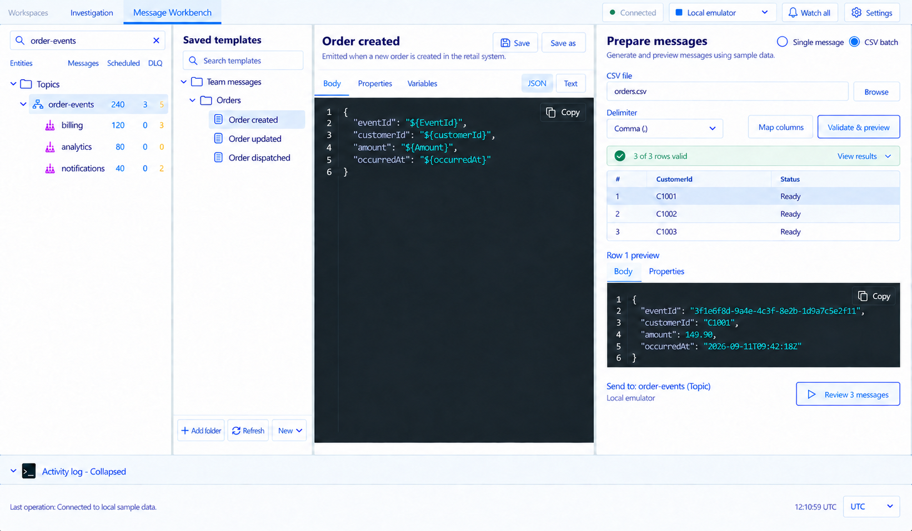
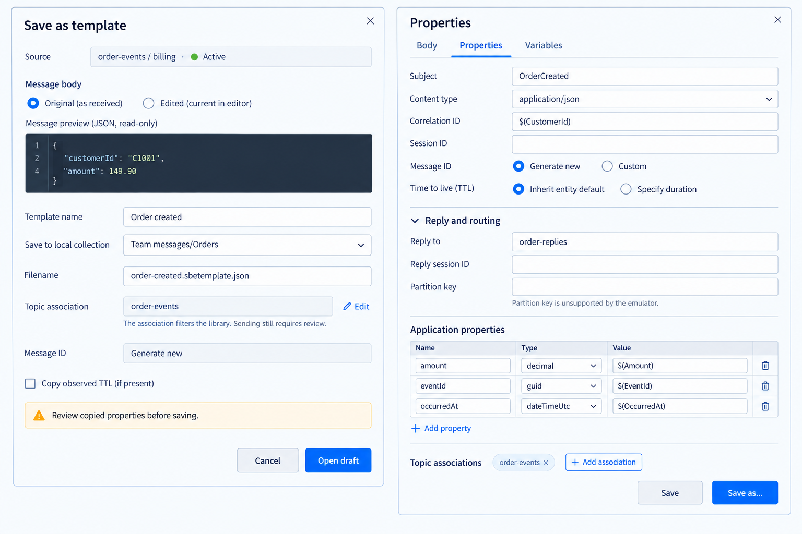
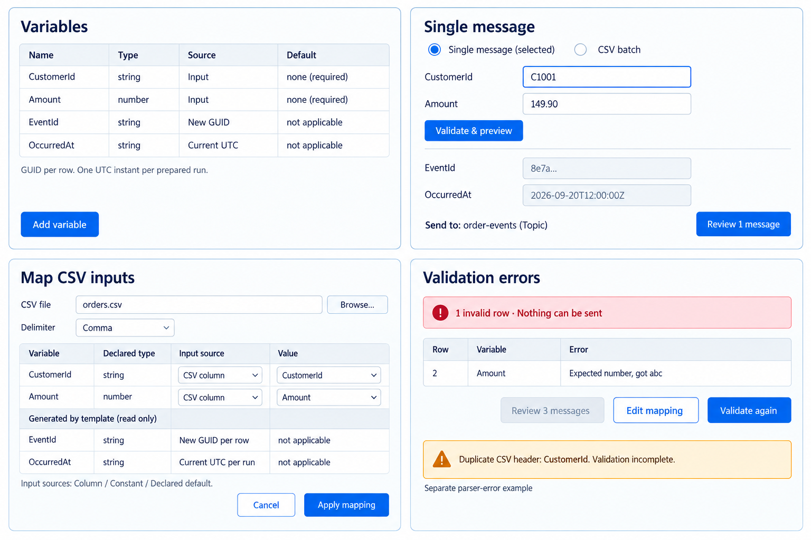
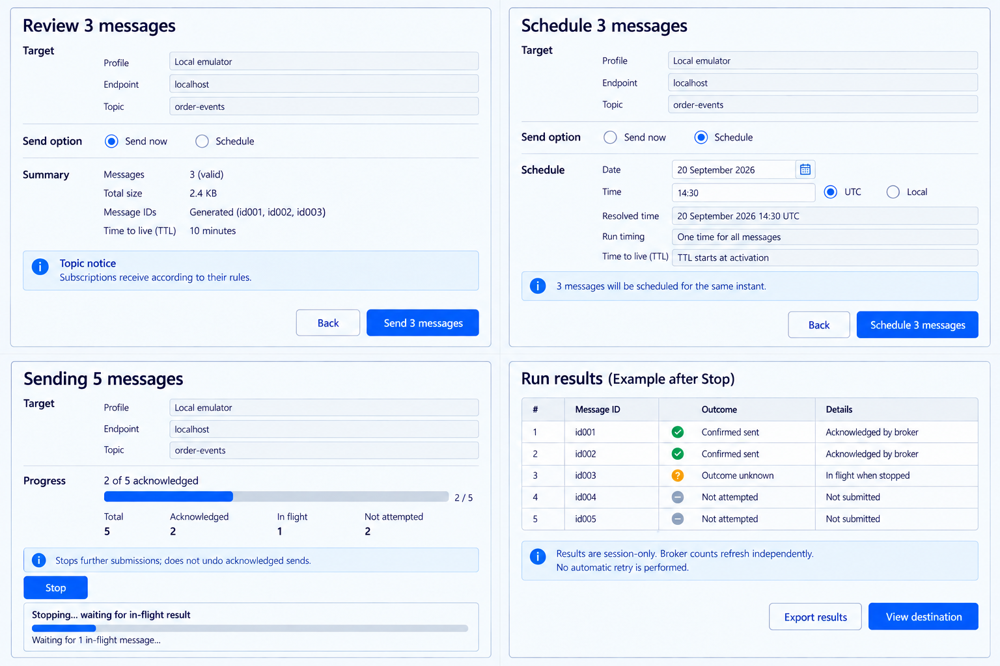
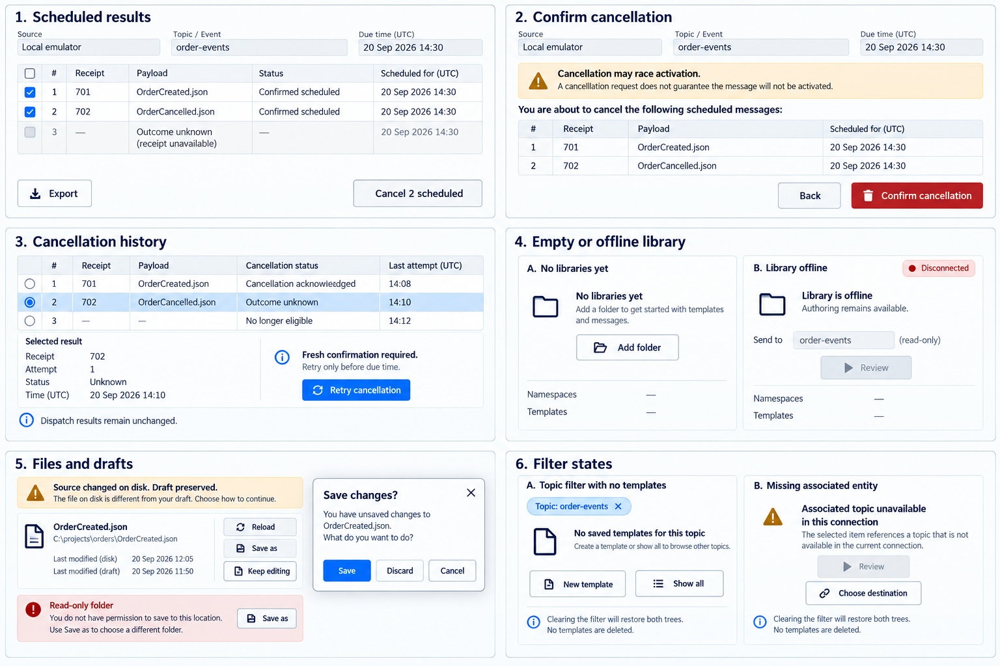

# Message Workbench — approved visual contract

The user approved the revised **Message Workbench** workspace mockup on 2026-09-21 as a prototype/mockup plan, not authorization to implement it. It replaces the earlier Board A workspace image; Boards B–E remain the approved state references. The old `approved/01-workspace.png` is historical and must not be used as the workspace layout baseline. No compact mockup is approved.

Read with the [main plan](../../message-library-implementation-plan.md), [topic context contract](../topic-context.md), [properties/cancellation](../message-properties-and-cancellation.md), and existing [app UI language](../../ui-language.md).

## Mandatory pixel-perfect acceptance

**Implement the approved UI pixel-perfect. “Similar”, “inspired by” or only functionally equivalent is not acceptable.** Match pane order/proportions, spacing, alignment, typography, density, colors, borders, icon style, action placement and states. Do not redesign, replace the library with a message-list tab, remove the namespace sidebar or add a permanent live-message pane.

Only the explicit image corrections below, real runtime data and existing production chrome/vector resources are exceptions. User-approved images govern composition; shared WPF tokens govern exact font/icon/brush rendering. **The generated image's pale-blue stain/wash is an artifact, not an approved color or effect.** Implement flat canvas `#FAFCFF`, raised surfaces `#FFFFFF`, toolbar `#F5F9FE`, and the other shared tokens below; do not reproduce blue haze, bloom, gradients or tinted shadows. Intentional blue actions, selection, profile accents and syntax colors remain. Surface any remaining conflict before implementing the conflicting part.

Use actual production WPF resources and routed controls. Capture deterministic fixtures at 100% scaling; compare side-by-side and with overlay/difference images. Board A's native extent is 1642×958; use a matching client-area crop, recording native frame exclusions. B–E are collages: compare corresponding panel/dialog crops, not entire boards as one window. Never stretch a screenshot to hide geometry differences.

Flat-color fills must match the **production WPF palette and rendered Investigation workspace**, not color-contaminated pixels in the generated mockup; component bounds must match at the reference scale. Compare solid interior color samples separately from geometry overlays so excluding the generated wash cannot excuse wrong actual colors. Font antialiasing/native frame differences and dynamic data may be isolated from raw pixel comparison, with each exclusion named. No blanket percentage threshold may excuse moved controls, wrong typography, missing states, clipped content or an off-palette tint. Record discrepancies, repair them, and rerun the whole affected flow. Static XAML review or generated images cannot pass this gate.

Also verify 1500×1000, 1100×800 and 980×640, profile themes, expanded/collapsed log, long content, focus and disabled/error states. Discarded compact boards are NOT baselines. Where a smaller size requires rearrangement, retain both trees and obtain a separately approved responsive reference before marking that viewport complete; do not silently hide a tree or squeeze unreadable columns. The approved wide-screen work can proceed independently.

## Composition and theme

The 2026-09-22 user refinement also requires Add/Edit association to reuse the app's styled dialog controls and a noneditable dropdown of available destinations. In the dummy-data prototype these are the sample topics and queue; production discovery remains outside this prototype. Variables provide substitution inputs, while application properties are metadata emitted on the prepared message.

- Wide layout: **Namespaces | Saved templates | Author | Prepare/preview**, with resizable splitters and full-width activity log. At A's reference extent pane boundaries are approximately x=310, 565 and 1074; measure actual bounds against the raster, including splitters.
- The 40-DIP top toolbar reads **Workspaces | Investigation | Message Workbench** on the left and **connection state | profile selector | Watch all | Settings** on the right. Preserve the existing status bar, UTC/Local selector and Investigation Active/DLQ inspector. No new avatar/logo/app heading. Counts refresh while the workbench is open when refresh is enabled.
- Topic filtering uses the existing Namespaces search field; the approved mockup shows `order-events` there with an in-field clear action. Do not add a full-width filter/chip row. Hide unrelated entities and library branches, retaining matching subscriptions and folder ancestors. The Saved templates search remains separate for local name/description matching. Keep Add folder/Refresh/New at the bottom of the library pane, never in the namespace tree.
- Preserve the existing **Entities | Messages | Scheduled | DLQ** namespace count headings and their accessible labels/tooltips. Use real runtime values, including the emulator's unavailable-count em dash, rather than treating mockup numbers as broker truth.
- Preserve existing Segoe UI/Consolas and shared palette: primary `#0069FA`, text `#17213D`, secondary `#627692`, canvas `#FAFCFF`, border `#CBD8E8`, divider `#DFE6EE`, selection `#DBEDFF`, editor `#1C2937`. Use existing profile accent resources and semantic status colors.
- Existing defaults remain 14-DIP body/controls, 12 metadata, 16 section heading, 24 primary title, 32 minimum button height, 3 corner radius, 16 vector icons, spacing 4/8/12/16/24. Retain existing focus/hover/pressed/disabled templates. Do not use superseded three-pane dimensions.
- Preserve author Body/Properties/Variables, JSON/Text, title and Save/Save as; preserve Prepare's Single/CSV, mapping, validation, rows, selected body/properties and bottom Review action.
- Resolved destination is plain read-only Send to. A picker appears only for unresolved/multiple/unavailable targets. Final review shows read-only profile, exact endpoint and entity.

## A — full workspace

## B — capture and properties

## C — variables, single inputs and CSV validation

## D — review, scheduling, progress and results

## E — cancellation, lifecycle and filter errors

## Explicit image corrections

| Board | Required correction |
|---|---|
| A | The pale-blue wash is a generation artifact: match actual flat app colors, not that tint. Prepared amount is numeric `149.90`; authored token stays quoted `"$(Amount)"`. View results is enabled only for retained execution results. The search query and mock counts are illustrative; use real data and existing accessible labels/tooltips. |
| B | Capture warning names real excluded/normalized properties and requires acknowledgement when the contract requires it; generic warning copy is illustrative. Capture's Message ID “Generate new” is a read-only summary, not a second mode editor. Generated/Custom mode is editable only in Properties. |
| C | `none (required)`/`not applicable` are display states, not serialized defaults. Use an explicit default toggle/value editor. Generated variables are string; mapping cannot edit declarations. |
| D | Short sample IDs represent complete GUIDs. Target fields are read-only. Three-message review and five-message progress are separate examples. One scheduled instant is not recurrence. |
| E | Unknown dispatch outcome belongs in Status, not Payload. Expired receipts remain in history. Retry requires fresh confirmation. Local templates remain usable offline; only broker observations become unavailable. File conflicts use fingerprints, not illustrated modification times. Any illustrated Clear filter/Show all action is rendered through the Namespaces search clear action, not a separate filter row. |
| All | Use actual values and exact domain outcome labels; no collage headings/numbers in production. Existing vector family and correct spelling override generated glyph artifacts. |

## Stage/state coverage

| Stage | Required boards and proof |
|---|---|
| 1 | A/B/C/E: registration, all-saved opening, associations, both filter directions, clear filter, new/open/save/refresh, dirty/conflict/unavailable/offline, pixel-perfect wide rendering |
| 2 | B/C/D/E: Active/DLQ capture, single preparation, inferred/explicit destination, send/schedule, results/cancel, preserved namespace refresh and Investigation context |
| 3 | A/C/D/E: CSV all-row validation, mapping/defaults, selected preview, ambiguous target, batch Stop/partial results/cancel |
| 4 | A–E: independent plan/pixel-perfect review, full lifecycle, approved responsive references, all profile accents, accessibility/DPI and broker proof |

Also exercise same-style variants: loading/canceled validation, malformed CSV, unused columns, duplicate-ID acknowledgement, TTL/partition/session/size errors, stale destination/reconnect, empty filtered library, long names, draft guards and cancellation attempt cap. No new visual convention is implied.

Approval: **revised Board A plus Boards B–E accepted as the prototype/mockup plan**; pixel-perfect implementation and rendered/accessibility proof remain **Pending**. Previous seven-board and original Board A review records are historical. This approval does not authorize production UI implementation.

## Dummy-data prototype

Approved refinement (2026-09-22): [centered tables and property controls](approved/07-table-properties-refinement.png). The user approved centered headers and values in both axes, the existing light-blue selection treatment instead of native gray, a Delete selected action alongside Add property, and Reply and routing collapsed on opening. The [UI language registry](../../ui-language.md) defines the app-wide table scope and preserves the existing flat palette and density.

The user separately authorized the clickable in-app prototype and repairs using dummy data only (2026-09-22). Launch the app with `--message-workbench-prototype` to open the seeded workspace. Templates, edits, generated messages and simulated results live only in the session. **Export results** can explicitly save those dummy results as JSON to a user-selected file; it does not persist or restore the workspace. Send, schedule and cancellation do not contact a broker.

Validation freezes the sample EventId, UTC time, body and MessageId for each row. Single inputs, selected-row preview, review and simulated results use that same prepared snapshot. Review labels its UTF-8 total as sample body size, not an AMQP envelope estimate. Properties and Single inputs follow the approved label/value structure; review confirmation remains visible while long details scroll.

To exercise conflict choices: clear Namespaces Search, select **External change sample**, edit its body, then click the library **Refresh**. This simulates another saved revision in memory. **Keep editing** preserves the draft, **Reload sample** restores the simulated revision, and **Save as** keeps a separate session copy. This conflict simulation reads and writes no external file.

Focused coverage is in [state tests](../../../tests/ServiceBusEmulatorExplorer.App.Tests/MessageWorkbenchStateTests.cs), [layout tests](../../../tests/ServiceBusEmulatorExplorer.App.Tests/MessageWorkbenchLayoutTests.cs), [review tests](../../../tests/ServiceBusEmulatorExplorer.App.Tests/MessageWorkbenchReviewTests.cs), and [app-only capture tests](../../../tests/ServiceBusEmulatorExplorer.App.Tests/WpfScreenshotTests.cs). This prototype proof does not complete production stages or establish full pixel parity, physical keyboard/screen-reader operation, or Windows DPI coverage.
