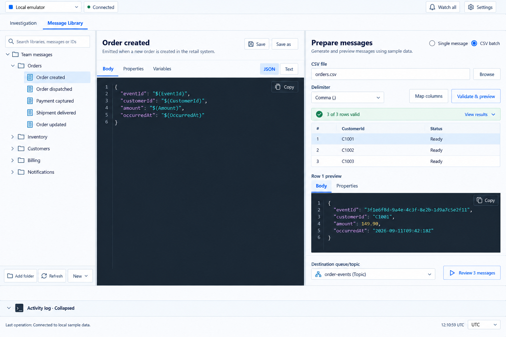
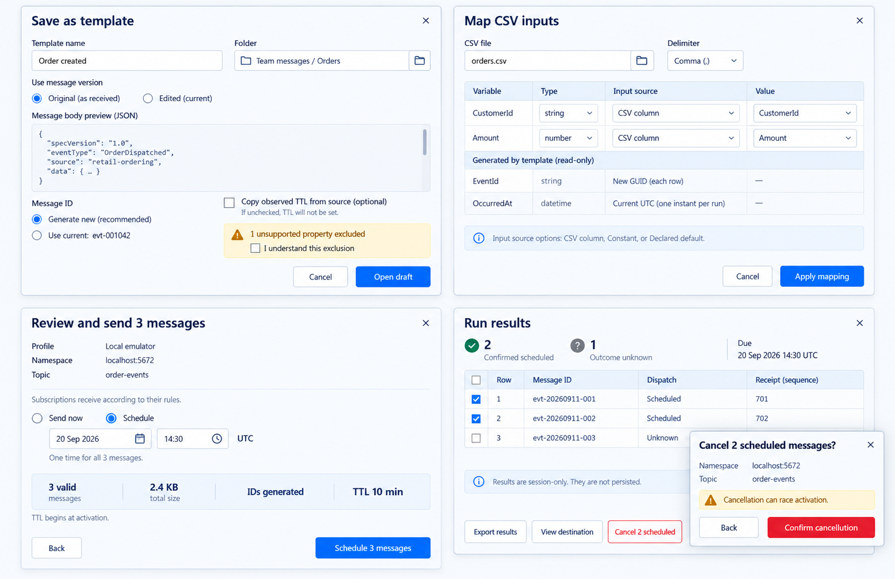
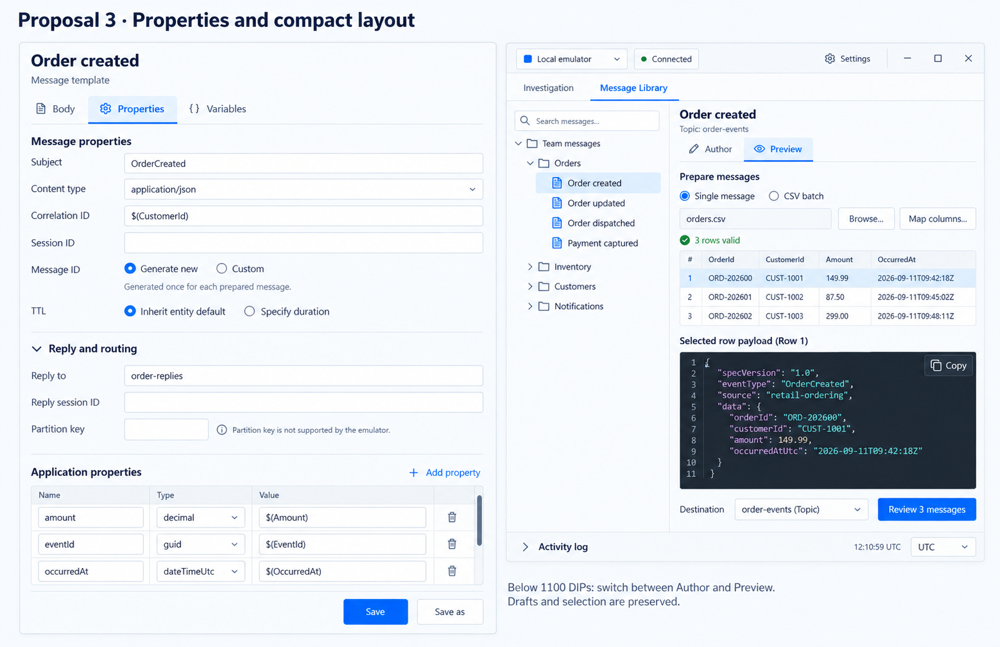
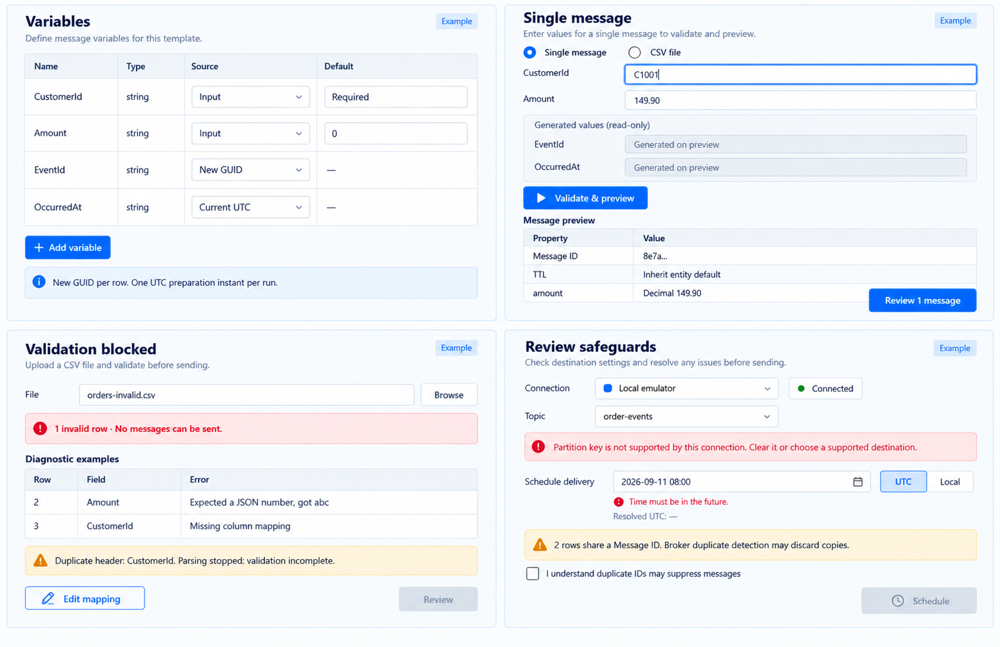
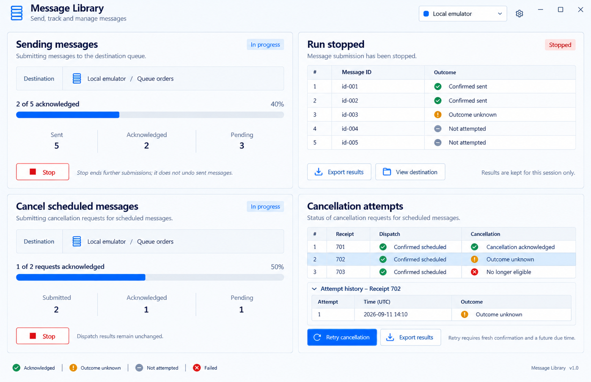
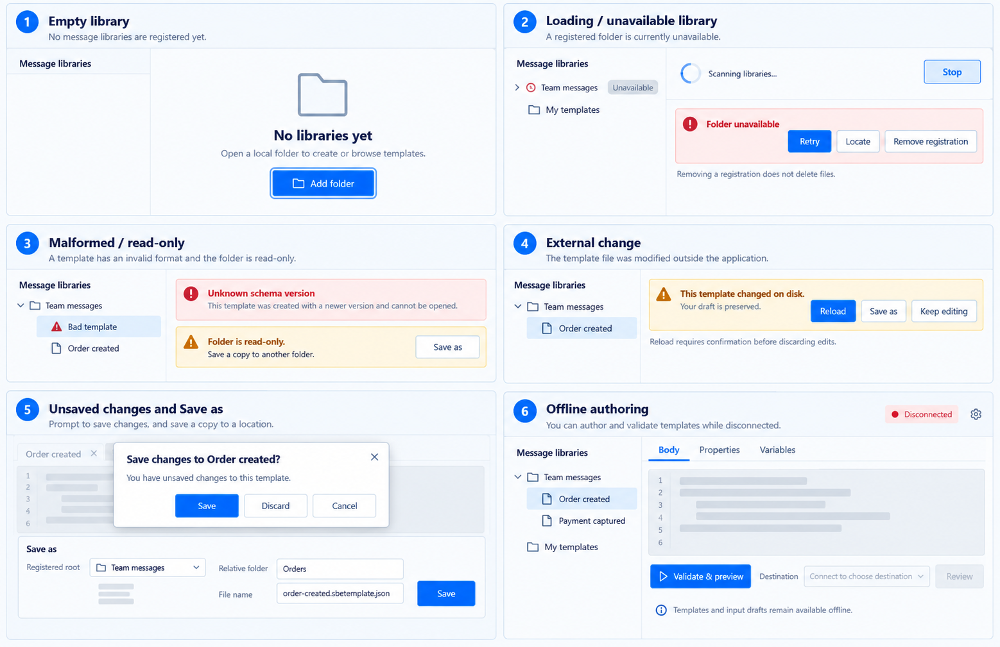
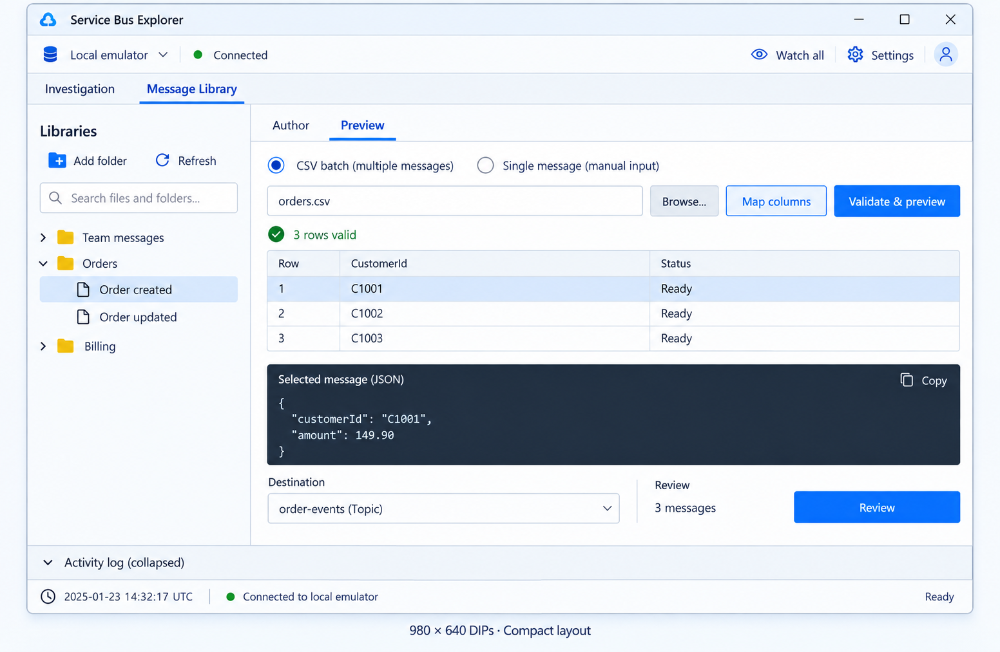

# Message Library visual contract and audit

The user approved the overall three-pane design and capture-to-results flow on 2026-09-19, then requested a completeness/theme audit before incorporation. This pack records that audit and expands the approved direction. It is a design specification, not evidence of a running WPF feature.

## Authority and precision

Read this document with the [implementation plan](../../message-library-implementation-plan.md), [property contract](../message-properties-and-cancellation.md), and [app UI language](../../ui-language.md). User decisions and behavioral contracts take precedence, followed by the exact geometry/tokens below, followed by images. Generated boards illustrate arrangement and state families; their incidental text, icons and measurements are **not pixel-accurate references**. Known deviations are explicitly reconciled below. Do not copy a conflicting image detail.

For pixel-accurate implementation, use named WPF resources and these DIP measurements; capture the real production view at 1500×1000, 1100×800 and 980×640. Compare component bounds and tokens, not antialiased raster pixels from an AI image. Production render, keyboard, scaling and broker proof remain Pending. A screenshot collage cannot prove compact geometry or accessibility.

## Exact layout and theme

- Preserve the real InvestigationWindow title bar, connection toolbar, Watch, Settings, status bar and UTC/Local selector. Add only the two workspace tabs beneath the connection toolbar. No duplicate application heading, avatar, new account button or new logo.
- Use Segoe UI 14 DIP body/controls, 12 metadata, 16 section titles, 24 template title (18 compact); Consolas 14 editor and 12 console. Reuse existing shared brushes: primary `#0069FA`, text `#17213D`, secondary `#627692`, canvas `#FAFCFF`, toolbar `#F5F9FE`, raised `#FFFFFF`, divider `#DFE6EE`, border `#CBD8E8`, selection `#DBEDFF`, editor `#1C2937`. Profile themes override only the existing accent resources. Green connection health, amber warnings and red destructive/error semantics remain fixed.
- Use existing 40-DIP toolbar; workspace tabs 40; control minimum height 32; icon target minimum 28; 16-DIP named vector icons; 7-DIP icon-label gap; 3-DIP corners. Spacing 4/8/12/16/24 only. Reuse production focus templates, not opacity-only hover/disabled treatment.
- Window sizes below refer to WPF window DIPs. Let `W` be the actual content width after native chrome. Desktop: library width 240; two 6-DIP splitters; remaining space split 1:1 between Author and Prepare. At 1100×800: library 200; splitters 6; remaining space split 1:1. Author/Prepare minimum 320. Use star rows and inner scrolling rather than fixed screenshot heights.
- Below 1100 window DIPs: library 200 plus 6-DIP splitter; remaining area is one workspace with Author/Preview tabs, each 40-DIP tab row. Do not retain an additional inspector column. Preserve draft, preview row, scroll and selection when changing tabs.
- Library: 12-DIP padding, heading 16, top action strip Add folder / Refresh / New menu, search below, tree fills remaining height. New menu offers New template and New folder; context menu includes Remove registration. Tree is roots → directories → templates, never broker entities/counts. Search is name/description only.
- Author: 12-DIP padding for header; title/description editable, Save/Save as right-aligned; Body/Properties/Variables tabs. Body has JSON/Text selector; editor stretches. Properties and Variables use their own vertical scroll areas with fixed reachable tab/header actions. Application properties use editable name/type/value rows; source type choices are the exact contract enum, not inferred from sample text.
- Prepare: 12-DIP padding; Single message/CSV batch selector, inputs, Validate & preview, status, row list and selected-row Body/Properties tabs. Row list virtualized, default height 144 desktop and 96 compact; selected preview stretches with inner scroll. Destination and Review stay in the bottom action row. At narrow widths controls wrap to a second row; no outer horizontal scrollbar.
- Reuse the full-width activity log. Default collapsed; expanded initial height 150 desktop, 120 compact, constrained to leave at least 180 DIPs workspace content. Inner panes scroll when height is small. Log header and status bar remain reachable. Do not add a second log.
- Dialog content width: capture/save-as 640, mapping 760, review 640, confirmation 520 DIPs; clamp to owner available width minus 32 and height minus 64. Scroll only dialog body; keep footer actions reachable. Padding 16; form row gap 8; label column 144 where space permits, otherwise stack labels. Keyboard focus enters first relevant field, Escape cancels, and closing restores invoking control focus.
- Blue, purple, teal, orange and red profile themes must use existing resources. Do not hardcode a new purple hue from a generated image. Full theme and DPI testing belongs to implementation proof, not this design audit.

## Screens and complete flow coverage

These are state families, not seven new windows. Panels become tabs, inline states or existing-style dialogs as indicated.

| ID / board | Required flow and state coverage | Placement / remaining textual variants |
|---|---|---|
| V1 Workspace | Open root, browse/search, new template/folder, edit/save, JSON/text, CSV preview and selected payload | Main workspace; zero search results uses the empty-state component |
| V2 Capture/review | Inspector Save as template, Original/Edited, exclusions, map, destination review, schedule, receipts and cancel confirmation | Dialogs; selected source preview required; no write before Save |
| V3 Properties | Subject/content type/correlation/session, generated/custom ID, inherited/explicit TTL, reply fields, partition, typed application properties | Author Properties tab; custom source and duration rows expand inline |
| V4 Inputs/validation | Variables and defaults, single values, generated fields, CSV errors, duplicate IDs, partition and scheduling errors | Author Variables / Prepare / review; generated values read-only in input mapping |
| V5 Execution | Pending progress, Stop, acknowledged/failed/unknown/not-attempted, export, View destination, cancellation attempts/retry | Prepare replaces review controls during execution; results remain selectable |
| V6 Lifecycle | Empty/loading, missing root, malformed file, read-only, external edit/save conflict, dirty navigation, Save as, offline | Inline tree/banner/form/dialog patterns; healthy siblings always available |
| V7 Compact | Author/Preview switching with tree retained, CSV preview, bottom actions and collapsed log | 980×640; 1100×800 retains three panes under geometry above |

Additional transitions use these same components, not unillustrated new screens:

- Open/Add folder uses the existing Windows folder picker; canceled pick changes nothing. Duplicate/overlapping root or invalid path uses V6 field/banner error. New folder and New template use V6 Save-as form fields. Remove registration never deletes files and uses dirty guard when needed.
- Capture starts from one focused message in Investigation, Active or DLQ. Binary/invalid UTF-8 disables capture with explanation. Normalization and excluded-property details use the V2 warning area; acknowledgement gates Open draft. Edited source is available only when an inspector edit exists. Source is never settled or deleted.
- Save/reopen, failed save, refresh while dirty and disappeared file preserve the draft. Conflict offers Reload with discard consent, Save as or Keep editing, never Force overwrite. Closing to tray preserves session state. Actual exit/navigation uses Save/Discard/Cancel.
- Single and CSV routes converge on one frozen prepared run. CSV delimiter is comma/semicolon/tab, explicit; input variable mapping supports column/constant/declared default. Generated rows show locked source; unused columns are listed. Missing, empty and default are distinct, with an explicit Use default control rather than treating blank input as absent.
- Validation shows progress and Cancel; cancel returns to editable inputs with no sendable run. Show row/field diagnostics and exact total invalid counts; parser failure says validation incomplete. Source edits invalidate preparation visibly. Destination/generation changes require new preflight/review without silently regenerating payloads.
- Selected-row Properties preview shows full final MessageId, TTL, reply/partition/session and every typed application property, including normalized value and normalization warning. Truncation may have tooltip/copy, but full value must be inspectable. Raw source and expanded preview are visually distinguished.
- Destination picker admits queue/topic only. Session-required failures, encoded size errors, missing credentials/disconnection and stale binding use the V4 blocking banner. Review presents captured profile, exact endpoint and entity as read-only; Back changes destination. Show topic routing notice and size summary.
- Send now and Schedule share review. Schedule exposes UTC/Local and the resolved UTC instant; ambiguous/nonexistent local time blocks until resolved. One future instant for the whole run. TTL displays requested value/inherit and entity-ceiling caveat. Duplicate IDs require explicit unchecked acknowledgement; destination acceptance never guarantees retained copies.
- Running disables duplicate submission and protects connection changes. Stop enters Stopping until in-flight accounting finishes; it is not rollback. A failed/unknown row stops the sequential run; untouched rows are Not attempted. Export includes immutable dispatch plus cancellation-attempt history. Notify before discarding session-only results.
- Cancellation targets eligible confirmed receipts, bound endpoint and destination, before due. Confirm dialog includes count, endpoint/entity, due time and receipt details. Stop leaves later attempts Not attempted. Acknowledged cancellation is not guaranteed rollback; failed/unknown may be explicitly retried only while eligible, with fresh confirmation. No-longer-eligible and ten-attempt cap disable retry with explanation.
- Profile changes preserve author/input drafts, clear destination, invalidate approval; while running require Stop plus final accounting. Workspace switching preserves ongoing state. View destination returns to actual Investigation queue or topic browsing; a scheduled message is not promised immediately visible.

### Stage evidence mapping

| Implementation stage | Required visual families | Gate focus |
|---|---|---|
| Stage 1 | V1 author/library, V3 editor, V4 Variables, V6 lifecycle, V7 responsive | New/open/save/refresh/dirty/conflict/offline, production resources and all three sizes |
| Stage 2 | V2 capture/single review, V3 compiled properties, V4 single/validation, V5 single execution/cancellation | Actual inspector-to-template-to-send path, schedule confirmation, truthful results and attempt history |
| Stage 3 | V1 CSV, V2 mapping/batch review, V4 full validation, V5 batch Stop/results | All-row validation, row/property preview, partial outcomes and eligible selected cancellation |
| Stage 4 | V1–V7 integrated | Full flow regression, five accents, expanded/collapsed log, keyboard, accessibility and DPI evidence |

All stages retain the existing plan's risk IDs and proof obligations. A board is not a substitute for executing the corresponding transitions.

## Generated-image audit: mandatory corrections

The following discrepancies were detected by inspection. They are specification overrides, not implementation options. Boards with grossly wrong broker trees or reversed panes were rejected and are not included.

| Board | Do not copy | Correct contract |
|---|---|---|
| V1 | Bottom library toolbar; search mentioning IDs; extra View results in validation banner | Top toolbar per geometry; name/description search; results action appears only when a retained run exists |
| V2 | Capture's “Use current” MessageId shortcut; mapping's `datetime` variable type/editable type; abbreviated result labels | Capture defaults generated, deliberate custom ID only in Properties; generated UTC variable type is `string`; mapping cannot edit declarations; use exact Confirmed scheduled / Outcome unknown labels |
| V2 | Open draft enabled beside unchecked exclusion acknowledgement | Disable until all required acknowledgements are checked; identify excluded property/type and transformations |
| V3 | Single message selected beside CSV controls in its compact inset | Use V7 for compact structure and CSV batch selected; Properties left panel only is V3 authority |
| V4 | Amount variable shown as string; “Required” as literal default; sample error counts blended with parser errors | Amount type number; explicit Has default toggle and typed value; required means no default; row-error and parser-error examples are separate states with internally consistent counts |
| V4 | Generated placeholders still visible while final preview exists; editable profile/topic in final review | Once prepared show frozen generated values; review destination labels read-only |
| V5 | Invented large app heading, Sent=5 during 2/5 progress, red Stopped/No longer eligible, purple/blue Retry primary | No duplicate heading; use Total=5, acknowledged=2, in-flight at most1, remainder not attempted; stopped/expired neutral with labels; Retry cancellation uses destructive confirmation conventions |
| V6 | Locate action and claims unknown schema is necessarily newer; gray skeleton while offline | Retry/Remove registration/Add folder suffice (no relocation feature); unknown version is unsupported, not necessarily newer; show real editable draft offline, not loading skeleton |
| V7 | Avatar/new logo/yellow folder icons, altered Watch glyph/statusbar, inconsistent root indentation | Preserve actual shell chrome/vector family; Team messages is parent of Orders/Billing; use current UTC/Local selector |
| All | Sample GUIDs/IDs/dates/ellipsis, collage headings, occasional capitalization and drawn dimensions | Use real values; consistent exact domain labels; no collage labels in app; geometry/tokens above determine dimensions |

## Visual references

### V1 — workspace

### V2 — capture, mapping, review and cancellation confirmation

### V3 — properties

### V4 — variables, single input and validation

### V5 — sending, results and cancellation attempts

### V6 — library lifecycle and offline authoring

### V7 — compact workspace

## Audit outcome and implementation gate

Coverage audit: all plan journeys mapped to V1–V7 or an explicit variant above. Theme audit: approved token/geometry source established; image deviations recorded, not silently accepted. Assets generated using built-in image generation, copied into this repository; earlier standalone mockup is historical. No production UI was changed or run. Design coverage is ready for implementation; **pixel-perfect/rendered WPF verification is not yet passed**.

The generation prompt set requested: the existing Investigation visual language; a three-pane desktop template/CSV workspace with quoted source placeholders; capture/mapping/read-only review/cancellation; property editing; variables/single-input/error states; run and cancellation outcomes; library lifecycle; and a two-pane compact workspace. Synthetic order data was used. A generated responsive board that incorrectly copied the broker entity tree was rejected. V3 retains the originally approved properties proposal; its compact inset is superseded. Exact colors and dimensions come from this contract rather than inferred image pixels.

Before a UI stage is complete, Luna must provide production resource renders at all three sizes, all five profile themes, expanded/collapsed log and the stage's state families; exercise focus, dirty guards, invalid input, progress/Stop and outcome transitions through real controls. Compare against this contract and the existing app, repair deviations, then run independent plan-compliance and UI-quality gates. Do not mark these gates passed from generated images or static XAML inspection.

Final independent Luna documentation review (2026-09-19): NO_FINDINGS after inspection of all seven boards, both diagrams/sources, renderer, stage mapping and theme authority. Validation: 44 relative links resolve; nine PNGs decode. This is a documentation completeness result, not a rendered-product verification result.
