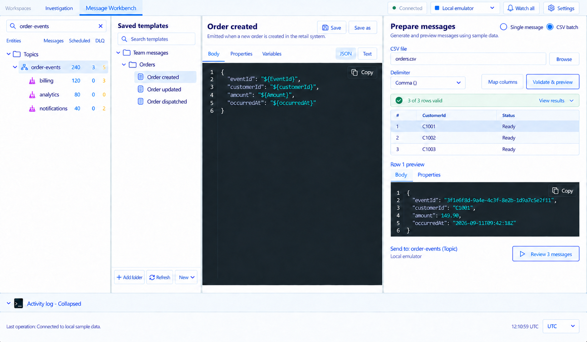
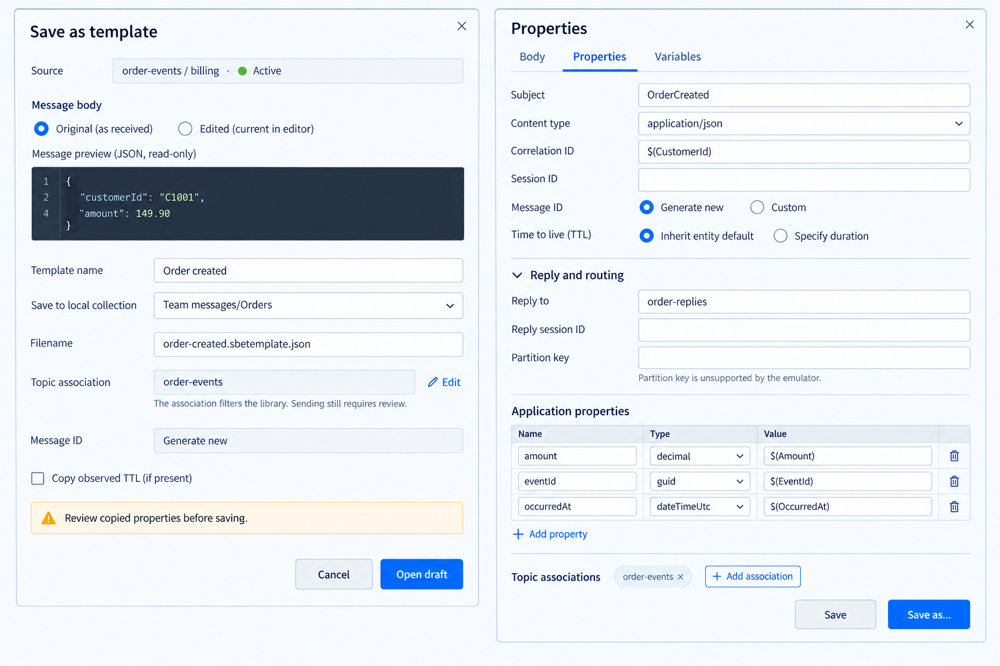
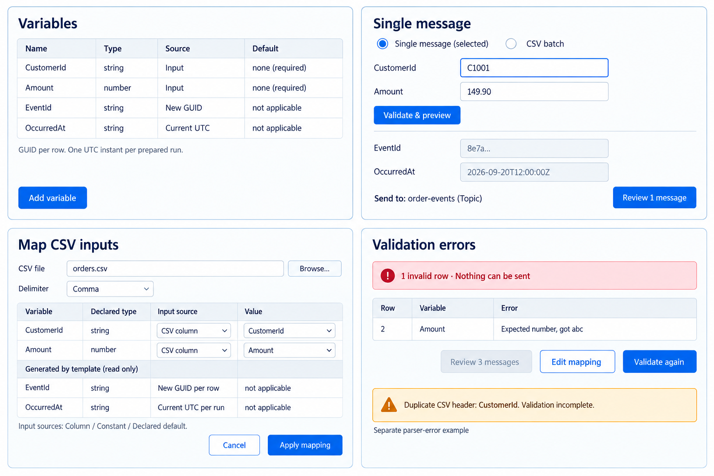
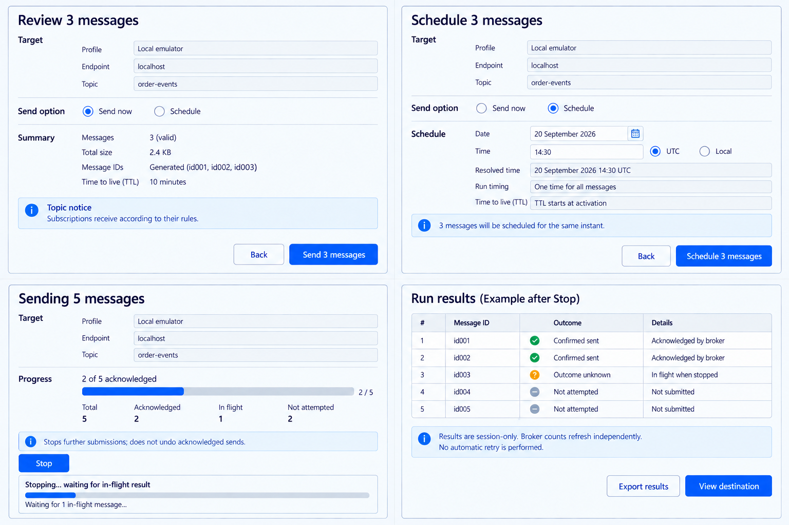
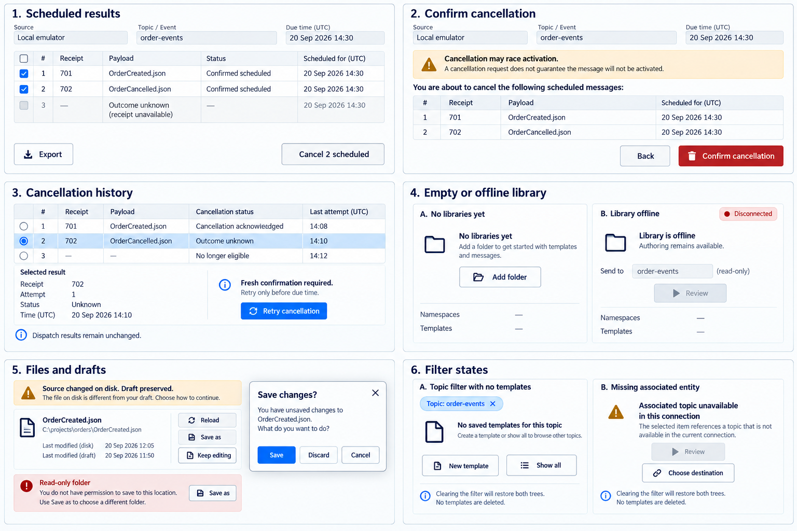

# Message Workbench — approved visual contract

## Approved responsive Compose layout (2026-10-02)

The user approved the [hybrid mockup](approved/18-responsive-workbench.png), clarified that small windows use a single property column, and requested implementation. The [responsive layout contract](../responsive-layout.md) defines wide, medium and small behavior and preservation requirements. This supersedes mutually exclusive Body/Properties surfaces only where sufficient editor width permits simultaneous display.

## Approved capture summary and inspector search (2026-10-02)

The user approved the [revised capture summary](approved/15-capture-summary-expanded.png) together with the [inspector search proposal](approved/16-inspector-search.png), responding "1". The revised capture image supersedes the earlier capture pane; there is no search highlight in the capture preview and no original-message footer label. Existing Find related remains even though image generation omitted it from the inspector crop.

- Capture details retain original/edited body selection and optional observed TTL. Replace the paragraph with three summary rows: copied body/reusable properties; generated Message ID; broker metadata not copied. The collapsed Which properties are copied disclosure lists Subject, Content type, Correlation ID, Session ID, Application properties and TTL only when selected. Review clarified two existing prototype limits: content type supports JSON/plain text (other values default to JSON), and unsupported application-property types convert to text. The disclosure labels/tooltips state those limits rather than claiming all values are preserved. This describes existing capture behavior; source messages remain untouched. Keep dialog actions reachable when details scroll.
- Inspector Create template and Replay actions share 32-DIP height for Active/DLQ states. Remove the explicit Find button. Keep Find related.
- Ctrl+F scoped to the inspector opens a dark search panel at the upper right and seeds the selected text. Show current/total matches, previous/next controls, and X. Enter/Shift+Enter navigate with wrapping; Escape closes and restores editor focus. Query editing retains focus and recalculates matches. Changes of message, displayed tab or body refresh stale results. No matches is an inline state, not a log entry.
- Copy and the Modified badge stay beneath the search panel without overlap. Search is local to displayed JSON/Raw/Properties, independent of namespace search and capture dialogs. Preserve existing shared palette, syntax colors and compact/minimum layouts.

Verification: final build passed with zero warnings; 11 focused inspector-search, capture-dialog and replay-render tests passed. The [real-window search proof](../../../tests/ServiceBusEmulatorExplorer.App.Tests/InvestigationInspectorSearchTests.cs) exercises selected-text Find, counts and wraparound, no matches, mode/message changes, Escape, consecutive DLQ body edits with Find open (caret retained), and equal action heights. Fresh captures in `artifacts/capture-search-proof` cover 1500x1000, 1100x800, 980x640, natural capture size, and 480/360-wide constrained dialogs with both disclosure scroll endpoints. Independent review and direct image inspection confirmed pinned capture actions and readable search/disclosure states. Routed WPF/command/render proof passed; physical Ctrl+F input, screen-reader output and multi-monitor/DPI proof remain unverified. Capture conversion limits are pre-existing and now stated by the UI; live broker capture was not rerun for this UI-only refinement.

## Approved destination selector and Prepare warning (2026-10-02)

[Approved mockup](approved/14-destinations-and-prepare-warning.png). The user's response "1" approved implementation.

- Destination choices and the selected value reuse distinct queue/topic icons, the destination name, and a small right-aligned type label; remove parenthesized type suffixes from the selector. Preserve typed identity, one destination per template, keyboard selection and accessible names.
- Remove the Prepare subtitle and repeated destination/profile footer labels. Keep the footer actions.
- When the destination is missing, unverified or unset, show a wrapping amber warning above the footer explaining the reason and next action. Keep Review disabled until the destination is available and preparation is valid; hide the warning when available.
- Preserve the editor preview and actions at compact/minimum window sizes; stacked inputs and preview share available height instead of allowing a fixed input row to push the preview away.

The user approved the revised **Message Workbench** workspace mockup on 2026-09-21 as a prototype/mockup plan, not authorization to implement it. It replaces the earlier Board A workspace image; Boards B–E remain the approved state references. The old `approved/01-workspace.png` is historical and must not be used as the workspace layout baseline. Later approved refinements and compact-table behavior are recorded below.

Read with the [main plan](../../message-library-implementation-plan.md), [topic context contract](../topic-context.md), [properties/cancellation](../message-properties-and-cancellation.md), and existing [app UI language](../../ui-language.md).

Verification: zero-warning build and all 10 focused destination/auto-refresh tests passed. The [destination harness](../../../tools/ServiceBusEmulatorExplorer.ReadmeScreenshot/DestinationScreenshotScenario.cs), invoked with an output directory and `--destinations`, asserts actual 1500x1000, 1100x800 and 980x640 dimensions and exercises queue/topic selection, long names, open popups, Available/Missing/Unverified/Unset warnings, recovery to Review and forced return when a destination disappears. Rendered checks passed after bringing the selector into view and preserving compact preview height. Proof is under `artifacts/destination-proof/states`. Accessible option names and polite warning announcements are declared; physical keyboard and screen-reader output, Windows scaling and multi-monitor behavior remain unverified.

## Approved organization, destination validation and capture (2026-10-02)

[Approved mockup](approved/13-library-organization-and-capture.png). The user approved implementation after the image was explicitly embedded in the final reply. This supersedes the earlier Save as location, input-like review target and message-ID summary list.

- Save as collects a name and existing library folder, including Root. Save keeps the current location. Locations remain in-memory library paths, not filesystem destinations.
- Drag templates or whole folder subtrees into another folder; empty tree space means Root. Preserve contents, destinations, unsaved editor state and expanded paths. Reject self/descendant folder drops and name conflicts without overwriting. Provide Move to as a keyboard-accessible equivalent.
- A newly created or just-saved open template stays visible through rename/save even when current filters exclude it. Navigating to another template releases that exception; filters remain intact.
- Review shows target values as plain summary text and omits the prepared message-ID list. IDs remain part of prepared messages and per-message results.
- Saved destinations are typed queue/topic references. Successful complete discovery can mark an absent destination Missing; disconnected, failed or incomplete discovery cannot prove absence. Show a yellow warning in tree and editor, preserve the saved target, and block review/dispatch until verified. Synthetic destinations remain available only in explicit prototype fixtures. Refresh and profile changes re-evaluate availability.
- Create template from an inspected Active or DLQ message copies body and reusable properties into the selected library folder without changing the original delivery. A subscription source targets its parent topic. New message IDs are generated; broker sequence/lock/delivery metadata is excluded. Use a compact name/folder/source-destination dialog and retain optional capture details for body choice and TTL.
- Demonstrate capture from both Active and DLQ on the local emulator, verifying original messages remain available. Workbench sends remain simulated; this milestone adds real discovery and read-only message capture, not live Workbench dispatch.

Verification (2026-10-02): 415 app tests and 188 core tests passed. After the final tree-scroll repair, all 88 focused Workbench/Watch tests and seven Workbench UI Automation flows passed against the isolated fresh build. The [organization capture harness](../../../tools/ServiceBusEmulatorExplorer.ReadmeScreenshot/OrganizationScreenshotScenario.cs), invoked with an output directory and `--organization`, exercises real routed Save as to a folder/Root, subtree moves, capture, missing/unverified/available destinations, and a 1,000-message review at 1642x958, 1500x1000, 1100x800 and 980x640. All 68 captures were inspected, including summary scroll endpoints. A failing root-row geometry assertion reproduced the small-window visibility defect before deferred BringIntoView fixed it. Watch failure/timeout tests likewise failed before publishing incomplete discovery, then passed while runtime-peek timeout retained verified discovery.

The [live capture harness](../../../tools/ServiceBusEmulatorExplorer.ReadmeScreenshot/LiveMessageCaptureScenario.cs), invoked with an output directory and `--message-capture-live`, passed against the local emulator: topic `workbench-demo-cf005003`, subscription `capture-demo`, one Active and one DLQ message. Real inspector/dialog actions preserved JSON, application properties and parent-topic destination; before/after broker peeks confirmed both originals remained. The local demo fixtures remain available; capture does not consume or delete a source message. Workbench dispatch is still simulated and library data remains session-only. Proof artifacts are local under `artifacts/organization-proof`. Routed drop and the Move to equivalent are covered; physical mouse drag gestures, screen-reader output and multi-monitor/DPI behavior remain unverified. UIA build warnings were limited to the unavailable NuGet vulnerability feed.

## Approved compact tables and explicit rename (2026-10-02)

[Approved mockup](approved/12-compact-tables-and-explicit-rename.png). The user's subsequent "do it" approved implementation. This supersedes the centered table layout, external property action buttons, disappearing variable-default area, and implicit rename confirmation below.

- Show Save name and Cancel beside a pending template rename; retain Enter/Escape. Tree rename has equivalent compact confirm/cancel actions. Leaving the text box does not silently save the name.
- All active tables use left-aligned text and compact content-sized leading data columns, capped near 200 DIPs (roughly 25 ordinary characters). Short type, checkbox and action columns stay appropriately small. The final data column absorbs spare width. Ellipses/tooltips limit display only; editing and copying preserve full values.
- Property tables show one permanent insertion row. Clicking starts entry; entered content is retained, while an untouched/cleared blank row resets on leaving it. Delete is a row-local trash action exposed on hover, selection or keyboard focus, with a keyboard equivalent. Remove external Add property and Delete selected controls.
- Variable tables size to their rows with bounded scrolling. Their detail area stays in place for input and generated variables. Generated variables display an explanatory status and disable controls that do not apply, without changing stored input defaults.
- Apply shared compact sizing to the active Investigation message table and Workbench Properties, Variables, CSV, validation, dispatch results, scheduled results and cancellation history. Send/replay key=value text editors are not converted into tables.
- Preserve the shared palette, row density, focus cues, semantic badges, window chrome and in-memory prototype scope. The generated crop is a composition reference; exact WPF styling remains authoritative.

Verification (2026-10-02): 403 app tests and 188 core tests passed. After the final property-name display repair, all 71 focused Workbench/table tests and seven Workbench UI Automation flows passed against the isolated fresh build. The [compact-table capture harness](../../../tools/ServiceBusEmulatorExplorer.ReadmeScreenshot/CompactTablesScreenshotScenario.cs), invoked with an output directory and `--compact-tables`, renders the real app and exercises rename, insertion, properties, generated-variable details, CSV validation, simulated dispatch, scheduling and cancellation. It produced 72 captures at 1642x958, 1500x1000, 1100x800 and 980x640, including scroll endpoints at the minimum size. It asserts the entered property name, exactly one insertion prompt, header alignment and visible primary actions. Proof artifacts are local under `artifacts/compact-tables-proof`; physical mouse/keyboard input, screen-reader output and multi-monitor/DPI behavior are not established by these captures.

## Approved library tree refinement (2026-10-02)

[Final approved mockup](approved/11-library-tree-and-rename.png). This refinement supersedes the earlier library root, footer actions, captions and association dialog in the dummy-data prototype. It keeps the existing shared styles, wizard and namespace pane.

- Use a selectable nested folder/template tree without the artificial Team messages root. The top toolbar has icon-only New template, New folder and Collapse all, with tooltips and accessible names. Remove Refresh, the library footer, Clear selection and the creation-location hint.
- Selecting a folder targets its children; selecting a template targets its containing folder; no selection targets the top level. Clicking empty tree space or elsewhere in the workspace clears tree selection while preserving the open draft. Creation actions and context menus retain their target.
- Tree selection and the open template are separate state. Save and Save as use the open template's folder, regardless of the selected tree folder. New folders, nested templates, saved edits and names work in memory. Retain filter ancestors and newly created empty folders.
- The title pencil starts inline template renaming. F2 and the Rename context action work on selected folders/templates. Enter confirms; Escape cancels. Reject blank or conflicting names without losing edits. Renaming a folder preserves its descendants; renaming a template preserves its body, properties and destination.
- One inline Destination dropdown replaces association chips and Add/Edit association dialogs. Each template has at most one queue or topic destination, shared by Compose, Prepare and Review. An unset destination prevents review; namespace filtering does not silently retarget a template.
- Keep the single JSON editor. Remove the secondary description under the template title and the Draft kept while preparing caption. Keep Save, Save as and Prepare message. Naming dialogs size to their content, including validation, so their actions remain visible.
- Refresh-triggered external-file-conflict simulation is removed with Refresh; this remains an in-memory UX prototype without external template storage or broker sends.

The mockup approves composition and interactions; shared WPF resources remain authoritative for exact icons, typography and palette. Runtime proof is recorded separately from design approval.

Verification (2026-10-02): 395 app tests and 188 core tests passed. The Add folder regression fails with the original 190-DIP height because the layout clips the action row; the content-sized dialog passes at both tested sizes, including validation feedback. Seven Workbench UI Automation flows passed across the suite and the focused rename recheck. The real WPF capture harness exercises nested folder creation, a new template, JSON editing, one destination, saving, renaming and review at 1642x958, 1500x1000, 1100x800 and 980x640; all 24 captures, including Properties and Review scroll endpoints, were independently inspected. Reproduce those captures with the [Workbench scenario](../../../tools/ServiceBusEmulatorExplorer.ReadmeScreenshot/WorkbenchTreeScreenshotScenario.cs) using --workbench-tree, --workbench-tree-1500, --workbench-tree-compact and --workbench-tree-minimum.

Rendered layout, routed interactions and the covered UI Automation flows pass. Physical keyboard/mouse traversal, screen-reader operation, and DPI/multi-monitor behavior remain unverified. This is still a session-only prototype, not broker or persistence proof.

## Mandatory pixel-perfect acceptance

**Implement the approved UI pixel-perfect. “Similar”, “inspired by” or only functionally equivalent is not acceptable.** Match pane order/proportions, spacing, alignment, typography, density, colors, borders, icon style, action placement and states. Do not redesign, replace the library with a message-list tab, remove the namespace sidebar or add a permanent live-message pane.

Only the explicit image corrections below, real runtime data and existing production chrome/vector resources are exceptions. User-approved images govern composition; shared WPF tokens govern exact font/icon/brush rendering. **The generated image's pale-blue stain/wash is an artifact, not an approved color or effect.** Implement flat canvas `#FAFCFF`, raised surfaces `#FFFFFF`, toolbar `#F5F9FE`, and the other shared tokens below; do not reproduce blue haze, bloom, gradients or tinted shadows. Intentional blue actions, selection, profile accents and syntax colors remain. Surface any remaining conflict before implementing the conflicting part.

Use actual production WPF resources and routed controls. Capture deterministic fixtures at 100% scaling; compare side-by-side and with overlay/difference images. Board A's native extent is 1642×958; use a matching client-area crop, recording native frame exclusions. B–E are collages: compare corresponding panel/dialog crops, not entire boards as one window. Never stretch a screenshot to hide geometry differences.

Flat-color fills must match the **production WPF palette and rendered Investigation workspace**, not color-contaminated pixels in the generated mockup; component bounds must match at the reference scale. Compare solid interior color samples separately from geometry overlays so excluding the generated wash cannot excuse wrong actual colors. Font antialiasing/native frame differences and dynamic data may be isolated from raw pixel comparison, with each exclusion named. No blanket percentage threshold may excuse moved controls, wrong typography, missing states, clipped content or an off-palette tint. Record discrepancies, repair them, and rerun the whole affected flow. Static XAML review or generated images cannot pass this gate.

Also verify 1500×1000, 1100×800 and 980×640, profile themes, expanded/collapsed log, long content, focus and disabled/error states. Discarded compact boards are NOT baselines. Where a smaller size requires rearrangement, retain both trees and obtain a separately approved responsive reference before marking that viewport complete; do not silently hide a tree or squeeze unreadable columns. The approved wide-screen work can proceed independently.

## Composition and theme

Historical 2026-09-22 association-dialog guidance is superseded for the dummy-data prototype by the inline Destination dropdown above. In the dummy-data prototype these are the sample topics and queue; production discovery remains outside this prototype. Variables provide substitution inputs, while application properties are metadata emitted on the prepared message.

- Wide layout: **Namespaces | Saved templates | Author | Prepare/preview**, with resizable splitters and full-width activity log. At A's reference extent pane boundaries are approximately x=310, 565 and 1074; measure actual bounds against the raster, including splitters.
- The 40-DIP top toolbar reads **Workspaces | Investigation | Message Workbench** on the left and **connection state | profile selector | Watch all | Settings** on the right. Preserve the existing status bar, UTC/Local selector and Investigation Active/DLQ inspector. No new avatar/logo/app heading. Counts refresh while the workbench is open when refresh is enabled.
- Topic filtering uses the existing Namespaces search field; the approved mockup shows `order-events` there with an in-field clear action. Do not add a full-width filter/chip row. Hide unrelated entities and library branches, retaining matching subscriptions and folder ancestors. The Saved templates search remains separate for local name/description matching. The approved library refinement places creation/collapse icons at the top of the library pane.
- Preserve the existing **Entities | Messages | Scheduled | DLQ** namespace count headings and their accessible labels/tooltips. Use real runtime values, including the emulator's unavailable-count em dash, rather than treating mockup numbers as broker truth.
- Preserve existing Segoe UI/Consolas and shared palette: primary `#0069FA`, text `#17213D`, secondary `#627692`, canvas `#FAFCFF`, border `#CBD8E8`, divider `#DFE6EE`, selection `#DBEDFF`, editor `#1C2937`. Use existing profile accent resources and semantic status colors.
- Existing defaults remain 14-DIP body/controls, 12 metadata, 16 section heading, 24 primary title, 32 minimum button height, 3 corner radius, 16 vector icons, spacing 4/8/12/16/24. Retain existing focus/hover/pressed/disabled templates. Do not use superseded three-pane dimensions.
- Preserve author Body/Properties/Variables, title and Save/Save as; preserve Prepare's Single/CSV, mapping, validation, rows, selected body/properties and bottom Review action. The dummy-data prototype uses a single JSON body editor per the later user-approved refinement below.
- Resolved destination is plain read-only Send to. A picker appears only for unresolved/multiple/unavailable targets. Final review shows read-only profile, exact endpoint and entity.

## A — full workspace

## B — capture and properties

## C — variables, single inputs and CSV validation

## D — review, scheduling, progress and results

## E — cancellation, lifecycle and filter errors

## Explicit image corrections

| Board | Required correction |
|---|---|
| A | The pale-blue wash is a generation artifact: match actual flat app colors, not that tint. Prepared amount is numeric `149.90`; authored token stays quoted `"$(Amount)"`. View results is enabled only for retained execution results. The search query and mock counts are illustrative; use real data and existing accessible labels/tooltips. |
| B | Capture warning names real excluded/normalized properties and requires acknowledgement when the contract requires it; generic warning copy is illustrative. Capture's Message ID “Generate new” is a read-only summary, not a second mode editor. Generated/Custom mode is editable only in Properties. |
| C | `none (required)`/`not applicable` are display states, not serialized defaults. Use an explicit default toggle/value editor. Generated variables are string; mapping cannot edit declarations. |
| D | Short sample IDs represent complete GUIDs. Target fields are read-only. Three-message review and five-message progress are separate examples. One scheduled instant is not recurrence. |
| E | Unknown dispatch outcome belongs in Status, not Payload. Expired receipts remain in history. Retry requires fresh confirmation. Local templates remain usable offline; only broker observations become unavailable. File conflicts use fingerprints, not illustrated modification times. Any illustrated Clear filter/Show all action is rendered through the Namespaces search clear action, not a separate filter row. |
| All | Use actual values and exact domain outcome labels; no collage headings/numbers in production. Existing vector family and correct spelling override generated glyph artifacts. |

## Stage/state coverage

| Stage | Required boards and proof |
|---|---|
| 1 | A/B/C/E: registration, all-saved opening, associations, both filter directions, clear filter, new/open/save/refresh, dirty/conflict/unavailable/offline, pixel-perfect wide rendering |
| 2 | B/C/D/E: Active/DLQ capture, single preparation, inferred/explicit destination, send/schedule, results/cancel, preserved namespace refresh and Investigation context |
| 3 | A/C/D/E: CSV all-row validation, mapping/defaults, selected preview, ambiguous target, batch Stop/partial results/cancel |
| 4 | A–E: independent plan/pixel-perfect review, full lifecycle, approved responsive references, all profile accents, accessibility/DPI and broker proof |

Also exercise same-style variants: loading/canceled validation, malformed CSV, unused columns, duplicate-ID acknowledgement, TTL/partition/session/size errors, stale destination/reconnect, empty filtered library, long names, draft guards and cancellation attempt cap. No new visual convention is implied.

Approval: **revised Board A plus Boards B–E accepted as the prototype/mockup plan**; pixel-perfect implementation and rendered/accessibility proof remain **Pending**. Previous seven-board and original Board A review records are historical. This approval does not authorize production UI implementation.

## Dummy-data prototype

Current scope reaffirmed on 2026-09-27: complete and sign off the interactive UI using in-memory mocks before implementing template files or broker operations. Missing disk persistence and real sending are intentional at this stage. Mock cancellation retains due-time context and per-attempt history when reopening results, confirms profile/endpoint/destination/receipts/times, and disables retry after ten attempts per receipt. Its shared destructive confirmation follows the existing dialog styles.

Approved refinement (2026-09-24): the Workbench uses the same Namespaces tree and aligned count columns as Investigation. Connected counts continue to refresh at the selected interval; while disconnected, the same tree shows clearly labeled sample entities without invented counts. The author body has one JSON view, with no JSON/Text switch. The former library footer actions are superseded by the 2026-10-02 icon toolbar above. A new template starts with `{}` and no inherited properties or destination; a newly added empty folder remains visible and selectable even under an active namespace filter. Capturing an observed message remains in Investigation through **Save as template**; the Workbench's synthetic capture menu is removed.

Approved wizard refinement (2026-09-23): [Compose](approved/08-wizard-compose.png), [Prepare](approved/09-wizard-prepare.png), and [Review & send](approved/10-wizard-review.png). The Saved templates search matches Namespaces search without a redundant heading. The Namespaces and templates panes remain visible while the main pane advances through one stage at a time. At compact widths, preparation inputs and preview stack vertically. Returning to an earlier stage retains the in-memory draft and prepared values. Review, simulated progress, results and cancellation live in the third stage rather than opening a separate review window.

Approved refinement (2026-09-22): [centered tables and property controls](approved/07-table-properties-refinement.png). The user approved centered headers and values in both axes, the existing light-blue selection treatment instead of native gray, a Delete selected action alongside Add property, and Reply and routing collapsed on opening. The [UI language registry](../../ui-language.md) defines the app-wide table scope and preserves the existing flat palette and density.

The user separately authorized the clickable in-app prototype and repairs using dummy data only (2026-09-22). Launch the app with `--message-workbench-prototype` to open the seeded workspace. Templates, edits, generated messages and simulated results live only in the session. **Export results** can explicitly save those dummy results as JSON to a user-selected file; it does not persist or restore the workspace. Send, schedule and cancellation do not contact a broker.

Editing a template, property, variable, CSV mapping, or single-message input automatically validates and prepares a new in-memory preview. Each successful preparation freezes the sample EventId, UTC time, body and MessageId for each row until the next edit. Single inputs, selected-row preview, review and simulated results use that same prepared snapshot. Review labels its UTF-8 total as sample body size, not an AMQP envelope estimate. Properties and Single inputs follow the approved label/value structure; short Message ID and property lists fit without a scrollbar, while large batches and long details scroll within bounded lists so review confirmation remains visible. Review cards fill the available wide-stage height, and stage actions use the shared button styles.

Prepare and Review footer dividers align at wide and compact sizes; the library has no footer. The Review notice sits above its fixed action row, with Back on the left and Send on the right.

The former Refresh-triggered external conflict sample was removed with the library Refresh action in the approved 2026-10-02 refinement.

Focused coverage is in [state tests](../../../tests/ServiceBusEmulatorExplorer.App.Tests/MessageWorkbenchStateTests.cs), [layout tests](../../../tests/ServiceBusEmulatorExplorer.App.Tests/MessageWorkbenchLayoutTests.cs), [review tests](../../../tests/ServiceBusEmulatorExplorer.App.Tests/MessageWorkbenchReviewTests.cs), and [app-only capture tests](../../../tests/ServiceBusEmulatorExplorer.App.Tests/WpfScreenshotTests.cs). This prototype proof does not complete production stages or establish full pixel parity, physical keyboard/screen-reader operation, or Windows DPI coverage.

## Validation actions, selection and scheduling refinement (2026-10-02)

[Approved mockup](approved/17-validation-actions-and-schedule.png): Compose and Prepare use the same amber validation frame with a matching right-hand `Choose destination` action. At narrow widths the action wraps beneath the text. It opens Compose > Properties, reveals and focuses Destination, and preserves draft values. Both Prepare entry points require an available destination; editing and saving remain possible. Discovery loss after preparation keeps the warning and blocks review/send until resolved. Unverified discovery uses `Check connection` to focus the shell connection control without changing the connection automatically; hosts without that control show the concrete reconnect instruction.

Editor and other-pane clicks preserve library selection; only blank library-tree space clears it. Review scheduling uses separate Date, Time, and Time zone rows, centered 32-DIP inputs and a wrapping resolved-time summary. Preserve existing send/schedule behavior and fixed footer actions. The reusable validation convention is maintained in [AGENTS.md](../../../AGENTS.md#actionable-validation).