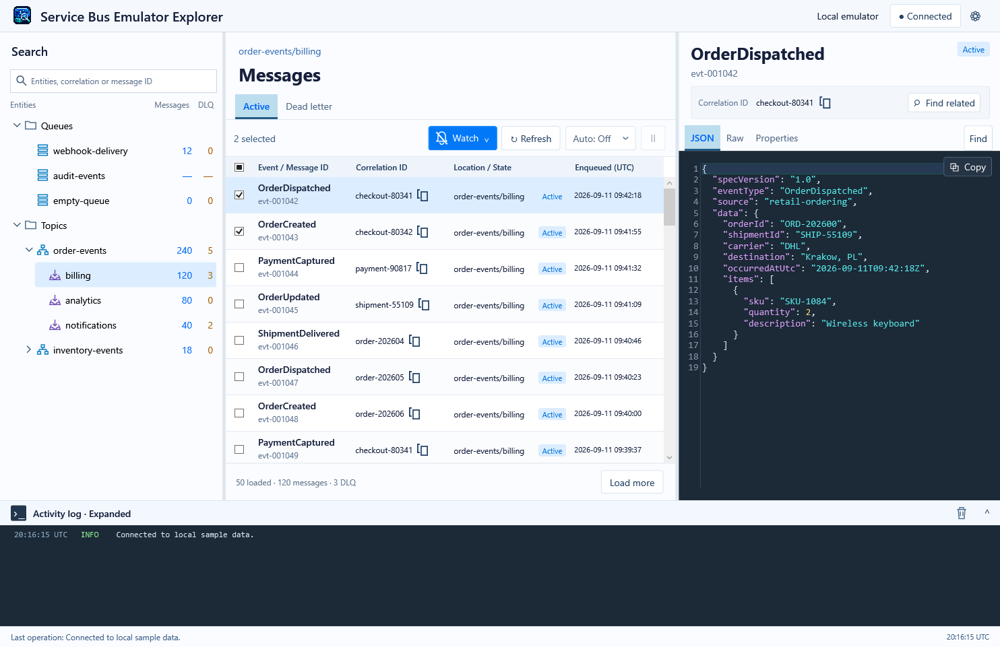
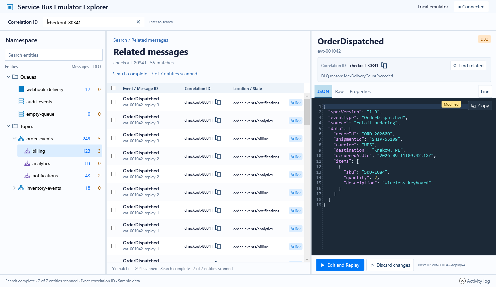
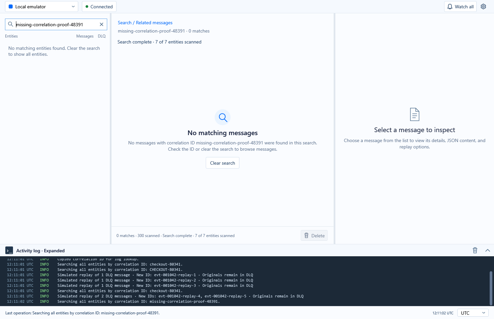
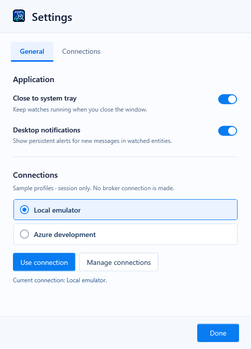
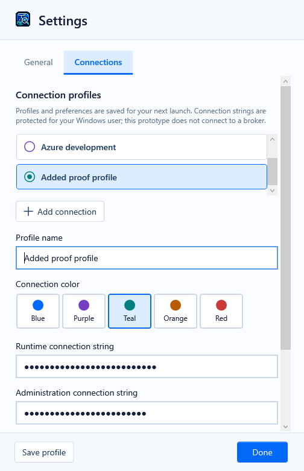

# Investigation workspace prototype

This WPF prototype implements the [approved unified-search and Watch mockup](watch-search-mockup-real-icon.png) on branch `prototype/investigation-workspace`. It uses synthetic, in-memory data only: no Service Bus connection, credentials, or persistence. Restarting resets messages, drafts, searches, watches, preferences and replay numbering. The actual app icon asset is reused in the window, tray and desktop notification.

Run from the repository root:

```powershell
dotnet run --project tools/ServiceBusEmulatorExplorer.InvestigationPrototype
```

## Investigate a correlation

Use the single **Search** field on the left. Suggestions are grouped as entities, correlation IDs, and messages already loaded in this session. Typing filters the entity tree. Use Up/Down and Enter or click a suggestion. Entity results open that entity; correlation results search all entities; message results open that exact message. The two explicit actions search all entities by correlation ID or message ID. Unknown pasted values are never silently classified. Global ID searches match the full ID exactly, including case.

Results combine queues and subscriptions, including Active and DLQ messages. The location and state stay visible for every delivery. Use the copy icon directly beside a correlation ID to search your logs, or **Find related** in the inspector to search the namespace.

Search scans the synthetic snapshot in pages of 50, yielding to the UI between pages. Its completed, in-progress and stopped states distinguish “No matching messages” from “No matches found so far.” The sample scan is usually almost instant; there is no artificial waiting animation. Namespace totals remain overall counts, separate from matches and scanned messages. The inline **×** clears both the text and applied correlation filter, returning to entity browsing. It remains available when an applied filter exists even if you edit or empty the field.

A real broker implementation will need cancellable paged peeking and explicit incomplete/error reporting; this prototype is not proof of broker-wide search.

## Inspect and replay

The grid shows event name, message ID, correlation ID, location, state and enqueue time (UTC). Checkboxes toggle independently without Shift. The aligned header checkbox selects or clears the displayed results. Clicking a row previews it without changing checked messages.

JSON is formatted and colored directly in the inspector. DLQ JSON is editable; Raw and Properties retain original text and metadata. Plain-text and malformed-JSON sample messages are deliberately included and labelled **Body (not JSON)**; their contents are preserved. **Replay** sends an unchanged sample copy with a default ID such as `evt-001042-replay-1`. A subsequent replay advances the suffix. Correlation ID stays unchanged.

Editing the JSON changes the single action to **Edit and Replay** and reveals **Modified** and **Discard changes**. Drafts and undo history stay with their message when you switch rows. Discard restores the original formatted JSON. Successful edited replay resets the editor to the retained DLQ original. Invalid JSON blocks edited replay; untouched non-JSON messages can still replay unchanged.

Checked DLQ messages form a batch; otherwise Replay targets the focused message. Mixed Active/DLQ selections cannot replay. A batch containing a draft must be resolved by replaying or discarding individual drafts. Subscription replay produces copies in each sample child subscription. Original DLQ messages remain unchanged.

The replay counter is local to this prototype run, not a shared audit of all users. Long original IDs are shortened to keep the generated ID within 128 characters; collision checks keep generated IDs unique in the sample state.

## Browse and refresh

Entity matching ignores case. Escape dismisses suggestions. The **×** button clears both the tree filter and any applied global search. Unmatched entity text retains explicit global search actions. Message and DLQ totals remain unchanged by filtering.

Selecting an entity or switching Active/DLQ loads its first 50 messages. **Load more** adds another 50. Refresh preserves focused and checked rows; retention can temporarily show more than the nominal page limit. Automatic refresh can be paused and resumes after leaving search through the tree. Search pauses automatic sample arrivals.

Resize to switch between side-by-side and stacked panes. The compact layout reduces heading space to retain usable rows and editor lines. Namespace totals are preserved, including unknown totals. The known emulator count limitation must not be used to skip future broker searches.

## Watch, tray and console

Select a queue or subscription and choose **Watch** for Active messages, DLQ messages, or both. Every 15 seconds the prototype generates a sample arrival in each watched bucket, independently of the current view or auto-refresh. Existing messages do not alert when Watch is enabled. Disconnect pauses generation. The header bell lists watched scopes and pending notifications.

Notifications use a separate, persistent WPF desktop window, not a timed native Windows toast. They remain while the main window is hidden, group arrivals by entity/bucket, and offer **Investigate** and **Dismiss**. Investigate restores the main window, fills Search with the notified correlation IDs joined by OR, searches across the connection, and focuses the latest notified message. If any notified message lacks a correlation ID, the batch uses exact message IDs instead; Dismiss leaves messages untouched. Stop watching clears that target's pending notifications.

Closing the main window sends it to the Windows tray by default. Double-click the real app tray icon or use **Open Service Bus Explorer** to restore it; **Exit** stops the process. The Settings gear opens **General** and **Connections** pages. General controls close-to-tray and desktop notifications, and lets you choose a profile with Use connection. Switching profiles disconnects and clears watches, pending notifications, searches, drafts, and synthetic arrivals; Connect starts the selected sample session. Manage connections edits profiles separately. Connections demonstrates two editable sample profiles with masked runtime and administration fields; saved edits survive reopening Settings within this session only. There is no real connection or disk persistence.

The Watch selector has independent Active and DLQ checkboxes and **Stop watching**. The toolbar bell is crossed out when off and filled when watching. The header bell appears only while entities are watched, shows their count, and opens the overview. The refresh interval dropdown uses the same flat blue-and-white treatment. The dark **Activity log** spans all three panes, with timestamped colored entries and a last-operation footer. Collapse releases space; the clear-history icon is visible only while expanded. The console height adapts at compact sizes.

Search by correlation ID or message ID supports `case-123 OR case-456` and `case-*`. ID matching is case-sensitive; the OR keyword is case-insensitive. Quote an entire ID to treat stars or OR literally. Clear search restores browsing. Invalid expressions display a correction message without scanning.

## Rendered evidence

Build: zero warnings and errors. Final walkthrough: **200 passing checks**, with rendered visual inspection. A separate [real tray lifetime proof](tray-verification.md) adds **11 passing checks**, including timer-driven arrivals while hidden, Investigate, disabling close-to-tray, and Exit cleanup.

| UI gate | Result | Evidence |
| --- | --- | --- |
| Design | PASS | Approved image, inline correlation metadata, state badges, editor actions and empty-state artwork. |
| Rendered flows | PASS | Suggestions, search, copy, drafts, replay, selection, refresh, pause and reconnect. |
| Geometry | PASS | Desktop 1500×1000, compact 1100×800 and minimum 980×640; whole message ID and multiple editor lines checked. |
| Basic accessibility | PASS | Named controls, keyboard suggestion navigation, checkbox Space activation and editor undo/redo. |
| Final regression | PASS | Complete rerun and independent review after compact-layout repairs. |











The [walkthrough report](verification.md) covers actual rendered WPF controls, suggestions, exact namespace results, copy, drafts, undo/redo, replay IDs, mixed selections, empty/stopped searches, refresh/pause, disconnect, and desktop/compact geometry. The original [checkbox regression](selection-regression.md) is retained as historical evidence.

Run the bounded proof:

```powershell
dotnet run --project tools/ServiceBusEmulatorExplorer.InvestigationPrototype -- --verify artifacts/correlation-proof
```

It closes the window after verification. Popup content is captured separately because a WPF Popup has its own native surface.

The real tray check takes about 20 seconds and cleans up its windows and icon:

```powershell
dotnet run --project tools/ServiceBusEmulatorExplorer.InvestigationPrototype -- --verify-tray artifacts/tray-proof
```

Limits: proof uses routed WPF actions and editor documents, not every physical pointer gesture. No broker integration, exhaustive DPI matrix, or full screen-reader audit is claimed. The mockup supplies visual authority; platform font rasterization and live sample content differ from the generated image. The earlier modal replay editor and its walkthrough have been replaced by inline editing.
