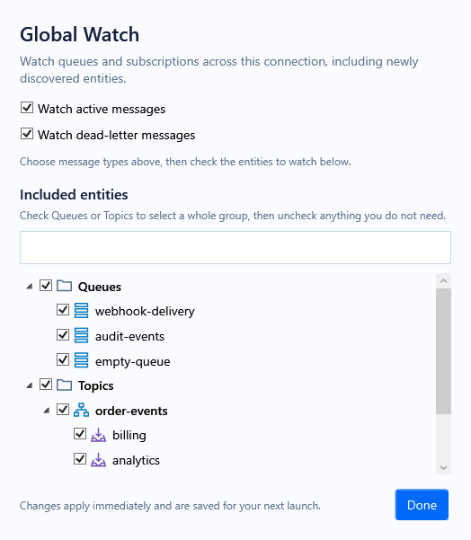
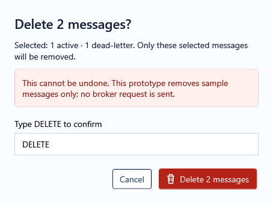
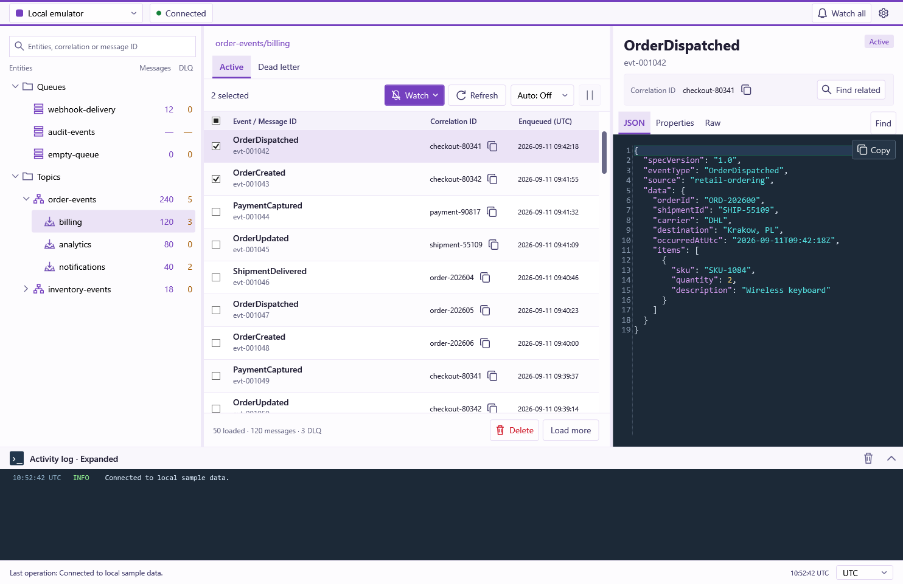
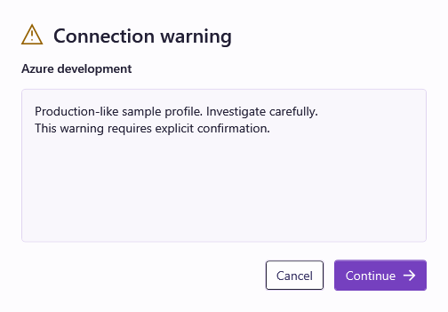

# Investigation workspace prototype

**Approved and ready for promotion** as of 2026-09-12, baseline `126c824`. Continue with the [production handoff](../../specs/investigation-workspace-handoff.md); the remaining work connects these approved interactions to real services.

This WPF prototype implements the [approved unified-search and Watch mockup](watch-search-mockup-real-icon.png) on branch `prototype/investigation-workspace`. Broker operations use synthetic messages only; no Service Bus connection is made. Profiles, preferences and Watch selections are saved locally for subsequent launches. Restarting resets messages, editor drafts, pending notifications and replay numbering. The actual app icon asset is reused in the window, tray and desktop notification.

Run from the repository root:

```powershell
dotnet run --project tools/ServiceBusEmulatorExplorer.InvestigationPrototype
```

## Investigate a correlation

Use the single **Search** field on the left. Suggestions are grouped as entities, correlation IDs, and messages already loaded in this session. Typing filters the entity tree. Use Up/Down and Enter or click a suggestion. Entity results open that entity; correlation results search all entities; message results open that exact message. The two explicit actions search all entities by correlation ID or message ID. Unknown pasted values are never silently classified. A plain ID matches exactly, including case; OR, wildcard and mixed-field expressions are supported as described below.

Results combine queues and subscriptions, including Active and DLQ messages. The location and state stay visible for every delivery. Use the copy icon directly beside a correlation ID to search your logs, or **Find related** in the inspector to search the namespace.

Search scans the synthetic snapshot in pages of 50, yielding to the UI between pages. Its completed, in-progress and stopped states distinguish “No matching messages” from “No matches found so far.” The sample scan is usually almost instant; there is no artificial waiting animation. During global search, the tree displays discovered match counts; original namespace totals are retained separately and restored on Clear. The inline **×** clears both the text and applied correlation filter, returning to entity browsing. It remains available when an applied filter exists even if you edit or empty the field.

A real broker implementation will need cancellable paged peeking and explicit incomplete/error reporting; this prototype is not proof of broker-wide search.

## Inspect and replay

The grid shows event name, message ID, correlation ID, location, state and enqueue time (UTC by default). Checkboxes toggle independently without Shift. The aligned header checkbox selects or clears the displayed results. Clicking a row previews it without changing checked messages.

JSON is formatted and colored directly in the inspector. DLQ JSON is editable; Raw and Properties retain original text and metadata. Plain-text and malformed-JSON sample messages are deliberately included and labelled **Body (not JSON)**; their contents are preserved. **Replay** sends an unchanged sample copy with a default ID such as `evt-001042-replay-1`. A subsequent replay advances the suffix. Correlation ID stays unchanged.

Editing the JSON changes the single action to **Edit and Replay** and reveals **Modified** and **Discard changes**. Drafts and undo history stay with their message when you switch rows. Discard restores the original formatted JSON. Successful edited replay resets the editor to the retained DLQ original. Invalid JSON blocks edited replay; untouched non-JSON messages can still replay unchanged.

Checked DLQ messages form a batch; otherwise Replay targets the focused message. Mixed Active/DLQ selections cannot replay. A batch containing a draft must be resolved by replaying or discarding individual drafts. Subscription replay produces copies in each sample child subscription. Original DLQ messages remain unchanged.

The replay counter is local to this prototype run, not a shared audit of all users. Long original IDs are shortened to keep the generated ID within 128 characters; collision checks keep generated IDs unique in the sample state.

**Delete** targets checked messages, or the focused message when nothing is checked. Active and DLQ messages may be deleted together. A separate confirmation shows the counts for each bucket. Type exact uppercase `DELETE` to enable deletion; clearing or changing the text disables it again. Cancel leaves the sample messages unchanged. Confirm removes only those synthetic deliveries. This does not implement broker deletion, entity deletion or purge.

## Browse and refresh

Entity matching ignores case. Escape dismisses suggestions. The **×** button clears both the tree filter and any applied global search. Unmatched entity text retains explicit global search actions. Entity-name filtering preserves Message and DLQ totals. Global ID search instead displays matching counts.

Selecting an entity or switching Active/DLQ loads its first 50 messages. **Load more** adds another 50. Refresh preserves focused and checked rows; retention can temporarily show more than the nominal page limit. Automatic refresh can be paused and resumes after leaving search through the tree. Search pauses automatic sample arrivals.

Resize to switch between side-by-side and stacked panes. The compact layout reduces heading space to retain usable rows and editor lines. Namespace totals are preserved, including unknown totals. The known emulator count limitation must not be used to skip future broker searches.

## Watch, tray and console

Choose **Watch** for Active messages, DLQ messages, or both. Global Watch covers the selected connection, including entities discovered later. A topic Watch covers its subscriptions, including future subscriptions. The searchable Watch tree uses checked rows for included scopes and mixed parent states for partial selection. Selecting or clearing a branch applies to its descendants and establishes inheritance for future descendants; a more specific child choice overrides inherited inclusion. Bucket choices remain independent. Every 15 seconds the prototype generates a sample arrival in each effective watched bucket, independently of the current view or auto-refresh. Existing messages do not alert when Watch is enabled. Disconnect pauses generation. Polling and real discovery remain future broker work.

Notifications use a separate, persistent WPF desktop window, not a timed native Windows toast. They remain while the main window is hidden, group arrivals by entity/bucket, and offer **Investigate** and **Dismiss**. Investigate restores the main window and adds notified correlation IDs to the applied search using OR, retaining prior cases and focusing the latest notified message. Already-covered criteria are not duplicated. A message without a correlation ID adds its exact message ID instead; mixed searches use explicit correlation: or message: prefixes so existing criteria retain their meaning. Unapplied input text is replaced by the combined applied search; Dismiss leaves messages untouched. Stop watching clears that target's pending notifications.

Closing the main window sends it to the Windows tray by default. Double-click the real app tray icon or use **Open Service Bus Explorer** to restore it; **Exit** stops the process. Choose a connection in the toolbar dropdown. General settings no longer duplicate this picker. Switching profiles disconnects and resets the synthetic investigation; Watch rules are stored per profile. Connect starts the selected sample session. The Settings gear opens **General** and **Connections** pages. General controls close-to-tray, desktop notifications and **Automatically connect when switching profiles**. This saved option is off by default; when enabled, an approved profile switch also connects. Configured warnings still require confirmation. Turning it on or saving a profile does not itself connect. The Connections tab edits profiles separately, including masked runtime/administration fields and a named color palette. Save profile keeps edits for later launches. The active profile color themes buttons, selected states and surface tints throughout the app, Settings and related windows, as well as the dropdown swatch and accent border. Semantic DLQ and destructive colors remain fixed; Delete stays clearly red. A separate labeled health indicator uses green for connected, red for disconnected and amber for warnings. The profile color is independent of health.

**Add connection** creates a uniquely named profile with empty connection strings and opens its editor without changing the active connection. Set its name, color and optional **Connection warning**, then Save profile. A saved warning appears before switching to or connecting that profile, including restored startup connections. Cancel preserves the previous connection when switching and prevents the pending connection attempt. Leave the warning empty to disable that confirmation. Editing another profile's color does not preview its theme over the active connection.

Preferences use `%LOCALAPPDATA%\ServiceBusEmulatorExplorer\InvestigationPrototype\preferences.json`. Runtime and administration connection strings are encrypted with Windows DPAPI for the current user; profile names and other preferences are ordinary JSON. The store supports an explicit alternate path for isolated verification. A failed load uses defaults with a warning; a failed save leaves the current session usable and reports that it could not persist changes. This storage is separate from the production app's profile store.

The Watch selector has independent Active and DLQ checkboxes and **Stop watching**. The toolbar bell is crossed out when off and filled when watching. The header bell appears only while entities are watched, shows their count, and opens the overview. The overview and refresh dropdown share the active profile's surface and selection colors. Watch search uses a magnifier and a short placeholder in the field without a verbose duplicate instruction. Each row can stop its Active or DLQ watch independently. The dark **Activity log** spans all three panes, with timestamped colored entries and a last-operation footer. Collapse releases space; the clear-history icon is visible only while expanded. The console height adapts at compact sizes.

Search by correlation ID or message ID supports `case-123 OR case-456` and `case-*`. ID matching is case-sensitive; the OR keyword is case-insensitive. Quote an entire ID to treat stars or OR literally. The Location / State column appears in global ID search results and topic views. During a search, the namespace tree shows matching sources and parent topics only; Active and DLQ counts reflect matches found so far, with topic totals aggregated from matching subscriptions. Clear search restores browsing, the complete tree, and the original entity totals. Invalid expressions display a correction message without scanning.

The footer time selector offers **UTC**, **Local**, and **Server**. It reformats enqueue times and existing activity-log/footer timestamps while retaining the original UTC instants and raw JSON/properties. Local uses the computer time zone with daylight-saving rules. Server uses a clearly identified fixed sample UTC-05:00 until a real connection time-zone setting is wired. The display preference is saved locally.

## Promotion handoff

See the [requirements, open questions and worker handoff](../../specs/investigation-workspace-handoff.md) and [shared UI language / audit](../../specs/ui-language.md) before connecting this prototype to real services.

## Rendered evidence

Current verification: build with zero warnings/errors and **347 passing checks**, including typed deletion, Watch inclusion, profile health/colors and protected preference save/reopen. The [real tray lifetime proof](tray-verification.md) passes **11 checks**. Full-profile themes, saved warnings, new profiles and simplified Watch search pass the current rendered walkthrough. Verification uses isolated preference files; broker operations remain synthetic.

| UI gate | Result | Evidence |
| --- | --- | --- |
| Design | PASS | Approved image, inline correlation metadata, state badges, editor actions and empty-state artwork. |
| Rendered flows | PASS | Suggestions, search, copy, drafts, replay, selection, refresh, pause and reconnect. |
| Geometry | PASS | Desktop 1500×1000, compact 1100×800 and minimum 980×640; whole message ID and multiple editor lines checked. |
| Basic accessibility | PASS | Named controls, keyboard suggestion navigation, checkbox Space activation and editor undo/redo. |
| Final regression | PASS | Complete rerun and independent review after compact-layout repairs. |










The [walkthrough report](verification.md) covers actual rendered WPF controls, suggestions, exact namespace results, copy, drafts, undo/redo, replay IDs, mixed selections, empty/stopped searches, refresh/pause, disconnect, and desktop/compact geometry. The original [checkbox regression](selection-regression.md) is retained as historical evidence.

Run the bounded proof:

```powershell
dotnet run --project tools/ServiceBusEmulatorExplorer.InvestigationPrototype -- --verify artifacts/correlation-proof
```

It closes the window after verification. Popup content is captured separately because a WPF Popup has its own native surface.

The real tray check takes about 20 seconds and cleans up its windows and icon:

```powershell
dotnet run --project tools/ServiceBusEmulatorExplorer.InvestigationPrototype -- --verify-tray artifacts/tray-proof
```

Limits: proof uses routed WPF actions and editor documents, not every physical pointer gesture. No broker integration, exhaustive DPI matrix, or full screen-reader audit is claimed. The mockup supplies visual authority; platform font rasterization and live sample content differ from the generated image. The earlier modal replay editor and its walkthrough have been replaced by inline editing.

Connection strings remain masked in Settings. Use the adjacent Copy button to share the current runtime or administration string; blank fields cannot be copied. The toolbar accent frames the controls above and below, and scrollbars share the profile theme throughout the prototype.
