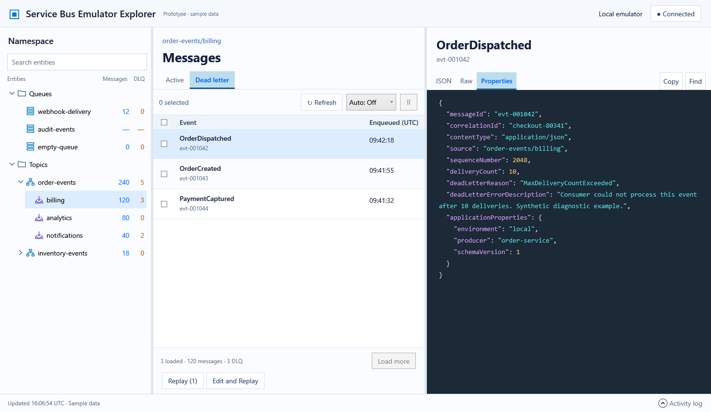

# Investigation workspace prototype

This throwaway WPF prototype explores the layout approved on September 11, 2026. It lives on `prototype/investigation-workspace` and uses only synthetic, in-memory data. It has no Service Bus client, network access, credentials, or profile persistence.

Run from the repository root:

```powershell
dotnet run --project tools/ServiceBusEmulatorExplorer.InvestigationPrototype
```

The prototype is deliberately separate from the production application and release solution. Close its window to stop it. Restarting resets its sample state.

## Design authority

[Approved layout](approved-layout.png): searchable namespace tree with aligned Messages/DLQ totals, message list with multi-selection, and a spacious JSON inspector. The explanatory notes underneath the tree were explicitly removed. Subsequent user feedback adds distinct entity icons, always-on wrapping, and contextual DLQ Replay / Edit and Replay. Connection settings, entity administration, new-message composition, and deletion remain outside this prototype.

The user approved this visual direction; whether the interactions feel right remains the question for this prototype. The next implementation should use the existing SDK services behind a properly tested state model, rather than promote throwaway prototype code directly into production.




## Try it

1. Start with `order-events / billing`. Check multiple messages with ordinary checkbox clicks; Shift is not required. Clicking elsewhere on a row previews it without changing checks. The aligned header checkbox selects all loaded rows, or clears all when every row is checked.
2. Switch between Active and Dead letter. Inspect JSON, original Raw text, and Properties. Try Copy and Find. Bodies always wrap to the pane width; long content scrolls vertically.
3. Refresh and load another page. The focused message and checked rows should remain stable.
4. Choose an automatic refresh interval and pause/resume it. Sample incoming messages demonstrate updates without contacting a broker.
5. Select the `order-events` topic to inspect subscription copies with their source identity.
6. Search the namespace tree. Try `audit-events` for unknown counts and non-JSON bodies, and `empty-queue` for an empty result.
7. Disconnect and reconnect the sample profile. Resize the window: the inspector moves below the list on narrow windows.
8. In Dead letter, Replay uses checked messages, or the focused message when none are checked. Each gets a new message ID. Edit and Replay is available for one target and opens an editor with a generated ID, formatted JSON, and the inspector's syntax colors. Coloring stays live as you type; text is not automatically reformatted while editing. Undo/redo work normally. Cancel does not replay. Original DLQ messages remain unchanged.

## Loading behavior

Switching Active/Dead letter or selecting another entity resets the visible limit to 50 and loads that view automatically. Load more raises the limit by 50. Refresh keeps the current limit and retains focused/checked messages, so retention can temporarily show more than the limit when incoming rows displace those messages. Switching tabs resets selection and does not remember the previous tab's expanded page count. All sample messages are held in memory and ordered newest first; this is not yet a broker paging implementation.

Replay is also simulated in memory. Queue messages produce an active copy in the same queue. Subscription messages replay to their topic and the sample delivers a copy to each child subscription, without simulating filters. New message IDs change broker metadata, not identifiers inside the event body. Application-property types and correlation metadata are preserved.

Numbers are fixture values. A loaded page is distinct from an entity's total; topic totals sum subscription deliveries. These distinctions remain part of the future API contract even though the tree no longer carries explanatory notes.

## Verification

The executable can exercise the rendered WPF controls and capture screenshots:

```powershell
dotnet run --project tools/ServiceBusEmulatorExplorer.InvestigationPrototype -- --verify artifacts/investigation-prototype-proof
```

This bounded proof mode closes after verification and writes its report and images to the supplied directory. It is a prototype acceptance aid, not a production regression suite or an emulator integration test.

## Verified on September 11, 2026

Build passed with zero warnings and errors. The [rendered walkthrough](verification.md) passed 59 interaction and state checks. Screenshots were visually inspected after repairs, including formatted JSON and long wrapped content in the replay editor at 760×640 and 560×440. The [selection regression](selection-regression.md) records the failing reproduction and the fix.


| UI gate | Result | Evidence |
| --- | --- | --- |
| Design | PASS | Approved image plus latest feedback: distinct entity shapes, contextual replay actions, always-wrapped inspector, totals retained and sidebar notes absent. |
| Rendered states | PASS | Active/DLQ, JSON/raw/properties, exact clipboard copy, find, always-on wrapping, refresh, paging, real timer/pause, empty, malformed body, disconnect/reconnect, single/batch replay, edit/cancel and ID validation. |
| Geometry | PASS | Desktop 1500×900 and compact 980×640 windows; aligned tree totals, readable topic source names, stacked inspector at compact size. |
| Basic accessibility | PASS | Named controls, keyboard focus and Tab traversal checked; header and row checkbox Space activation checked at both sizes; numeric DLQ values accompany color emphasis. |
| Final sweep | PASS | Repeated complete walkthrough and visually inspected refreshed captures after repairs. |

Limits: no broker integration, full screen-reader audit, or exhaustive DPI matrix. Sample arrivals are deliberately simulated. Window and pane sizes reset when the prototype restarts. The proof exercises WPF events and automation peers; it does not emulate every physical pointer gesture.
