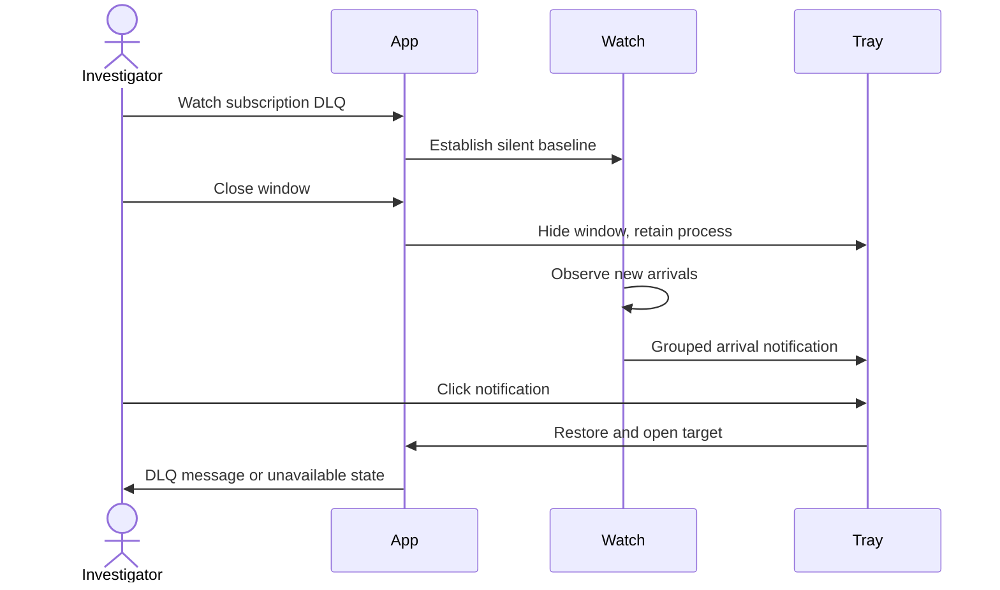

# Watch and Settings

Status: behavior direction agreed; Watch and Settings implementation pending. This plan extends the sample-data investigation prototype. Real broker integration is a separate stage.

## Intent and agreed direction

The investigator watches a queue or subscription for new Active or DLQ messages while working elsewhere. A desktop popup brings the investigator back to the relevant message. Closing the window keeps watching in the system tray by default; Settings can disable close-to-tray. An explicit Exit command stops the application. Settings also owns named emulator and Azure connection profiles.

The preceding search refinement replaces the large Correlation ID action with the Namespace search treatment: inline clear, consistent suggestion spacing, Enter or suggestion-click to search. Clear removes both the typed value and applied correlation filter.

## Sources and existing constraints

- [Current prototype](README.md) and [approved investigation layout](approved-investigation-layout.png) establish appearance and sample-only scope. Generate an image for any proposed new Settings/Watch layout; do not use ASCII wireframes. Obtain design approval before building that new layout.
- [ConnectionProfile](../../src/ServiceBusEmulatorExplorer.Core/Connection/ConnectionProfile.cs) already supports connection strings and Azure CLI authentication. Preserve those domain distinctions when connecting this UI to production.
- [Current store](../../src/ServiceBusEmulatorExplorer.Core/Connection/JsonConnectionProfileStore.cs) stores raw strings. Do not reuse that persistence unchanged for real credentials. Protected multi-profile persistence is already pending in [the remediation plan](../../specs/codebase-audit-remediation-plan.md).
- That remediation plan records an emulator subscription reporting zero Active messages for three minutes despite successful publication of 60 and peeking of 50. Counts must not gate Watch scans. Retain MessageCount/DLQ totals as totals; never substitute the loaded-page size.
- Prototype auto-refresh generates arrivals only for the current view and stops during correlation search. Watch needs independent scope and lifecycle ownership.

## Proposed first slice

Settings has Connections and General sections. Connections demonstrates named Emulator and Azure profiles with sample values; secret fields are masked. No real connection or credential saving is introduced in the prototype. General includes Close to system tray (default on) and desktop notifications. Non-secret preferences may persist in a prototype-specific store, isolated from production profiles; verification uses a temporary store.

A queue/subscription Watch action selects Active, DLQ, or both. Watch targets retain connection-profile identity, entity path and bucket. Start establishes a baseline silently; subsequent new arrivals notify. Navigation and auto-refresh do not stop watches. Disconnect pauses watches with visible status; reconnect establishes a fresh baseline without notifying for all old messages. The first prototype does not automatically reconnect or resume saved watches after a full Exit/restart.

Tray actions: Open, Exit. Closing with the setting enabled hides the main window; disabling it makes close exit. Exit disposes the tray icon and stops all timers. Proof shutdown must always exit, regardless of the preference.

Notify once per target/bucket per check, grouping bursts and retaining the latest message identity. Clicking a notification restores and activates the window, clears incompatible namespace/correlation filters, selects the source entity and Active/DLQ tab, loads the relevant page and focuses the message when still available. If unavailable, open the correct scope and explain that the message is no longer present. Never send, receive-lock, replay or delete in response to a notification.

Use synthetic arrivals independent of the inspected entity. Keep simulator controls in proof infrastructure, outside the normal product surface. Notification content contains entity/bucket and arrival count; message bodies and connection strings do not appear in notifications.

## Contracts and ownership

| Owner | Responsibility | Consumers |
|---|---|---|
| Prototype settings store | Non-secret preferences, atomic save, isolated path | Settings and app lifetime |
| Settings view/model | Profile sample drafts and preference editing | Main window |
| Watch coordinator | Targets, baselines, newly observed identity, paused state | Watch controls and notifications |
| Notification adapter | Grouped popup and immutable target identity on click | Watch coordinator |
| App lifetime/tray adapter | Hide, restore, explicit Exit and disposal | Program and Settings |
| Investigation navigation | Resolve profile/entity/bucket/message; clear conflicting filters | Notification adapter |

Prefer focused files over extending the main window code-behind with these responsibilities. Suggested seam records: WatchTarget(profileId, entityPath, bucket), ArrivalNotice(target, count, messageKey), GeneralPreferences(closeToTray, notificationsEnabled). Watch state: Off, Baselining, Watching, Paused, Error. Turning off a watch invalidates pending notifications for that target.

## Stage 1 — Approve the visual flow

Allowed: prototype design artifacts and this plan. Do not change production code. Generate a mockup image showing Settings, the compact Watch action, and an example notification using existing visual styles and sample content. Show close-to-tray enabled and masked sample profile inputs. Review the complete flow and get user approval. Stop if the proposed layout conflicts with the existing approved investigation screen.

Acceptance: approved image path recorded here. Risk Manifest not required: design-only work, no runtime or persistent state change.

## Stage 2 — Build the sample Watch and Settings flow

Allowed: this prototype, its proof infrastructure, screenshots and documentation. Do not edit production src, connect to a broker, or persist real secrets. Follow Stage 1 visual approval. First add failing proof for each R1–R4 seam below; implement one vertical flow, then verify the real rendered app and tray behavior. Read current Windows notification API documentation before choosing the tray/notification adapter. Do not claim native click-to-open passed using only an internal callback test.

Tasks: implement Settings/preference store (R1), lifetime/tray adapter (R2), independent sample watch coordinator (R3), notifications and navigation (R4). Remove any superseded timer ownership or duplicate settings paths. Run bounded builds and full affected UI proof, inspect desktop and 980×640 including settings validation and empty states, then commit the milestone.

### Risk Manifest

| ID | Risk | Canonical owner | States / failure edges | Persistence / concurrency |
|---|---|---|---|---|
| R1 | Credentials or prototype data cross storage boundaries | Prototype settings store | Missing/corrupt file; save failure | Non-secret preferences only; atomic replace; one writer; temporary proof path |
| R2 | Hidden app stops watches or cannot exit | App lifetime/tray adapter | Visible, hidden, restored, exiting; preference off; proof shutdown | Exit flag wins over close interception; dispose once |
| R3 | Duplicate alerts, old backlog alerts, or watching only current view | Watch coordinator | Silent baseline, watching, paused, reconnect, stopped | Baselines per profile/path/bucket; independent of view timer; bounded in-memory synthetic state |
| R4 | Notification opens wrong scope or a missing message is misrepresented | Investigation navigation | New arrival, burst, click, changed profile, missing message | Immutable target identity; no message mutation; reject stale/disabled targets |

| ID | Public seam / planned red proof | Expected observation | Final evidence |
|---|---|---|---|
| R1 | Save and reopen preferences in isolated test path; corrupt file and failed save | Defaults/recovery shown; no real credentials stored; production store untouched | Pending |
| R2 | Close window with preference on/off; restore via tray; explicit Exit | Hidden process keeps watching; restore works; Exit leaves no tray/timers | Pending |
| R3 | Baseline with backlog; inject into unselected Active and DLQ during correlation search; repeat same snapshot; disconnect/reconnect | No baseline/duplicate alerts; correct grouped new alerts; visible paused state | Pending |
| R4 | Click actual popup, including minimized app, conflicting filters, missing message and stale profile | Restored correct entity/tab/message or explicit unavailable state | Pending |

Budget/environment: operate solely on synthetic messages; no service installation, startup registration or broker mutation. Validate tray and native popup in this Windows session. If notification APIs or session permissions prevent native proof, stop that portion and report BLOCKED rather than silently substituting an in-app popup. Build cap 60 seconds; give any longer manual lifetime proof a stated bound. Final environment facts: Pending.

Stage acceptance: R1–R4 proofs pass; both supported layouts and keyboard Settings/Watch navigation pass the UI quality gate; no orphaned tray process; updated screenshots/documentation and a scoped commit. Implementation request: “Implement Stage 2 of WATCH_SETTINGS_PLAN.md against the approved Stage 1 image.”

## Stage 3 — Separate production integration plan

Do not implement production integration from this prototype plan. First reconcile existing connection-remediation stages, then plan protected multi-profile storage, profile switching and credential migration, actual Azure/emulator paged non-destructive inspection, cancellation/backoff, and bounded per-target deduplication. Prove detection with a backlog exceeding one page and the observed zero-count emulator behavior. Polling may miss messages consumed between checks; make coverage and failures visible and do not promise guaranteed delivery notifications. Reconfirm current SDK/provider behavior with primary documentation and live opt-in tests.

This stage produces its own production Risk Manifest and red/green API/integration proof before changes. The prototype is evidence of interaction design, not broker delivery guarantees.
